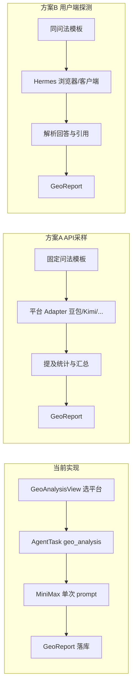

# GEO 多平台分析：API vs 用户端 方案评估

## 现状（与 UI 的落差）

前端在 [`src/components/GeoAnalysisView.tsx`](src/components/GeoAnalysisView.tsx) 通过 [`src/lib/geo-ai-platforms.ts`](src/lib/geo-ai-platforms.ts) 展示 9 个目标：**豆包、元宝、Kimi、通义、文心、DeepSeek、智谱、星火、混元**。

后端 [`server/agent/executors/direct-model.ts`](server/agent/executors/direct-model.ts) 的 `generateGeoAnalysis` **并未真正访问这些平台**，而是：

```17:30:server/agent/executors/direct-model.ts
async function generateGeoAnalysis(input: Record<string, unknown>) {
  const platforms = (input.platforms as string[]) ?? ['豆包', '元宝'];
  // ...
  }>(`你是 GEO 分析专家。分析品牌 ${brand} 在国内 AI 对话/搜索产品（${platforms.join('、')}）中的可见度...`);
```

即用 **MiniMax 一次 JSON 生成** + 随机 metrics，属于「演示型报告」，与商家理解的「在豆包/Kimi 里搜一下品牌会不会被提到」不一致。

PRD [`docs/GEO投放助手_正式开发版_PRD_v1.1_最新设计风格.md`](docs/GEO投放助手_正式开发版_PRD_v1.1_最新设计风格.md) 6.2 / 7.2 要求：**多平台分析任务、提及率/排名/缺口**；7.1 已写明：**有稳定接口走 Skill/API，无接口则 Hermes 浏览器/客户端自动化**。



---

## 方案 A：调用各平台开放 API

**做法**：为每个平台配置官方/开放平台 API Key，用统一「探测问法」（如「{城市}{品类}推荐」「{品牌}怎么样」）调用 Chat Completions，再统计回答中是否出现品牌名、竞品、引用链接等。

| 维度 | 评估 |
|------|------|
| **与真实场景贴合度** | **中等偏低**。C 端产品（豆包 App、元宝、文心一言）的回答 ≠ 开发者 API：模型版本、是否联网搜索、RAG 索引、个性化、产品内插件路由均不同。API 结果更适合「模型层可见度近似」，不能声称等于「用户在 App 里看到的结果」。 |
| **好做程度** | **相对好做**。与现有 `AgentTask` + 异步 Worker 架构一致；可新增 `server/lib/geo-providers/` 各厂商 adapter，并行请求、超时重试、结果结构化落 `GeoReport`。 |
| **工程成本** | 9 平台 ≈ 9 套密钥、计费、限流、错误码；部分平台需企业资质。可先接 **DeepSeek / 智谱 / Moonshot(Kimi) / 火山(豆包) / 阿里(通义)** 等文档齐全的 3–5 家。 |
| **合规** | 走官方 API 条款，风险可控。 |
| **可扩展** | 易做定时任务、历史对比、A/B 问法。 |

**适合**：MVP、内测、需要 **稳定、可批量、可复现** 的报告；页面上应标注「基于开放平台 API 采样，与 App 体验可能存在差异」。

---

## 方案 B：直接探测用户端产品（Web/App）

**做法**：通过 Hermes（或 Playwright）打开豆包网页、Kimi、通义千问等 **消费者界面**，输入同样问法，抓取回答文本/引用卡片，再算提及率。

| 维度 | 评估 |
|------|------|
| **与真实场景贴合度** | **高**。最接近 GEO 营销诉求：「用户在该产品里问一句话，品牌会不会被推荐」。 |
| **好做程度** | **难**。每平台 UI、登录态、验证码、反爬、A/B 界面不同；9 平台维护成本接近 9 个小项目。 |
| **工程成本** | 需专用执行环境（本机/云浏览器）、账号池、失败重试与截图存证；与 PRD 中 Hermes Gateway 路径耦合，运维重。 |
| **合规** | 需核对各产品 ToS；自动化登录/爬取常有灰色地带。 |
| **稳定性** | 界面一改就挂，不适合作为唯一数据源。 |

**适合**：少量 **标杆平台**（如豆包 + Kimi）做「地面真值」抽检，或与方案 A 结果做校准，不宜一期覆盖 9 个全量。

---

## 结论：真实场景哪个更合理？哪个更好做？

| 问题 | 建议 |
|------|------|
| **哪个更合理（业务语义）** | **用户端探测**更贴近「品牌在 AI 产品里的可见度」；但若无法稳定覆盖 9 平台，应用 **API 采样 + 少量用户端校准** 的混合策略，并在报告中区分数据来源。 |
| **哪个更好做（研发落地）** | **API 方案**明显更好做，与当前 Express + AgentTask + MiniMax 栈兼容，2–4 周可做出「真采样」MVP；用户端方案建议 **只做 1–2 个平台 PoC**，全量 9 平台不现实。 |
| **当前最不合理** | 继续用 **单一 MiniMax 扮演多平台** 却 UI 勾选 9 平台——对用户有误导，应优先改掉。 |

**不推荐**二选一硬扛到底：

- 仅 API：报告可信但可能被商家质疑「和我在豆包里问的不一样」。
- 仅用户端：交付慢、脆、难规模化。

---

## 推荐分阶段路径（与现有代码对齐）

### 阶段 0（立即）：诚实化现状

- 报告页增加 **数据来源说明**（当前为「分析模型推断」或「API 采样」）。
- `metrics`（提及率/排名）停止随机数，改为基于真实采样计数或标注「待接入」。

### 阶段 1（P0，好做）：API 多平台采样 MVP

- 新增 `GeoProbeService`：固定 3–5 条问法模板 × 用户选中的平台子集。
- 平台 adapter 映射（示例）：

| UI 名称 | 可行接入方式 |
|---------|----------------|
| DeepSeek | 官方 API |
| Kimi | Moonshot API |
| 智谱 | 智谱 API |
| 豆包 | 火山引擎 / 豆包开放平台 |
| 通义 | 阿里云 DashScope |
| 文心 | 千帆 API |
| 混元 | 腾讯混元 API |
| 星火 | 讯飞开放平台 |
| 元宝 | 需确认是否独立 API 或走腾讯系 |

- 汇总层仍可用 **MiniMax**（已配置 [`config/minimax.local.json`](config/minimax.local.json)）做「跨平台归纳 + 策略建议」，但 **事实字段**（是否提及、引用 URL）必须来自各平台原始回答。
- 扩展 [`server/agent/executors/direct-model.ts`](server/agent/executors/direct-model.ts) 的 `geo_analysis` 分支，或拆独立 `GeoAnalysisExecutor`。

### 阶段 2（P1，真实场景）：Hermes 用户端抽检

- 仅 **豆包 + Kimi**（或 PRD 优先级最高的 2 个）走 [`server/agent/executors/hermes.ts`](server/agent/executors/hermes.ts) / Hermes Skill。
- 与 API 结果并列展示：**API 采样** vs **产品实测**，差异大时在报告中解释（联网、索引、版本）。

### 阶段 3（可选）：第三方 GEO 监测

- 若采购外部 GEO/SERP 监测服务，可作为 adapter 接入，减少自研爬虫。

---

## 对 UI 选平台的建议

- **默认勾选**：已有 API、文档清晰的 2–3 个（如 DeepSeek、Kimi、豆包），避免默认 9 个全开导致成本高、失败率高。
- **未接入平台**：禁用或显示「即将支持」，避免勾选后仍走 MiniMax 模拟。

---

## 若后续进入开发，主要改动文件

- 新建：`server/services/geo-probe.service.ts`、`server/lib/geo-providers/*.ts`
- 修改：[`server/agent/executors/direct-model.ts`](server/agent/executors/direct-model.ts)（或新 executor）、[`server/agent/worker.ts`](server/agent/worker.ts) 落库逻辑、[`prisma/schema.prisma`](prisma/schema.prisma)（可选：`GeoReport` 增加 `probeSource`、`rawSamples` JSON）
- 前端：[`src/components/GeoAnalysisView.tsx`](src/components/GeoAnalysisView.tsx) 展示分平台原始片段与数据来源标签
