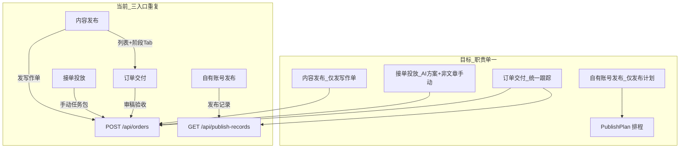

# 发单与订单交付合并优化计划

## 问题诊断（当前重复点）

| 能力 | 现状 | 重复对象 |
|------|------|----------|
| 订单阶段列表 | [`ContentPublishView.tsx`](src/components/ContentPublishView.tsx) Tab：待审稿 / 待回填·验收 / 已完成 | 与 [`OrderDeliveryView.tsx`](src/components/OrderDeliveryView.tsx) 同读 `/api/orders`，后者已有审稿区、最终验收、交付记录 |
| 发单创建 | 内容发布「发写作单」`POST /api/orders`（`type: 文章`） | 与 [`DeliveryPlanView.tsx`](src/components/DeliveryPlanView.tsx)「手动创建任务包」同一接口，字段几乎通用 |
| 发布结果 | [`SelfAccountPublishView.tsx`](src/components/SelfAccountPublishView.tsx) → [`PublishRecordsView.tsx`](src/components/PublishRecordsView.tsx)（`PublishRecord` 模型） | 与接单 `TaskOrder` 不同源，但用户心智都是「发布后看结果」，宜在同一履约页查看 |

文档 [`docs/GEO投放助手_发布端信息架构优化方案.md`](docs/GEO投放助手_发布端信息架构优化方案.md) §5.1 仍描述内容发布含「待审稿/待回填/已完成」Tab，与本次收敛方向冲突，实施时需同步修订 §5、§8、§10。

---

## 目标信息架构（发布后）

### 侧边栏职责（保留 4 个入口，收窄边界）

| 入口 | 唯一职责 | 不再承担 |
|------|----------|----------|
| **内容发布** | 文章类写作/发文单的**创建向导**（平台、方向、篇数、字数、关键词、预算、双阶段验收模板） | 订单列表、阶段 Tab、审稿操作 |
| **接单投放** | **AI 制定任务包** + **手动创建非文章类**订单（达人/探店/顾问/综合等） | 通用 `POST /api/orders` 发文章单 |
| **自有账号发布** | **发布计划**排程（[`PublishScheduleView`](src/components/PublishScheduleView.tsx)） | 发布记录 Tab |
| **订单交付** | **所有接单订单**的阶段筛选 + 详情 + 审稿/验收/返修/争议；**自有发布记录**第三视图 | — |

### 订单交付（履约中枢）增强结构

在现有「投放订单 | 网站订单」之上，建议改为三层 Tab 或顶栏分段：

1. **接单订单**（`TaskOrder`）— 主列表  
   - 顶栏**阶段筛选**（替代内容发布 Tab）：全部 · 待接单 · 执行中 · 待审稿 · 审稿返修 · 待发布 · 待验收 · 已完成 · 争议  
   - 可选**类型筛选**：文章类 / 非文章类（复用 [`isArticleContentOrder`](src/lib/task-order-flow.ts)）  
   - 左侧列表 + 右侧详情（保留现有草稿审稿、最终验收 UI）  
   - 发单成功跳转：`order_delivery?hint=<orderId>&stage=draft_review`（或 `filter=draft_review`）

2. **网站订单** — 保持现状

3. **自有发布记录** — 嵌入原 `PublishRecordsView` 列表/筛选（数据仍走 `/api/publish-records`，不强行并入 `TaskOrder` 表）

列表项展示统一使用 [`TASK_ORDER_STATUS_LABEL`](src/lib/task-order-flow.ts)，文章类在标题旁加轻量标签「文章」。

---

## 分阶段实施

### P0：去掉重复列表（优先、改动小）

**1. 精简 `ContentPublishView`**

- 删除 Tab：`draft_review` / `pending_publish` / `completed` 及 `TAB_STATUSES`、下方订单卡片列表（[`ContentPublishView.tsx`](src/components/ContentPublishView.tsx) L32–43、L372–430）。  
- 保留：`compose` 发写作单表单 + 可选「最近 1 条待领取」轻提示（`published` 状态，最多 3 条，点进订单交付）。  
- 发单成功：`onNavigate('order_delivery', order.id)` 并带 stage hint，不再 `switchTab('draft_review')`。  
- URL：废弃 `contentTab` 非 compose 值；`contentPublishTabFromHint` 仅返回 `compose`。

**2. 增强 `OrderDeliveryView`**

- 增加 `stageFilter`（URL 参数 `orderStage` 或 `hint` 映射，与 [`contentPublishTabFromHint`](src/components/ContentPublishView.tsx) 旧值兼容重定向）。  
- 列表按 `stageFilter` + `isArticleContentOrder` 过滤；计数角标（可选 P0.5）。  
- 移除内容发布页「详细审稿请在订单交付操作」的冗余文案（审稿只在详情区）。

**3. 路由与导航**

- [`App.tsx`](src/App.tsx)：`content_publish` + `contentTab=draft_review` 等 → 重定向 `order_delivery?orderStage=...`  
- [`BrandListView`](src/components/BrandListView.tsx)「发布」：仍进内容发布 compose；工作台/GEO 分析「内容发布」不变。  
- [`Header.tsx`](src/components/Header.tsx) 标题不变。

### P1：发单入口去重

**4. `DeliveryPlanView` 手动模式**

- 任务类型下拉去掉「文章」或选择文章时提示「请使用侧边栏 → 内容发布」。  
- 默认 `manualType` 为 `达人` / `探店` 等非文章枚举；`deliverable`/`acceptance` 文案区分非文章验收（不要求草稿审稿模板）。  
- 手动发单成功后同样跳转 `order_delivery`（可不带 stage）。

**5. 抽取共享发单逻辑（可选但推荐）**

- 新建 [`src/lib/create-task-order.ts`](src/lib/create-task-order.ts)：`createArticleWritingOrder(payload)` / `createLobbyOrder(payload)`，封装 `POST /api/orders` 与默认 `acceptance` 模板，避免两处表单漂移。

### P2：自有发布记录并入订单交付

**6. `SelfAccountPublishView`**

- 移除「发布记录」Tab，仅保留「发布计划」。  
- [`SelfAccountPublishView.tsx`](src/components/SelfAccountPublishView.tsx) 单 Tab 或去掉 Tab 栏直接渲染 `PublishScheduleView`。

**7. `OrderDeliveryView` 第三 Tab**

- 引入 `PublishRecordsView`（或抽 `PublishRecordsPanel` 去掉重复 `BrandScopeBar`，共用订单页顶部品牌条）。  
- 失败记录可增加「查看运行日志」链到 `agent_tasks`（文档 P3 项）。

**8. 文档**

- 更新 [`GEO投放助手_发布端信息架构优化方案.md`](docs/GEO投放助手_发布端信息架构优化方案.md)：§5.1 内容发布仅「发写作单」；§5.2 发布记录迁入订单交付；§5.4 订单交付增加阶段筛选与自有发布记录 Tab。

---

## 关键文件清单

| 文件 | 变更 |
|------|------|
| [`src/components/ContentPublishView.tsx`](src/components/ContentPublishView.tsx) | 删阶段 Tab 与列表，compose-only |
| [`src/components/OrderDeliveryView.tsx`](src/components/OrderDeliveryView.tsx) | 阶段/类型筛选 + 自有发布记录 Tab |
| [`src/components/SelfAccountPublishView.tsx`](src/components/SelfAccountPublishView.tsx) | 仅发布计划 |
| [`src/components/DeliveryPlanView.tsx`](src/components/DeliveryPlanView.tsx) | 手动发单限制非文章 |
| [`src/App.tsx`](src/App.tsx) | URL 兼容重定向 |
| [`src/components/Sidebar.tsx`](src/components/Sidebar.tsx) | 文案微调（可选副标题） |
| [`docs/GEO投放助手_发布端信息架构优化方案.md`](docs/GEO投放助手_发布端信息架构优化方案.md) | 与实现对齐 |

---

## 验收标准

1. 「内容发布」页不再出现待审稿/待回填/已完成 Tab 及可点击订单列表（除可选「待领取」摘要）。  
2. 上述阶段订单均在「订单交付」左侧列表通过筛选可见，选中后审稿/验收行为与现有一致。  
3. 「接单投放 → 手动创建」无法（或明确拦截）创建与内容发布重复的文章写作单。  
4. 「自有账号发布」无「发布记录」Tab；发布记录在「订单交付 → 自有发布记录」可查看。  
5. 旧书签 `contentTab=draft_review` 等打开后落到订单交付对应筛选，不 404。

---

## 后续可选（不纳入本次必做）

- 将「内容发布」与「接单投放」合并为单一侧边栏「接单发单」（三模式：文章 / AI 包 / 手动非文章）— 需更大 IA 讨论。  
- 内容发布「根据 GEO 分析生成计划」（文档 §5.1 方案 B）— 独立迭代。
