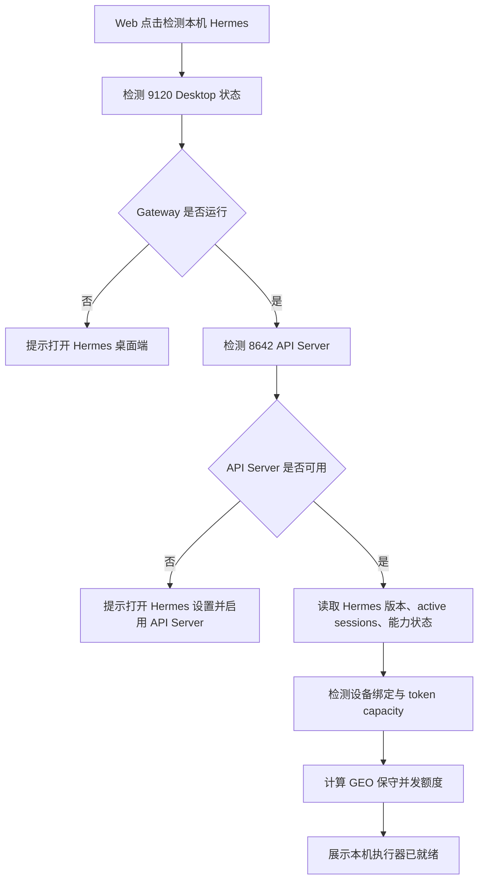
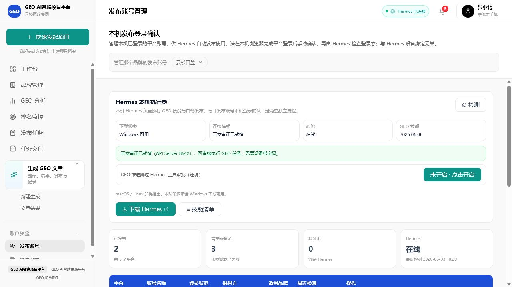
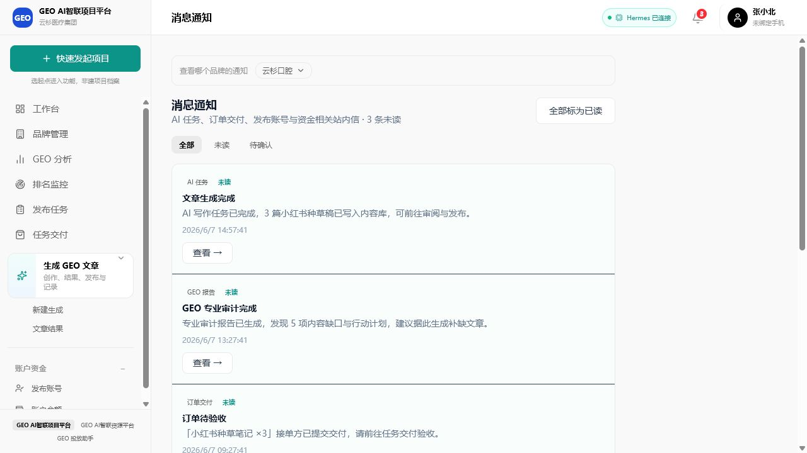
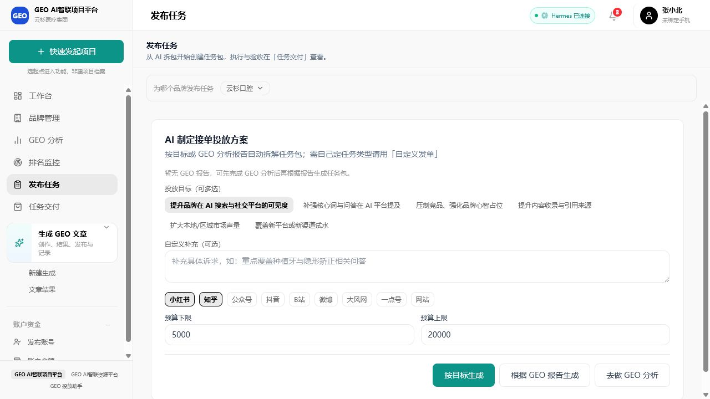
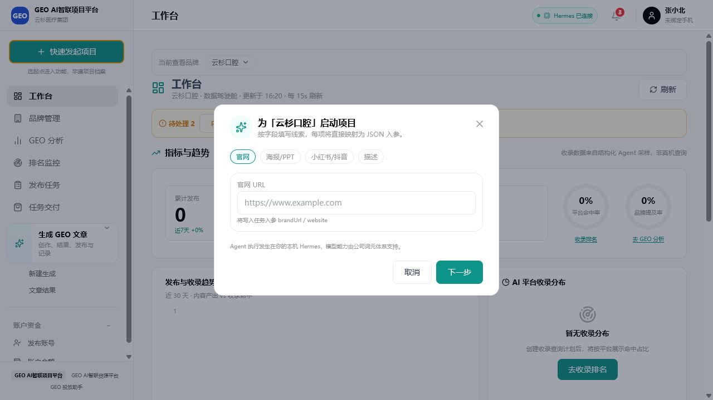
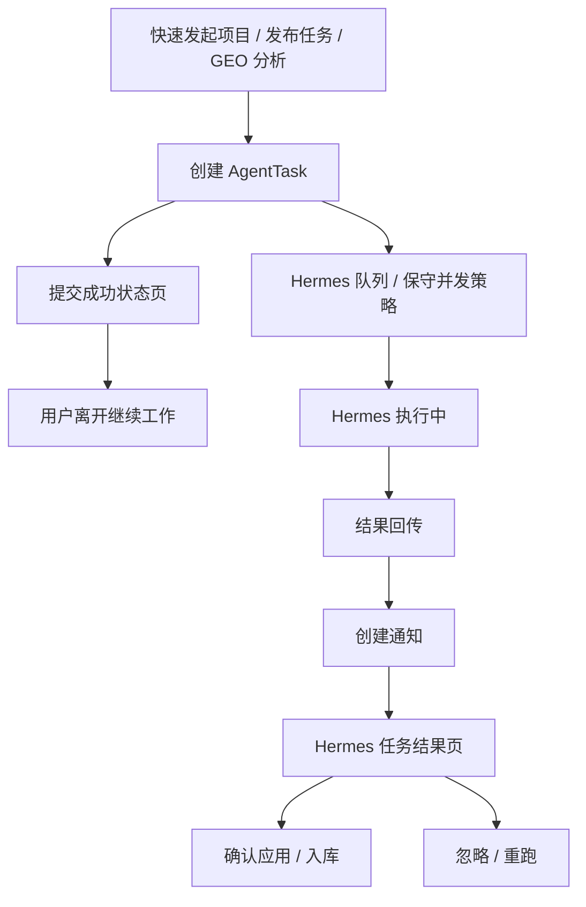

# GEO 投放助手：Hermes 保守并发与桌面端保护迭代计划

版本：v1.0  
日期：2026-06-07  
范围：发布端 Hermes 配对检测、任务并发额度、结果通知入口、桌面端使用保护、开发直连与商用 Pull 模式的迁移策略。

> GUI 重设计以独立文档为准：[`GEO投放助手_Hermes异步任务流程GUI重设计规范.md`](./GEO投放助手_Hermes异步任务流程GUI重设计规范.md)。本文只保留 Hermes 并发、配对检测、桌面端保护等技术策略背景。

---

## 1. 结论

Hermes 本机能力可以支持并行任务，但 GEO 投放助手不应直接按 Hermes API Server 的硬上限发满任务。

本机 `D:\Hermes` 当前版本具备以下事实：

1. `http://127.0.0.1:8642/health` 已可用，API Server 处于连接状态。
2. `D:\Hermes\resources\hermes-agent\gateway\platforms\api_server.py` 中 `/v1/runs` 支持异步运行，提交后返回 `run_id`。
3. 本机代码中 `_MAX_CONCURRENT_RUNS = 10`，这是 API Server 对外部 run 的硬上限。
4. Hermes 内部子代理并行默认配置为 `delegation.max_concurrent_children = 3`。
5. 10 个 run 是技术上限，不是 GEO 业务默认额度。发布、账号检测、浏览器自动化类任务会占用用户本机浏览器、登录态和模型额度，必须保守。

因此本轮迭代目标是：

```text
支持多任务排队和有限并行
  但默认不打满 Hermes
  发布类任务强制串行
  普通分析类任务保守并发
  用户使用 Hermes 桌面端时自动降载或暂停领取新任务
```

---

## 2. 产品体验目标

### 2.1 用户不需要等待任务结果

用户在发起任务页提交后，页面立即进入“AI/Hermes 工作中”状态：

```text
任务已提交，本机 Hermes 会在后台处理。
你可以先去做其他事，完成后我们会通过通知提醒你。
```

页面只保留：

1. 当前任务进度摘要。
2. 查看任务详情入口。
3. 返回工作台或继续创建任务入口。

不要求用户停留在当前页等结果。

### 2.2 通知作为统一召回入口

Hermes 回传结果后，发布端通知中心生成通知。

通知点击后优先进入统一结果页，而不是散落到不同业务页面：

```text
通知中心
  -> Hermes 任务结果页
  -> 预览结果
  -> 确认应用 / 入库 / 忽略 / 重跑
```

### 2.3 配对时完成并发能力检测

在 Web 与本机 Hermes 配对或检测时，除了检查“是否在线”，还要检查：

1. API Server 是否启用。
2. Hermes 版本。
3. GEO skills 是否可用。
4. 词元/模型能力是否可用。
5. 当前 active sessions 数量。
6. 当前 API Server run 上限与建议并发额度。
7. 是否开启“保护桌面端使用”的保守模式。

用户不需要理解 `8642`、`run_id`、`_MAX_CONCURRENT_RUNS` 等技术细节，只看到：

```text
本机 Hermes 已就绪
后台任务额度：保守模式，最多同时处理 2 个分析任务
发布任务：一次只执行 1 个，避免影响你的登录态和浏览器操作
```

### 2.4 需要配置时跳转 Hermes 桌面端

如果检测发现 Hermes 未开启 API Server、词元能力不可用、版本过旧或技能缺失，Web 不在页面里暴露复杂配置项，而是提供明确动作：

1. 打开 Hermes 桌面端。
2. 跳转到 Hermes 设置页或展示路径：`Settings -> Platforms -> API Server`。
3. 检测后自动刷新状态。

理想产品化能力：

```text
[打开 Hermes 设置] [重新检测]
```

开发阶段若无法深链到具体设置页，则先打开 Hermes 桌面端并展示短说明。

---

## 3. 并发策略

### 3.1 不同任务分级

| 任务类型 | 示例 | 默认并发 | 原因 |
|---|---|---:|---|
| 轻量分析 | `keyword_mining`、`knowledge_extract`、`geo_content` | 2 | 主要消耗模型额度，对本机交互影响较小 |
| GEO 报告 | `geo_quick_start`、`geo_audit`、`geo_compare` | 2 | 可能调用网页读取和多个工具，保守处理 |
| 内容生成 | `article_generation`、`article_rewrite` | 2 | 输出较长，模型耗时和 token 消耗较高 |
| 技术资产 | `geo_schema`、`geo_llmstxt`、`geo_citability` | 2 | 结果需确认，通常不强占浏览器 |
| 账号检测 | `account_verify` | 1 | 依赖用户本机登录态，避免并发误判 |
| 自动发布 | `hermes_publish` | 1 | 涉及浏览器、平台登录、风控和留证，必须串行 |

### 3.2 全局默认额度

P0 推荐默认：

```ts
hermesConcurrencyPolicy = {
  mode: 'conservative',
  maxTotalRuns: 3,
  maxAnalysisRuns: 2,
  maxPublishRuns: 1,
  maxAccountRuns: 1,
  reserveDesktopSlots: 1,
}
```

含义：

1. GEO 后台最多同时占用 3 个 Hermes run。
2. 分析类最多同时 2 个。
3. 发布类永远 1 个。
4. 至少给 Hermes 桌面端保留 1 个可用空间。
5. 即使 Hermes API Server 硬上限是 10，GEO 默认也只使用其中一小部分。

### 3.3 用户正在使用桌面端时降载

当检测到 Hermes 桌面端存在 active sessions，或者 API Server `/health/detailed` / 9120 状态返回 active sessions 大于 0 时：

```text
GEO 不再领取新的低优先级后台任务
正在执行的任务不强制中断
发布类任务如果尚未开始，继续等待
```

降载策略：

| 桌面端状态 | GEO 行为 |
|---|---|
| active sessions = 0 | 使用默认保守额度 |
| active sessions >= 1 | `maxTotalRuns` 降为 1，禁止启动发布任务 |
| 用户手动开启“勿打扰” | 只允许已运行任务完成，不领取新任务 |
| 用户手动开启“加速后台任务” | 可临时提高到 3 个分析任务，但发布仍串行 |

---

## 4. 配对与检测流程

### 4.1 检测链路



### 4.2 配对完成后的能力快照

建议 Web 后端保存一份设备能力快照：

```json
{
  "deviceIdHash": "xxx",
  "deviceName": "Feihong-Windows",
  "hermesVersion": "0.14.0",
  "apiServerReady": true,
  "apiServerMaxRuns": 10,
  "geoRecommendedMaxRuns": 3,
  "geoRecommendedAnalysisRuns": 2,
  "geoRecommendedPublishRuns": 1,
  "activeSessions": 0,
  "desktopProtection": true,
  "lastCheckedAt": "2026-06-07T15:30:00+08:00"
}
```

不要把 Hermes 的硬上限直接暴露成用户可调项。用户侧只展示“保守 / 平衡 / 加速”。

---

## 5. 后端改造计划

### 5.1 新增并发策略服务

新增服务建议：

```text
server/services/hermes-concurrency.service.ts
```

职责：

1. 读取 Hermes 健康状态和 active sessions。
2. 读取系统配置中的并发策略。
3. 按任务类型计算是否允许入队或领取。
4. 对发布类、账号类任务做互斥。
5. 给前端返回可读状态。

核心函数建议：

```ts
resolveHermesConcurrencyPolicy()
canStartHermesTask(task)
getHermesCapacitySnapshot()
markHermesRunStarted(taskId, runKind)
markHermesRunFinished(taskId)
```

### 5.2 调整任务领取逻辑

当前 Pull 模式 `/api/hermes-local/tasks/next` 每次只返回一个任务。

P0 保持单次领取一个任务，但领取前增加并发判断：

1. 发布类任务如果已有发布任务运行，返回 `task: null`。
2. active sessions 大于 0 时，不领取发布任务。
3. 当前 GEO 运行任务达到 `maxTotalRuns` 时，返回 `task: null`。
4. 分析类达到 `maxAnalysisRuns` 时，继续等待。

P1 再考虑：

```text
GET /api/hermes-local/tasks/poll?limit=3
```

一次返回多个任务，但仍受策略限制。

### 5.3 调整开发直连 `/v1/runs`

当前开发直连模式通过 Hermes API Server 创建 `/v1/runs`。

集成要求：

1. 创建 run 后记录 `externalRunId`。
2. 必须订阅或消费 `/v1/runs/{run_id}/events`，避免 `_run_streams` 长时间占用。
3. 同时保留 `/v1/runs/{run_id}` 轮询作为兜底。
4. 失败、取消、超时后清理本地任务状态。

注意：Hermes API Server 的 `_MAX_CONCURRENT_RUNS = 10` 是保护上限。GEO 自己仍应以 `maxTotalRuns = 3` 为默认。

---

## 6. 前端改造计划

### 6.1 Hermes 执行器面板

在发布端 Hermes 执行器面板中新增：

1. 本机状态：未安装 / 未运行 / API Server 未启用 / 已就绪。
2. 绑定状态：未绑定 / 已绑定 / 心跳在线。
3. 能力状态：词元可用 / 模型可用 / GEO skills 可用。
4. 后台任务额度：保守模式，当前可同时执行几个任务。
5. 桌面端保护：开启 / 关闭。
6. 检测按钮：重新检测本机 Hermes。
7. 配置按钮：打开 Hermes 或打开配置说明。

### 6.2 任务提交后的工作动画

发起任务页提交成功后展示：

```text
Hermes 正在后台处理
完成后会通过通知提醒你
你可以先去处理其他工作
```

按钮：

1. 查看任务详情。
2. 返回工作台。
3. 继续创建任务。

如果任务进入等待队列，展示：

```text
当前本机 Hermes 正在处理其他任务，已为你排队。
发布类任务会串行执行，避免影响你的平台登录态。
```

### 6.3 通知与结果页

通知列表增加状态标签：

1. 处理中。
2. 排队中。
3. 已完成。
4. 待确认应用。
5. 部分完成。
6. 需要手动处理。

点击通知进入统一结果页：

```text
AgentTaskResultView
```

结果页负责：

1. 展示 Hermes 输出。
2. 展示执行证据。
3. 确认应用或入库。
4. 忽略。
5. 重跑。
6. 查看日志。

---

## 7. 系统配置建议

新增或扩展 `SystemConfig`：

| key | 默认值 | 说明 |
|---|---|---|
| `hermes_concurrency_policy` | 见下方 JSON | 全局并发策略 |
| `hermes_desktop_protection_enabled` | `true` | 是否保护用户桌面端使用 |
| `hermes_publish_serial_enabled` | `true` | 发布任务是否强制串行 |
| `hermes_capacity_last_snapshot` | `{}` | 最近一次检测结果 |

默认 JSON：

```json
{
  "mode": "conservative",
  "maxTotalRuns": 3,
  "maxAnalysisRuns": 2,
  "maxPublishRuns": 1,
  "maxAccountRuns": 1,
  "reserveDesktopSlots": 1,
  "pausePublishWhenDesktopActive": true
}
```

---

## 8. 分阶段迭代

### P0：保守并发最小闭环

目标：不影响现有任务执行，先把并发限制和桌面端保护加上。

任务：

1. 新增 Hermes 能力检测和并发策略服务。
2. `/api/hermes/health` 增加 active sessions、推荐并发额度、保护模式状态。
3. `pullNextHermesTask` 领取前执行 `canStartHermesTask`。
4. 发布类和账号类任务强制串行。
5. 前端 Hermes 面板展示“后台任务额度”。
6. 任务提交后展示后台执行动画和排队提示。

验收：

1. 同时提交 5 个分析任务，最多只有 2 个进入运行，其余排队。
2. 同时提交多个发布任务，始终只有 1 个执行。
3. Hermes 桌面端 active sessions 大于 0 时，不启动新的发布任务。
4. 用户离开发起页后，任务完成仍能通过通知进入结果页。

### P1：统一结果页

目标：所有 Hermes 输出都有共同承载页面。

任务：

1. 新增 `AgentTaskResultView`。
2. 通知统一跳转结果页。
3. 将现有结果确认抽屉迁移到结果页能力。
4. 为发布、账号检测、GEO 报告、技术资产增加统一摘要组件。

验收：

1. `brand_extract`、`keyword_mining`、`knowledge_extract` 可在结果页确认入库。
2. `hermes_publish` 可在结果页查看发布证据和手动处理提示。
3. 失败任务可在结果页重试。

### P2：批量 Pull 与动态容量

目标：Hermes 客户端支持一次拉取多个任务，并动态上报容量。

任务：

1. Hermes 心跳上报 `maxConcurrentTasks`、`runningTaskIds`、`availableSlots`。
2. 新增 `/api/hermes-local/tasks/poll?limit=3`。
3. Web 后端根据设备上报容量和系统保守策略共同计算可发任务。
4. 前端支持“保守 / 平衡 / 加速”模式。

验收：

1. Hermes 空闲时可一次领取多个分析任务。
2. 用户切换到保守模式后，新任务领取立即降载。
3. 发布任务无论何种模式都保持串行。

---

## 9. 风险与边界

1. Hermes 的 10 run 上限不是业务 SLA，只是 API Server 资源保护值。
2. 如果调用方不消费 `/events`，run stream 可能保留到 300 秒 TTL，影响后续并发额度判断。
3. 发布类任务涉及平台风控，不能因为技术上可并行就并行。
4. 桌面端用户主动使用 Hermes 时，GEO 后台任务应让路。
5. 生产商用 Pull 模式不能依赖平台访问用户本机 `127.0.0.1:8642`。
6. 开发直连可以继续使用 8642，但架构上要与 Pull 模式保持同一套 AgentTask 状态和结果确认逻辑。

---

## 10. 推荐默认口径

对用户：

```text
GEO 会使用你的本机 Hermes 在后台处理任务。为避免影响你正常使用 Hermes 桌面端，系统默认开启保守模式：分析类任务可有限并行，发布和账号操作会串行执行。
```

对研发：

```text
Hermes API Server 当前硬上限是 10 个 run，但 GEO 默认 maxTotalRuns=3，maxAnalysisRuns=2，maxPublishRuns=1。所有任务必须经过并发策略服务，不允许页面或服务绕过策略直接创建 Hermes run。
```

---

## 11. 当前 GUI 截图与问题定位

本节基于当前本地页面截图整理，不只依赖代码判断。截图文件保存在：

```text
docs/hermes-gui-screenshots/
```

### 11.1 发布账号页：Hermes 执行器现状



当前优点：

1. Hermes 状态已经放在发布账号页中，用户可以看到下载、连接模式、心跳、GEO 技能版本。
2. 顶部 Header 已有 Hermes 已连接状态，整体具备基础可见性。
3. 面板中已经有检测、下载 Hermes、技能清单、审批跳过开关。

当前问题：

1. 页面标题是“本机发布登录确认”，Hermes 执行器只是其中一块内容，用户不容易理解“后台任务能力”和“发布账号登录态”之间的关系。
2. 现有状态只说明“连接上了”，没有说明“能同时跑几个任务”“哪些任务会排队”“发布任务为什么串行”。
3. 没有桌面端保护状态，例如用户正在 Hermes 桌面端聊天时，GEO 是否会让路。
4. 没有配置跳转。API Server 未启用、词元能力异常、技能缺失时，只能靠文案提示，缺少清晰操作按钮。
5. “GEO 推送跳过 Hermes 工具审批”是开发/连调用语，普通商家不应看到过多技术解释。

### 11.2 通知中心现状



当前优点：

1. 通知已经能承载 AI 任务完成、GEO 报告完成、订单交付等召回。
2. 有全部、未读、待确认筛选。
3. 通知项中有“查看”按钮，可以作为结果页入口的基础。

当前问题：

1. 通知是消息列表，不是结果工作台。用户点击后会跳到不同业务页，结果承载分散。
2. 通知项没有表达“排队中 / 执行中 / 待应用 / 已应用 / 部分完成”等任务结果状态。
3. 缺少任务类型、执行设备、是否受桌面端保护影响等信息。
4. 对需要确认入库的 Hermes 结果，入口不够强，无法形成统一“处理收件箱”。

### 11.3 发布任务页现状



当前优点：

1. 表单已经聚焦业务目标、平台、预算，适合商家发起投放任务包。
2. 有“根据 GEO 报告生成”和“去做 GEO 分析”的分流按钮。
3. 页面没有暴露 Hermes 技术概念，业务语言比较清楚。

当前问题：

1. 提交后的后台执行状态不明显。用户不知道任务会进入 Hermes 队列、是否可以离开页面。
2. 没有排队提示，也没有解释发布类任务会串行执行。
3. 缺少“提交前能力检查”：例如 Hermes 未就绪、桌面端正忙、发布任务排队时的预估提示。
4. 按钮区只表达“生成”，没有表达生成后的异步结果入口。

### 11.4 快速发起项目弹窗现状



当前优点：

1. 输入入口已经支持官网、海报/PPT、小红书/抖音、描述，符合“任意品牌线索启动”的方向。
2. 弹窗提示 Agent 发生在本机 Hermes，和当前产品架构一致。
3. 表单足够轻量，适合作为新用户首启入口。

当前问题：

1. 只说明“本机 Hermes 执行”，没有展示当前 Hermes 是否就绪。
2. 没有并发/排队提示，用户连续发起多个项目时不知道系统会如何处理。
3. 下一步之后缺少明确的“后台任务已创建，可离开”的状态页。
4. 弹窗没有和通知中心、任务结果页形成闭环。

---

## 12. 改造后 GUI 总体结构

### 12.1 信息架构调整

建议把 Hermes 能力从“发布账号页中的一个面板”提升为“本机执行器状态层”，但仍保留在发布端，不另建复杂平台。

```text
发布端
├─ 工作台
│  ├─ 今日任务 / 待处理结果 / Hermes 状态摘要
│  └─ 快速发起项目
├─ 发布任务
│  ├─ 发起任务表单
│  └─ 提交后后台执行状态
├─ 消息通知
│  ├─ 全部通知
│  ├─ 待处理结果
│  └─ 执行异常
├─ Hermes 任务结果页
│  ├─ 结果预览
│  ├─ 应用 / 入库 / 忽略 / 重跑
│  └─ 日志与证据
└─ 发布账号
   ├─ 本机发布登录确认
   └─ Hermes 本机执行器详细状态
```

### 12.2 页面关系



---

## 13. 改造后核心页面线框图

### 13.1 工作台：增加 Hermes 状态摘要与待处理结果

目标：用户一进工作台就知道后台是否正常、有没有待处理结果、Hermes 是否正在忙。

```text
┌────────────────────────────────────────────────────────────────────────────┐
│ 工作台                                      [Hermes 已就绪 · 保守模式] [铃] │
├────────────────────────────────────────────────────────────────────────────┤
│ 当前查看品牌 [云杉口腔 v]                                                   │
│                                                                            │
│ ┌──────────────────────────────┐ ┌───────────────────────────────────────┐ │
│ │ 本机 Hermes                  │ │ 待处理结果                             │ │
│ │ ● 已连接                     │ │ 3 条待确认 / 1 条需要手动处理           │ │
│ │ 后台额度：分析 2 / 发布 1    │ │ [查看结果收件箱]                        │ │
│ │ 桌面端保护：开启             │ └───────────────────────────────────────┘ │
│ │ 当前：空闲，可处理新任务     │                                           │
│ │ [检测] [打开 Hermes]         │ ┌───────────────────────────────────────┐ │
│ └──────────────────────────────┘ │ 今日后台任务                            │ │
│                                  │ 排队 2 · 执行中 1 · 已完成 5            │ │
│                                  │ [查看运行日志]                          │ │
│                                  └───────────────────────────────────────┘ │
│                                                                            │
│ 指标与趋势、发布与收录趋势保持原有布局                                      │
└────────────────────────────────────────────────────────────────────────────┘
```

优化点：

1. Header 状态只保留简短徽标，详细状态进入工作台卡片。
2. “待处理结果”成为通知中心之外的第二入口。
3. 用户能看到保守并发策略，而不是只看到“在线”。

### 13.2 Hermes 执行器详细面板

目标：保留在发布账号页，但从“连接状态卡”升级为“本机执行器控制台”。

```text
┌────────────────────────────────────────────────────────────────────────────┐
│ Hermes 本机执行器                                               [重新检测] │
│ 本机 Hermes 负责 GEO 技能、后台分析、账号检测和自动发布。                  │
├────────────────────────────────────────────────────────────────────────────┤
│ ┌──────────────┐ ┌──────────────┐ ┌──────────────┐ ┌──────────────┐       │
│ │ 连接状态      │ │ 设备绑定      │ │ 词元/模型     │ │ GEO 技能      │       │
│ │ 已连接 8642   │ │ 开发直连      │ │ 可用          │ │ 2026.06.06   │       │
│ └──────────────┘ └──────────────┘ └──────────────┘ └──────────────┘       │
│                                                                            │
│ ┌──────────────────────────────────────────────────────────────────────┐   │
│ │ 后台任务额度                                                         │   │
│ │ 模式：[保守 v]  分析任务 0/2  发布任务 0/1  总占用 0/3               │   │
│ │ 说明：发布和账号操作会串行执行，避免影响平台登录态。                 │   │
│ └──────────────────────────────────────────────────────────────────────┘   │
│                                                                            │
│ ┌──────────────────────────────────────────────────────────────────────┐   │
│ │ 桌面端保护                                                           │   │
│ │ [开启] 当你正在 Hermes 桌面端使用聊天或工具时，GEO 暂停领取新发布任务 │   │
│ │ 当前桌面端：空闲                                                     │   │
│ └──────────────────────────────────────────────────────────────────────┘   │
│                                                                            │
│ [打开 Hermes] [打开设置说明] [生成绑定码] [技能清单] [查看运行日志]        │
└────────────────────────────────────────────────────────────────────────────┘
```

异常态线框：

```text
┌────────────────────────────────────────────────────────────────────────────┐
│ Hermes 本机执行器                                               [重新检测] │
├────────────────────────────────────────────────────────────────────────────┤
│ ⚠ API Server 未启用                                                        │
│ 需要在 Hermes 设置中开启 Platforms -> API Server，保存后重启 Gateway。      │
│                                                                            │
│ [打开 Hermes 设置] [查看图文说明] [我已开启，重新检测]                      │
└────────────────────────────────────────────────────────────────────────────┘
```

优化点：

1. 把“检测结果”拆成连接、绑定、模型能力、技能能力四类。
2. 新增后台任务额度区，避免用户误以为所有任务都会同时执行。
3. 新增桌面端保护区，解释为什么有些任务会排队。
4. 开发用的审批跳过开关收进“高级设置”，默认不直接展示给普通用户。

### 13.3 任务提交后状态页 / 状态卡

目标：用户提交后立即知道“不必等”，也知道任务是否排队。

```text
┌────────────────────────────────────────────────────────────────────────────┐
│ 发布任务                                                                  │
├────────────────────────────────────────────────────────────────────────────┤
│ ┌──────────────────────────────────────────────────────────────────────┐   │
│ │ Hermes 正在后台处理                                                  │   │
│ │ 已创建任务：AI 制定接单投放方案                                       │   │
│ │ 当前状态：排队中，前面还有 1 个分析任务                               │   │
│ │                                                                      │   │
│ │ 你可以先去处理其他工作，完成后会通过通知提醒你。                      │   │
│ │                                                                      │   │
│ │ [查看任务详情] [返回工作台] [继续创建任务]                            │   │
│ └──────────────────────────────────────────────────────────────────────┘   │
│                                                                            │
│ ┌──────────────────────────────────────────────────────────────────────┐   │
│ │ 为什么排队？                                                         │   │
│ │ 当前为保守模式：分析任务最多同时 2 个，发布任务一次只执行 1 个。       │   │
│ │ 这样可以避免影响你在 Hermes 桌面端的正常使用。                        │   │
│ └──────────────────────────────────────────────────────────────────────┘   │
└────────────────────────────────────────────────────────────────────────────┘
```

执行中状态：

```text
┌──────────────────────────────────────────────────────────────────────┐
│ Hermes 正在执行                                                      │
│ 进度 35%  正在读取 GEO 报告并拆解投放任务包                           │
│ [查看实时日志] [完成后通知我]                                          │
└──────────────────────────────────────────────────────────────────────┘
```

完成状态：

```text
┌──────────────────────────────────────────────────────────────────────┐
│ 任务已完成                                                           │
│ Hermes 已生成投放任务包，请进入结果页确认是否应用。                   │
│ [查看结果] [稍后处理]                                                 │
└──────────────────────────────────────────────────────────────────────┘
```

优化点：

1. 发起页不再承担长期等待。
2. 排队原因可解释，降低“没反应”的焦虑。
3. 完成后统一导向结果页。

### 13.4 通知中心：从消息列表升级为结果收件箱

目标：保留通知列表，但突出待处理结果。

```text
┌────────────────────────────────────────────────────────────────────────────┐
│ 消息通知                                                                  │
├────────────────────────────────────────────────────────────────────────────┤
│ [全部] [未读] [待处理结果 3] [执行异常 1]                                  │
│                                                                            │
│ ┌──────────────────────────────────────────────────────────────────────┐   │
│ │ 待确认应用                                                           │   │
│ │ GEO 专业审计完成                                                     │   │
│ │ 发现 5 项内容缺口与行动计划。                                         │   │
│ │ Hermes：云杉口腔 · 2026/6/7 13:27                                    │   │
│ │ [查看结果] [忽略]                                                     │   │
│ └──────────────────────────────────────────────────────────────────────┘   │
│                                                                            │
│ ┌──────────────────────────────────────────────────────────────────────┐   │
│ │ 需要手动处理                                                         │   │
│ │ Hermes 发布部分完成                                                  │   │
│ │ 小红书 2 篇已发布，公众号 1 篇需要重新登录。                          │   │
│ │ [查看证据] [去处理账号]                                               │   │
│ └──────────────────────────────────────────────────────────────────────┘   │
└────────────────────────────────────────────────────────────────────────────┘
```

通知项新增字段：

| 字段 | 展示 |
|---|---|
| `resultStatus` | 待确认应用 / 已应用 / 需要手动处理 / 失败 |
| `taskTypeLabel` | GEO 审计 / 自动发布 / 账号检测 |
| `executorLabel` | 本机 Hermes |
| `capacityHint` | 排队完成 / 保守模式执行 |
| `primaryAction` | 查看结果 / 查看证据 / 去处理账号 |

### 13.5 Hermes 任务结果页

目标：所有 Hermes 输出都能落到同一个“结果容器”，再按任务类型展示差异化内容。

```text
┌────────────────────────────────────────────────────────────────────────────┐
│ Hermes 任务结果                                      [返回通知] [查看日志] │
├────────────────────────────────────────────────────────────────────────────┤
│ AI 制定接单投放方案                                                        │
│ 品牌：云杉口腔 · 执行器：本机 Hermes · 状态：待确认应用                    │
│                                                                            │
│ ┌──────────────────────────────────────────────────────────────────────┐   │
│ │ 结果摘要                                                             │   │
│ │ 已生成 3 个任务包，覆盖小红书、知乎、公众号。                         │   │
│ │ 预计预算 5,000 - 20,000 元。                                          │   │
│ └──────────────────────────────────────────────────────────────────────┘   │
│                                                                            │
│ ┌──────────────────────────────┐ ┌─────────────────────────────────────┐  │
│ │ 结构化结果                    │ │ 证据与日志                           │  │
│ │ - 任务包 A                    │ │ - Hermes run id                       │  │
│ │ - 任务包 B                    │ │ - 执行步骤                            │  │
│ │ - 任务包 C                    │ │ - 原始输出                            │  │
│ └──────────────────────────────┘ └─────────────────────────────────────┘  │
│                                                                            │
│ [确认应用到任务包] [忽略本次结果] [重新生成]                                │
└────────────────────────────────────────────────────────────────────────────┘
```

不同任务类型的结果区：

| 任务类型 | 结果区重点 | 主按钮 |
|---|---|---|
| `brand_extract` | 字段对比、来源材料 | 确认写入品牌资料 |
| `keyword_mining` | 关键词分组、可勾选入库 | 确认加入关键词库 |
| `knowledge_extract` | 知识条目分组 | 确认加入知识库 |
| `geo_audit` | 评分、发现、行动计划 | 生成整改任务包 |
| `campaign_plan` | 任务包、预算、平台 | 应用到发布任务 |
| `hermes_publish` | 发布证据、链接、失败原因 | 查看发布记录 / 去处理账号 |
| `account_verify` | 登录态、平台账号、异常原因 | 更新账号状态 |

---

## 14. 页面改造优先级

| 优先级 | 页面 | 改造内容 | 原因 |
|---|---|---|---|
| P0 | Hermes 执行器面板 | 增加保守并发额度、桌面端保护、配置跳转 | 这是多任务并行的用户可理解入口 |
| P0 | 任务提交后状态卡 | 告诉用户可离开、会通知、当前排队/执行中 | 解决异步任务体验断层 |
| P0 | 通知中心 | 增加待处理结果状态和强入口 | 先用现有通知承接结果召回 |
| P1 | Hermes 任务结果页 | 统一结果预览、确认、入库、重跑 | 解决结果承载分散 |
| P1 | 工作台 | 增加待处理结果和 Hermes 状态摘要 | 让用户回到工作台也能继续处理 |
| P2 | 快速发起弹窗 | 增加提交后后台任务状态和 Hermes 就绪提示 | 优化首启体验 |

---

## 15. 设计验收清单

1. 用户在发布账号页能看到“保守模式：分析 2 / 发布 1 / 总 3”。
2. 用户能理解发布任务为什么串行。
3. 用户正在 Hermes 桌面端使用时，Web 显示“桌面端保护中，后台发布任务暂停领取”。
4. 任务提交后页面明确提示“可以先去做别的事”。
5. 通知中心能筛选“待处理结果”。
6. 点击通知后进入统一结果页，而不是只跳到运行日志。
7. 结果页支持确认应用、忽略、重跑。
8. API Server 未启用时，页面提供“打开 Hermes 设置 / 查看说明 / 重新检测”。
9. 普通商家页面不暴露 `_MAX_CONCURRENT_RUNS`、`run_id`、`8642` 等工程细节；这些只出现在高级诊断或开发日志中。
