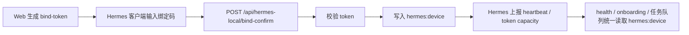
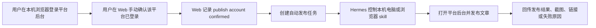

# GEO 投放助手：Hermes 商用绑定逻辑收敛方案

版本：v1.0  
日期：2026-06-06  
实施：2026-06-06（mock 绑定已移除，health/onboarding 统一读 `hermes:device`）  
范围：整理 Hermes 设备绑定、健康检查、任务提交就绪判断，并明确发布账号“绑定”的产品边界。

---

## 1. 结论

真实商用期只保留一条 Hermes 设备绑定链路：



开发连调期如果 `8642 API Server` 可用，可以不要求绑定；商用 Pull 模式下必须以 `hermes:device` 作为唯一设备绑定数据源。

因此建议：

1. 保留 `createHermesBindToken()`，负责生成一次性绑定码。
2. 保留 `confirmHermesLocalBinding()`，作为 Hermes 客户端真实绑定入口。
3. 保留 `/api/hermes-local/heartbeat`、`deviceIdHash`、任务 Pull 和结果回传。
4. 移除或仅 dev 环境保留 `/api/hermes/bind-confirm` 与 `mockConfirmHermesBinding()`。
5. 停止写入和读取 `hermes:device_binding`，统一读取 `hermes:device`。
6. UI 移除“模拟绑定”按钮，避免用户误以为 Web 可以代替 Hermes 客户端完成绑定。

一句话：`apiGatewayOk === true` 是开发直连就绪；`hermes:device` 是商用设备绑定事实。

---

## 2. 当前代码现状

### 2.1 现有两条绑定路径

| 路径 | 入口 | 服务函数 | 存储 key | 当前定位 |
|---|---|---|---|---|
| A：Web/mock 绑定 | `POST /api/hermes/bind-confirm` | `mockConfirmHermesBinding()` | `hermes:device_binding` | 连调前演示 / 历史占位 |
| B：Hermes local 真实绑定 | `POST /api/hermes-local/bind-confirm` | `confirmHermesLocalBinding()` | `hermes:device` | 商用目标链路 |

关键文件：

| 文件 | 现状 |
|---|---|
| `server/services/hermes-binding.service.ts` | 生成 bind-token；读取设备状态；仍保留 `BINDING_KEY = hermes:device_binding` 和 mock confirm |
| `server/services/hermes-local.service.ts` | 真实绑定、心跳、词元能力状态、任务拉取、进度/结果/artifact 回传 |
| `server/routes/hermes.ts` | 暴露 `/api/hermes/health`、`/api/hermes/bind-token`、`/api/hermes/bind-confirm` |
| `server/routes/hermes-local.ts` | 暴露真实客户端链路 `/api/hermes-local/*` |
| `src/lib/hermes-client.ts` | 同时有 `createHermesBindToken()` 和 `confirmHermesBinding()` |
| `src/components/hermes/HermesExecutorPanel.tsx` | 展示生成绑定码和“模拟绑定”按钮 |
| `server/services/onboarding.service.ts` | `hermesReady` 已允许 `apiGatewayOk` 绕过绑定直接提交任务 |

### 2.2 当前真正决定能否跑任务的判断

`server/services/onboarding.service.ts` 中的核心逻辑：

```ts
const hermesReady =
  (health.apiGatewayOk ||
    (Boolean(device) && healthOk)) &&
  (!tokenCapacity ||
    (tokenCapacity.tokenCapacityStatus === 'available' &&
      tokenCapacity.modelRuntimeStatus === 'available'));
```

含义：

1. `health.apiGatewayOk === true`：开发/本机直连模式，Web 后端可以通过 8642 推送任务，不需要绑定。
2. `Boolean(device) && healthOk`：Pull 或真实设备模式，需要已写入 `hermes:device`，并且健康检查可用。
3. `tokenCapacity` 如果存在，必须可用；如果尚未上报，则暂不阻塞。

这个判断本身方向是对的，问题是 UI 和接口仍保留了另一套 mock 绑定，容易让状态来源变得含糊。

---

## 3. 商用期目标状态

### 3.1 数据源

商用期只允许一个设备绑定事实：

```text
systemConfig.key = "hermes:device"
```

字段建议：

| 字段 | 说明 |
|---|---|
| `deviceIdHash` | Hermes 设备摘要 ID，Pull、heartbeat、结果回传都使用它校验 |
| `deviceName` | 客户端上报的可读设备名 |
| `hermesVersion` | Hermes 客户端版本 |
| `geoSkillsVersion` | GEO skill 版本 |
| `boundAt` | 绑定时间 |
| `lastHeartbeatAt` | 最近心跳时间 |
| `tokenCapacityStatus` | 词元能力状态 |
| `modelRuntimeStatus` | 模型运行状态 |
| `provider` | 词元/模型供应来源摘要 |

不再使用：

```text
systemConfig.key = "hermes:device_binding"
```

### 3.2 API 契约

保留：

| API | 调用方 | 说明 |
|---|---|---|
| `POST /api/hermes/bind-token` | Web | 生成一次性绑定码 |
| `GET /api/hermes/health` | Web | 聚合展示 API Server、设备、心跳、词元能力状态 |
| `GET /api/hermes/skills` | Web | 展示 GEO skill 能力 |
| `POST /api/hermes-local/bind-confirm` | Hermes 客户端 | 使用绑定码完成真实设备绑定 |
| `POST /api/hermes-local/heartbeat` | Hermes 客户端 | 上报设备在线状态 |
| `POST /api/hermes-local/token-capacity/status` | Hermes 客户端 | 上报词元/模型能力 |
| `GET /api/hermes-local/tasks/next` | Hermes 客户端 | Pull 模式拉取任务 |
| `POST /api/hermes-local/tasks/:id/progress` | Hermes 客户端 | 回传进度 |
| `POST /api/hermes-local/tasks/:id/result` | Hermes 客户端 | 回传结果 |
| `POST /api/hermes-local/tasks/:id/artifacts` | Hermes 客户端 | 回传产物 |

删除或降级：

| API | 处理建议 |
|---|---|
| `POST /api/hermes/bind-confirm` | 生产环境删除；如要保留，只在显式 dev/demo flag 下开启 |

### 3.3 状态语义

| 状态 | 商用含义 | 是否可提交 GEO 任务 |
|---|---|---|
| `api_gateway_ready` | 开发直连 8642 可用 | 是 |
| `bound_online` | 已绑定设备且心跳在线 | 是 |
| `bound_offline` | 已绑定但心跳离线 | Pull 模式否；可提示打开 Hermes |
| `not_bound` | 未完成 Hermes 客户端绑定 | 否，除非 `apiGatewayOk === true` |
| `token_capacity_unavailable` | 词元/模型能力不可用 | 否 |
| `offline` | 未检测到 Hermes | 否 |

重点：开发直连可用时，UI 不应提示“必须绑定”。商用 Pull 模式下，UI 应提示“在 Hermes 客户端输入绑定码”。

---

## 4. 具体改动清单

### 4.1 后端服务

#### `server/services/hermes-binding.service.ts`

建议改造：

1. 删除 `BINDING_KEY = 'hermes:device_binding'`。
2. 删除 `BindingState`、`writeBinding()`、`mockConfirmHermesBinding()`。
3. `readBinding()` 改名为 `readHermesDeviceBindingSummary()` 或直接内联读取 `getHermesDevice()`。
4. `getHermesExtendedHealth()` 只从 `getHermesDevice()` 读取绑定状态。
5. `createHermesBindToken()` 保留，但返回中文文案需要修复编码。

目标行为：

```ts
const device = await getHermesDevice();

return {
  bound: Boolean(device),
  boundDevice: device?.deviceName ?? null,
  clientVersion: device?.hermesVersion ?? health.desktopAppVersion ?? null,
  heartbeat: heartbeatOnline ? 'online' : health.desktopRunning ? 'desktop_running' : 'offline',
  apiGatewayOk: health.apiGatewayOk ?? false,
};
```

#### `server/routes/hermes.ts`

建议改造：

1. 删除 `mockConfirmHermesBinding` import。
2. 删除生产环境的 `POST /api/hermes/bind-confirm`。
3. 如果演示仍需要，改为：

```ts
if (process.env.HERMES_ENABLE_MOCK_BIND === 'true') {
  app.post('/api/hermes/bind-confirm', ...);
}
```

但更推荐完全移除，因为商用期不应让 Web 伪造设备绑定。

#### `server/services/hermes-local.service.ts`

建议保留主体逻辑，并补强：

1. `confirmHermesLocalBinding()` 成功后只写 `hermes:device`。
2. 绑定成功后继续推进 `pending_setup + hermes_not_bound` 任务。
3. `hashDeviceId(deviceName, hermesVersion)` 可短期保留；商用更稳妥的是由 Hermes 客户端上报稳定设备摘要，平台只保存摘要，不保存硬件明文。
4. 所有错误中文文案修复编码。
5. 后续可增加 `organizationId/userId` 维度，避免多租户下所有用户共用一个全局设备 key。

### 4.2 前端 API client

#### `src/lib/hermes-client.ts`

建议改造：

1. 保留 `createHermesBindToken()`。
2. 删除 `confirmHermesBinding()`，因为 Web 不再模拟确认绑定。
3. `HermesHealth` 中补充或明确 `tokenCapacity` 类型，如果 UI 要展示词元状态。

### 4.3 前端 UI

#### `src/components/hermes/HermesExecutorPanel.tsx`

建议改造：

1. 删除“模拟绑定（演示）”按钮。
2. 生成绑定码后，只展示“请在 Hermes 客户端输入此绑定码”。
3. 当 `health.apiGatewayOk === true` 时，展示“开发直连已就绪，可直接执行任务”，不把未绑定渲染成阻塞。
4. 当 `!health.apiGatewayOk && !health.bound` 时，再展示“等待 Hermes 客户端绑定”。
5. 修复当前文件中的中文编码损坏。

#### `src/components/onboarding/OnboardingConsoleView.tsx`

建议改造：

1. 保留当前“8642 API Server 连调不需要绑定”的说明。
2. 如果 `apiGatewayOk === true`，首启页不展示绑定阻塞态。
3. 如果 `apiGatewayOk !== true` 且 `!device`，展示商用绑定步骤。
4. 文案区分：
   - 开发期：开启 API Server 8642。
   - 商用期：在 Hermes 客户端输入绑定码。
5. 修复中文编码损坏。

#### `src/components/common/HermesConnectionIndicator.tsx`

建议改造：

1. `apiGatewayOk` 优先视为 `ready`，当前逻辑已符合。
2. `running_unbound` 文案需要改成“开发直连未开启 / 商用待绑定”，避免单一“待绑定”误导。
3. 修复中文编码损坏。

#### `src/components/geo/HermesReadinessPanel.tsx`

建议改造：

1. `needs_setup` 的详情文案不要再固定写“安装、绑定并开启 API Server”。
2. 根据模式输出：
   - 开发：请开启 Hermes API Server 8642。
   - 商用：请在 Hermes 客户端完成绑定并保持在线。
3. `ensureHermesReadyForSubmit()` 继续使用 `readinessUiState`，但 readiness 状态来源应统一。

---

## 5. 兼容与迁移策略

### 5.1 短期兼容

为了不破坏现有开发演示，可以分两步：

第一步：逻辑收敛但不删路由。

1. `getHermesExtendedHealth()` 改为只读 `hermes:device`。
2. `/api/hermes/bind-confirm` 加 dev flag。
3. UI 删除模拟绑定按钮。
4. 保留 `hermes:device_binding` 数据但不再读取。

第二步：删除 mock。

1. 删除 `mockConfirmHermesBinding()`。
2. 删除 `/api/hermes/bind-confirm`。
3. 删除 `confirmHermesBinding()` 前端 client。
4. 增加一次 systemConfig 清理脚本，删除 `hermes:device_binding`。

### 5.2 数据迁移

如果已有 `hermes:device_binding` 演示数据，不建议迁移为真实 `hermes:device`，因为它缺少可信 `deviceIdHash` 和客户端心跳来源。

推荐：

```text
hermes:device_binding -> 直接废弃
hermes:device -> 由 Hermes 客户端 bind-confirm 重新写入
```

开发环境可手动清理：

```sql
DELETE FROM SystemConfig WHERE key = 'hermes:device_binding';
```

具体表名以 Prisma schema 映射为准。

---

## 6. 安全与多租户注意事项

当前 `systemConfig` 是全局 key/value，适合本地 POC，但商用 SaaS 需要增加组织或用户维度。

建议后续模型：

```text
HermesDevice
- id
- organizationId
- userId
- deviceIdHash
- deviceName
- hermesVersion
- geoSkillsVersion
- boundAt
- lastHeartbeatAt
- status
- revokedAt
```

绑定 token 建议模型：

```text
HermesBindToken
- tokenHash
- organizationId
- userId
- expiresAt
- usedAt
- createdAt
```

安全规则：

1. 绑定码只保存 hash，避免明文 token 泄露。
2. 绑定码一次性使用，15 分钟过期。
3. `deviceIdHash` 只作为设备摘要，不保存硬件明文。
4. `heartbeat`、`tasks/next`、`result` 必须校验设备属于当前组织。
5. 设备解绑后拒绝继续拉任务和回传结果。

---

## 7. 验收标准

### 开发连调模式

1. Hermes 8642 API Server 可用时，`/api/hermes/health` 返回 `apiGatewayOk: true`。
2. `apiGatewayOk: true` 时，即使 `bound: false`，首启页和 GEO 提交前校验也允许执行任务。
3. UI 不展示“必须绑定才能执行”的阻塞文案。

### 商用 Pull 模式

1. Web 能生成绑定码。
2. Web 不能模拟确认绑定。
3. Hermes 客户端调用 `/api/hermes-local/bind-confirm` 后写入 `hermes:device`。
4. `/api/hermes/health` 从 `hermes:device` 展示已绑定设备和心跳。
5. 未绑定设备不能调用 `tasks/next`、`progress`、`result`、`artifacts`。
6. 绑定后，`pending_setup + hermes_not_bound` 任务能推进到 `waiting_local_device` 或 `queued`。
7. 删除 `hermes:device_binding` 后，UI 状态不受影响。

### 文案与体验

1. “绑定 Hermes 设备”和“发布平台账号绑定”在 UI 文案中明确区分。
2. 不再出现“模拟绑定”按钮。
3. 当前开发期说明清楚写明：8642 直连可执行任务，绑定码为商用预留。
4. 中文文案无乱码。

---

## 8. 建议实施顺序

1. 修复中文编码损坏，避免改造时误判业务文案。
2. 后端 health 读取收敛到 `hermes:device`。
3. 前端删除 mock confirm client 和“模拟绑定”按钮。
4. `/api/hermes/bind-confirm` 加 dev flag 或删除。
5. 首启页和 readiness 面板按 `apiGatewayOk` 与 `device` 分模式展示。
6. 增加 smoke check：
   - `apiGatewayOk=true` 且 `device=null` 时可提交。
   - `apiGatewayOk=false` 且 `device=null` 时阻塞。
   - `apiGatewayOk=false` 且 `device+heartbeat` 时可提交。
7. 最后清理 `hermes:device_binding` 旧 key。

---

## 9. 与发布平台账号绑定的边界

Hermes 设备绑定只回答：

```text
哪台本机 Hermes 可以替当前 GEO 用户执行 Agent/GEO 任务？
```

发布平台账号绑定只回答：

```text
用户是否确认本机浏览器已经登录小红书、知乎、公众号等发布后台，可由 Hermes 控制浏览器执行发布？
```

两者不能混用：

1. 提交 GEO 体检、专业审计、资产生成任务，不需要发布平台账号绑定。
2. 自动发布到官方平台前，只校验用户是否手动确认过对应平台账号已在本机浏览器登录。
3. Hermes 设备绑定不代表用户已授权任何发布平台账号。
4. 发布平台账号确认也不代表 Hermes 执行器已在线。

### 9.1 发布账号确认不是接口授权

当前产品不应把“发布账号绑定”设计成平台 OAuth 或接口授权，因为多数发布平台无法稳定提供可用的发布 API，项目也无法从服务端直接获取用户本地浏览器的登录态。

真实执行方式是：



因此，发布账号状态应定义为“用户声明 + 最近一次 Hermes 校验/执行证据”，而不是“平台接口返回的授权状态”。

建议状态：

| 状态 | 含义 | 来源 |
|---|---|---|
| `not_confirmed` | 用户未确认本机已登录该平台 | Web 表单 |
| `confirmed_by_user` | 用户手动确认已登录 | 用户点击确认 |
| `verified_by_hermes` | Hermes 最近一次打开后台并确认登录态可用 | Hermes browser/computer skill 回传 |
| `login_expired` | Hermes 执行时发现登录失效 | Hermes 执行失败原因 |
| `publish_blocked` | 平台风控、验证码、权限不足等导致暂不可发布 | Hermes 执行失败原因 |

### 9.2 UI 与文案建议

发布账号页不写“授权成功”或“接口已绑定”，改为：

1. “我已在本机浏览器登录小红书后台”
2. “我已在本机浏览器登录知乎账号”
3. “我已在本机浏览器登录公众号后台”
4. “让 Hermes 检查登录状态”
5. “最近一次检查：可用 / 登录已失效 / 需要人工处理验证码”

自动发布前的校验也应改为：

```text
平台账号未确认：请先在本机浏览器登录目标平台后台，并在发布账号页手动确认。
```

而不是：

```text
平台账号未授权，请绑定 API 账号。
```

### 9.3 后续代码影响

这条产品边界会影响以下模块的命名和校验：

| 模块 | 调整方向 |
|---|---|
| `AccountBinding` / 发布账号相关 UI | 从“绑定/授权”改为“本机登录确认/最近检查” |
| 自动发布 gate | 校验用户确认状态 + Hermes 就绪，不校验平台 API token |
| Hermes 发布 skill | 负责打开本机浏览器后台、检测登录态、发布、截图取证 |
| 发布记录 | 保存 Hermes 回传的截图、发布链接、失败原因和人工处理提示 |
| 数据回传 | 如果没有平台接口，只能依赖 Hermes 浏览器读取或用户手动补充 |

结论：发布账号“绑定”本质是本机登录态确认和自动化执行前置条件，不是服务端可验证的三方授权。
