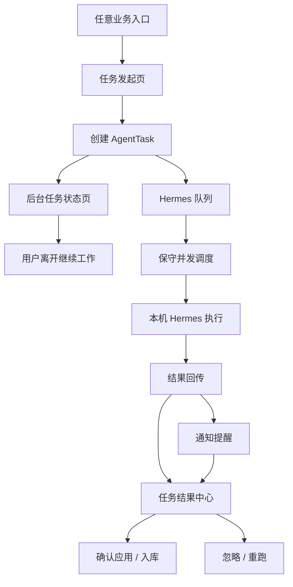

# GEO 投放助手：Hermes 异步任务流程 GUI 重设计规范

版本：v1.0  
日期：2026-06-07  
定位：这是新的 GUI 流程设计规范，不是旧页面修补方案。  
关联技术计划：[`GEO投放助手_Hermes保守并发与桌面端保护迭代计划.md`](./GEO投放助手_Hermes保守并发与桌面端保护迭代计划.md)

---

## 1. 设计结论

Hermes 接入后的发布端 GUI 不应继续围绕“用户停留在某个功能页等待结果”来设计，而应改为：

```text
发起任务
  -> 后台执行
  -> 通知召回
  -> 结果中心确认
  -> 应用 / 入库 / 发布 / 忽略
```

因此本次 GUI 不是在旧页面上继续塞状态卡，而是新增一套“后台任务工作流”：

1. **任务发起页**只负责收集业务目标和创建任务。
2. **后台任务状态页**负责告诉用户任务已进入 Hermes 队列，可以离开。
3. **通知中心**负责召回，但不承担完整结果处理。
4. **结果中心**负责统一承载 Hermes 返回结果，并执行确认/应用/落库。
5. **Hermes 执行器页**负责设备、配对、并发额度和桌面端保护，不再混在发布账号登录态里当附属卡片。

旧页面不是废弃，而是降级为入口或详情：

| 旧页面 | 新定位 |
|---|---|
| 发布账号管理 | 只管理平台账号登录态；Hermes 执行器从这里拆出独立状态页 |
| 通知中心 | 结果召回入口；待处理结果跳转到结果中心 |
| 发布任务页 | 任务创建入口；提交后进入后台任务状态页 |
| 任务运行日志 | 技术诊断页；不作为普通用户处理结果的主入口 |
| 快速发起项目弹窗 | 首启/轻量入口；提交后进入后台任务状态页 |

---

## 2. 新信息架构

### 2.1 发布端导航调整

建议发布端一级导航变为：

```text
工作台
品牌管理
GEO 分析
排名监控
发布任务
任务结果
内容与发布
发布账号
本机 Hermes
账户资金
```

其中新增两个关键入口：

1. **任务结果**：所有 Hermes/Agent 结果统一收件箱。
2. **本机 Hermes**：设备配对、并发额度、桌面端保护、技能状态。

如果不想新增一级导航，可以短期放在工作台顶部和 Header 菜单里，但产品结构上必须承认它们是独立流程。

### 2.2 主流程



---

## 3. GUI 设计原则

1. **业务语言优先**：用户看到“后台处理、排队、待确认、已应用”，不看到 `run_id`、`8642`、`_MAX_CONCURRENT_RUNS`。
2. **任务发起和结果处理分离**：发起页不展示复杂结果，结果页不重复发起表单。
3. **统一结果容器**：无论 Hermes 返回品牌资料、关键词、GEO 报告、发布证据，都进入同一结果中心。
4. **并发策略可解释但不打扰**：默认展示“保守模式”，只有展开后才解释分析 2 / 发布 1 / 总 3。
5. **桌面端保护可见**：用户要知道 GEO 不会抢占他正在使用的 Hermes 桌面端。
6. **配置问题给动作**：未启用 API Server、词元不可用、技能缺失时，页面给“打开 Hermes / 查看设置 / 重新检测”，而不是只报错。

---

## 4. 新页面一：本机 Hermes

### 4.1 页面定位

这是一个独立的执行器控制台，面向普通商家展示“本机 Hermes 是否可用、后台任务额度、是否保护桌面端使用”。

不再把 Hermes 作为“发布账号管理”下的一块卡片。发布账号管理只关注各平台登录态。

### 4.2 线框图

```text
┌────────────────────────────────────────────────────────────────────────────┐
│ 本机 Hermes                                      [重新检测] [打开 Hermes] │
├────────────────────────────────────────────────────────────────────────────┤
│ 本机 Hermes 会在你的电脑上执行 GEO 分析、内容生成、账号检测和自动发布。    │
│ 为避免影响你正常使用桌面端，系统默认开启保守模式。                         │
│                                                                            │
│ ┌──────────────┐ ┌──────────────┐ ┌──────────────┐ ┌──────────────┐       │
│ │ 连接状态      │ │ 设备配对      │ │ 模型能力      │ │ GEO 技能      │       │
│ │ 已连接        │ │ 已配对/直连   │ │ 可用          │ │ 已就绪        │       │
│ └──────────────┘ └──────────────┘ └──────────────┘ └──────────────┘       │
│                                                                            │
│ ┌──────────────────────────────────────────────────────────────────────┐   │
│ │ 后台任务额度                                                         │   │
│ │ 当前模式：保守                                                       │   │
│ │ 分析任务：0 / 2    发布任务：0 / 1    总任务：0 / 3                  │   │
│ │ [保守] [平衡] [加速]                                                  │   │
│ │ 说明：发布和账号操作始终串行，避免影响平台登录态。                   │   │
│ └──────────────────────────────────────────────────────────────────────┘   │
│                                                                            │
│ ┌──────────────────────────────────────────────────────────────────────┐   │
│ │ 桌面端保护                                                           │   │
│ │ [开启] 当你正在 Hermes 桌面端工作时，GEO 会暂停领取新的发布任务。     │   │
│ │ 当前桌面端：空闲                                                     │   │
│ └──────────────────────────────────────────────────────────────────────┘   │
│                                                                            │
│ ┌──────────────────────────────────────────────────────────────────────┐   │
│ │ 诊断与配置                                                           │   │
│ │ [打开设置说明] [生成绑定码] [技能清单] [运行日志]                     │   │
│ └──────────────────────────────────────────────────────────────────────┘   │
└────────────────────────────────────────────────────────────────────────────┘
```

### 4.3 异常态

```text
┌────────────────────────────────────────────────────────────────────────────┐
│ 本机 Hermes                                                                │
├────────────────────────────────────────────────────────────────────────────┤
│ ⚠ 需要完成 Hermes 设置                                                     │
│                                                                            │
│ 检测到 Hermes 已运行，但后台任务接口未开启。                               │
│ 请在 Hermes 桌面端打开 Settings -> Platforms -> API Server。                │
│                                                                            │
│ [打开 Hermes] [查看设置说明] [重新检测]                                     │
└────────────────────────────────────────────────────────────────────────────┘
```

---

## 5. 新页面二：后台任务状态页

### 5.1 页面定位

用户提交任务后进入这个页面。它不是任务详情页，也不是日志页，而是一个“你可以离开”的过渡页。

### 5.2 排队状态

```text
┌────────────────────────────────────────────────────────────────────────────┐
│ 后台任务已提交                                                             │
├────────────────────────────────────────────────────────────────────────────┤
│ ┌──────────────────────────────────────────────────────────────────────┐   │
│ │ AI 制定接单投放方案                                                  │   │
│ │ 状态：排队中                                                         │   │
│ │ 前面还有 1 个分析任务。                                               │   │
│ │                                                                      │   │
│ │ 本机 Hermes 会在后台处理，完成后通过通知提醒你。                      │   │
│ │ 你可以先去处理其他工作。                                              │   │
│ │                                                                      │   │
│ │ [返回工作台] [查看任务日志] [继续创建任务]                            │   │
│ └──────────────────────────────────────────────────────────────────────┘   │
│                                                                            │
│ 为什么排队？                                                               │
│ 当前为保守模式：分析任务最多同时 2 个，发布任务一次只执行 1 个。             │
└────────────────────────────────────────────────────────────────────────────┘
```

### 5.3 执行中状态

```text
┌────────────────────────────────────────────────────────────────────────────┐
│ Hermes 正在后台处理                                                        │
├────────────────────────────────────────────────────────────────────────────┤
│ 进度 35%                                                                  │
│ 正在读取 GEO 报告并拆解投放任务包。                                         │
│                                                                            │
│ [完成后通知我] [查看实时日志] [返回工作台]                                  │
└────────────────────────────────────────────────────────────────────────────┘
```

### 5.4 完成状态

```text
┌────────────────────────────────────────────────────────────────────────────┐
│ 任务完成，等待确认                                                         │
├────────────────────────────────────────────────────────────────────────────┤
│ Hermes 已生成投放任务包。                                                   │
│ 请进入结果中心确认是否应用。                                                │
│                                                                            │
│ [查看结果] [稍后处理]                                                       │
└────────────────────────────────────────────────────────────────────────────┘
```

---

## 6. 新页面三：任务结果中心

### 6.1 页面定位

这是最核心的新页面。所有 Hermes 返回数据都进入这里承载。

它解决三个问题：

1. 用户离开发起页后，结果仍有明确位置。
2. 所有结果都先预览，再确认应用或入库。
3. 通知中心、工作台、任务列表都可以跳到同一个结果页面。

### 6.2 结果收件箱

```text
┌────────────────────────────────────────────────────────────────────────────┐
│ 任务结果                                                                   │
├────────────────────────────────────────────────────────────────────────────┤
│ [待处理 3] [执行中 1] [已应用] [已忽略] [失败]                              │
│                                                                            │
│ ┌──────────────────────────────────────────────────────────────────────┐   │
│ │ 待确认应用                                                           │   │
│ │ GEO 专业审计完成                                                     │   │
│ │ 发现 5 项内容缺口与行动计划。                                         │   │
│ │ 品牌：云杉口腔 · 本机 Hermes · 2026/6/7 13:27                         │   │
│ │ [查看结果] [忽略]                                                     │   │
│ └──────────────────────────────────────────────────────────────────────┘   │
│                                                                            │
│ ┌──────────────────────────────────────────────────────────────────────┐   │
│ │ 需要手动处理                                                         │   │
│ │ Hermes 发布部分完成                                                  │   │
│ │ 小红书 2 篇已发布，公众号 1 篇需要重新登录。                          │   │
│ │ [查看证据] [去处理账号]                                               │   │
│ └──────────────────────────────────────────────────────────────────────┘   │
└────────────────────────────────────────────────────────────────────────────┘
```

### 6.3 结果详情

```text
┌────────────────────────────────────────────────────────────────────────────┐
│ 任务结果详情                                      [返回结果中心] [查看日志] │
├────────────────────────────────────────────────────────────────────────────┤
│ GEO 专业审计完成                                                           │
│ 品牌：云杉口腔 · 执行器：本机 Hermes · 状态：待确认应用                    │
│                                                                            │
│ ┌──────────────────────────────────────────────────────────────────────┐   │
│ │ 结果摘要                                                             │   │
│ │ 发现 5 项内容缺口、3 项技术问题、2 个可立即生成的整改任务。           │   │
│ └──────────────────────────────────────────────────────────────────────┘   │
│                                                                            │
│ ┌──────────────────────────────┐ ┌─────────────────────────────────────┐  │
│ │ 结构化结果                    │ │ 证据与日志                           │  │
│ │ - 内容缺口                    │ │ - 执行步骤                            │  │
│ │ - Schema 建议                 │ │ - 生成的 artifact                     │  │
│ │ - llms.txt 建议               │ │ - 原始输出                            │  │
│ └──────────────────────────────┘ └─────────────────────────────────────┘  │
│                                                                            │
│ [确认应用] [生成整改任务包] [忽略本次结果] [重新生成]                       │
└────────────────────────────────────────────────────────────────────────────┘
```

### 6.4 不同结果类型的主动作

| 任务类型 | 主动作 | 次动作 |
|---|---|---|
| 品牌资料提取 | 确认写入品牌资料 | 忽略 / 重跑 |
| 关键词挖掘 | 确认加入关键词库 | 调整分组 / 重跑 |
| 知识库抽取 | 确认加入知识库 | 忽略 / 重跑 |
| GEO 审计 | 生成整改任务包 | 查看报告 / 忽略 |
| 内容生成 | 加入内容库 | 去审稿 / 重跑 |
| 自动发布 | 查看发布证据 | 去处理账号 / 重试失败项 |
| 账号检测 | 更新账号状态 | 重新检测 |

---

## 7. 通知中心改造

通知中心不再承载完整处理，而是作为入口。

### 7.1 新通知项规范

```text
┌──────────────────────────────────────────────────────────────────────┐
│ 待确认应用                                                           │
│ GEO 专业审计完成                                                     │
│ Hermes 已完成后台分析，请确认是否生成整改任务包。                    │
│ [查看结果]                                                           │
└──────────────────────────────────────────────────────────────────────┘
```

字段规范：

| 字段 | 示例 |
|---|---|
| 状态标签 | 待确认应用 / 需要手动处理 / 已应用 / 失败 |
| 标题 | GEO 专业审计完成 |
| 摘要 | 发现 5 项内容缺口与行动计划 |
| 操作 | 查看结果 |

### 7.2 通知跳转规则

```text
通知 refType = agent_task
通知 refId = taskId
actionView = agent_task_result
```

通知点击后进入：

```text
/?view=agent_task_result&taskId=xxx
```

---

## 8. 任务发起页改造

任务发起页继续保留业务表单，但新增提交前状态条和提交后跳转。

### 8.1 提交前状态条

```text
┌──────────────────────────────────────────────────────────────────────┐
│ 本机 Hermes 已就绪 · 保守模式 · 当前可处理新分析任务                  │
│ 发布任务将串行执行，避免影响你的平台登录态。                          │
└──────────────────────────────────────────────────────────────────────┘
```

异常时：

```text
┌──────────────────────────────────────────────────────────────────────┐
│ 需要完成 Hermes 设置后才能执行后台任务                                │
│ [打开 Hermes] [查看设置说明] [重新检测]                                │
└──────────────────────────────────────────────────────────────────────┘
```

### 8.2 提交后行为

旧行为：

```text
留在原页面等结果或跳到运行日志
```

新行为：

```text
创建任务成功
  -> 跳转后台任务状态页
  -> 允许用户离开
  -> 完成后通知
  -> 进入结果中心
```

---

## 9. 工作台改造

工作台只做摘要，不承载复杂处理。

```text
┌────────────────────────────────────────────────────────────────────────────┐
│ 工作台                                                                     │
├────────────────────────────────────────────────────────────────────────────┤
│ ┌──────────────────────────────┐ ┌───────────────────────────────────────┐ │
│ │ 本机 Hermes                  │ │ 待处理结果                             │ │
│ │ 已就绪 · 保守模式            │ │ 3 条待确认 / 1 条异常                   │ │
│ │ 分析 0/2 · 发布 0/1          │ │ [进入任务结果]                          │ │
│ │ [查看本机 Hermes]            │ └───────────────────────────────────────┘ │
│ └──────────────────────────────┘                                           │
│                                                                            │
│ 原有指标、趋势、发布与收录模块保持                                         │
└────────────────────────────────────────────────────────────────────────────┘
```

---

## 10. 快速发起项目改造

快速发起弹窗继续保留轻量输入，但底部必须接入 Hermes 就绪状态和提交后去向。

```text
┌──────────────────────────────────────────────────────────────────────┐
│ 为「云杉口腔」启动项目                                                │
├──────────────────────────────────────────────────────────────────────┤
│ [官网] [海报/PPT] [小红书/抖音] [描述]                                 │
│                                                                      │
│ 官网 URL                                                              │
│ [https://www.example.com                                      ]       │
│                                                                      │
│ 本机 Hermes：已就绪 · 保守模式                                        │
│ 提交后将在后台整理品牌资料，完成后通知你确认。                         │
│                                                                      │
│ [取消] [创建后台任务]                                                  │
└──────────────────────────────────────────────────────────────────────┘
```

提交后不继续留在弹窗，而是进入后台任务状态页。

---

## 11. 组件规范

### 11.1 Hermes 状态徽标

用于 Header 和卡片顶部。

| 状态 | 文案 | 颜色 |
|---|---|---|
| ready | Hermes 已就绪 | 绿色 |
| busy | Hermes 后台处理中 | 蓝色 |
| protected | 桌面端保护中 | 琥珀色 |
| setup_required | 需要设置 Hermes | 红色/琥珀色 |
| offline | Hermes 未运行 | 灰色 |

### 11.2 后台额度组件

```text
保守模式
分析 0/2 · 发布 0/1 · 总 0/3
```

展开后显示解释，不默认展开工程细节。

### 11.3 结果状态标签

| 状态 | 文案 |
|---|---|
| queued | 排队中 |
| running | 执行中 |
| pending_apply | 待确认应用 |
| applied | 已应用 |
| manual_required | 需要手动处理 |
| rejected | 已忽略 |
| failed | 失败 |

---

## 12. 路由建议

新增视图：

```ts
type ViewType =
  | 'hermes_console'
  | 'agent_task_result'
  | 'agent_task_results'
  | 'agent_task_submitted'
```

路由行为：

| view | 用途 |
|---|---|
| `hermes_console` | 本机 Hermes 独立状态页 |
| `agent_task_results` | 任务结果中心列表 |
| `agent_task_result` | 单个结果详情 |
| `agent_task_submitted` | 提交后后台状态页 |

旧路由兼容：

| 旧入口 | 新跳转 |
|---|---|
| 通知 `agent_tasks` | 如果任务有 output，跳 `agent_task_result` |
| 发起任务成功 | 跳 `agent_task_submitted` |
| Header Hermes 状态 | 跳 `hermes_console` |

---

## 13. 与旧页面的关系

这份 GUI 规范不是在旧页面中继续增加卡片，而是定义新流程。

旧页面保留策略：

1. `AccountBindingView` 保留发布账号登录态管理。
2. `HermesExecutorPanel` 可迁移为 `HermesConsoleView` 的一部分。
3. `NotificationsView` 保留消息列表，但待处理结果跳到结果中心。
4. `AgentTasksView` 保留为运行日志和技术诊断，不作为普通用户主入口。
5. `CreateOrderView` 保留表单，但提交成功后跳后台状态页。
6. `QuickStartModal` 保留输入方式，但提交成功后跳后台状态页。

---

## 14. 迭代拆分

### Phase 1：新流程骨架

1. 新增 `hermes_console` 页面。
2. 新增 `agent_task_submitted` 页面。
3. 新增 `agent_task_results` 和 `agent_task_result` 页面。
4. 通知中心跳转结果详情。
5. 发起任务成功跳后台状态页。

### Phase 2：结果确认能力迁移

1. 品牌资料、关键词、知识库确认能力迁入结果详情页。
2. GEO 报告和整改任务包生成接入结果详情页。
3. 发布证据和账号异常接入结果详情页。

### Phase 3：并发与桌面端保护可视化

1. Hermes Console 展示后台额度。
2. 提交前状态条展示当前可执行性。
3. 桌面端保护中时，新发布任务显示等待原因。
4. 运行日志保留高级诊断。

---

## 15. 验收标准

1. 用户能从 Header 或侧边栏进入“本机 Hermes”，而不是必须去发布账号页找执行器。
2. 用户提交任务后看到“后台任务已提交”，并明确知道可以离开页面。
3. 用户收到通知后进入任务结果详情，而不是只进入运行日志。
4. 所有 Hermes 返回结果都能在任务结果中心找到。
5. 需要落库或应用的数据必须经过结果详情页确认。
6. 发布类任务显示串行原因。
7. Hermes 未设置好时，页面提供打开 Hermes 和查看设置说明的动作。
8. 普通用户路径不出现 `8642`、`run_id`、`_MAX_CONCURRENT_RUNS` 等工程字段。

