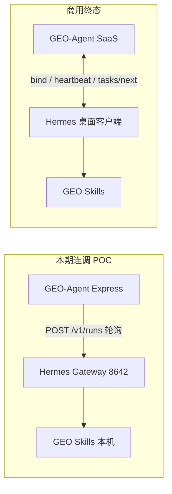

# GEO 投放助手 · Hermes 本机对接最佳方案与本期连调范围

> **文档版本**：v1.0  
> **更新日期**：2026-06-06  
> **状态**：方案定稿 · **不在本期实现**  
> **本期目标**：手动完成 Hermes 环境配置，优先 **8642 接口 + Skill 文件对接 + 项目内缺失 Skill 开发**  
> **关联文档**：[`Hermes-POC.md`](./Hermes-POC.md) · [`GEO-SKILL-INPUT-MAPPING.md`](./GEO-SKILL-INPUT-MAPPING.md) · [`GEO投放助手_Hermes产品与内置GEO技能连调缺口清单.md`](./GEO投放助手_Hermes产品与内置GEO技能连调缺口清单.md) · [`GEO投放助手_本机Hermes首启与真实调用商用迭代方案.md`](./GEO投放助手_本机Hermes首启与真实调用商用迭代方案.md)

---

## 1. 文档目的

本文回答三个问题：

1. **Hermes ↔ GEO 长期最佳对接方案是什么**（含 API Server 一键开启、安装目录、商用拉取模式）——供后续迭代，**本期不写代码**。
2. **换电脑 / 新环境时，开发者现在应如何手动配置**，以便立刻开始连调。
3. **本期连调应聚焦什么、刻意不做什么**，避免与 Skill 对接工作抢优先级。

---

## 2. 结论摘要

| 主题 | 结论 |
|------|------|
| 检测提示「Gateway 已启动，8642 未开」 | **检测正确**，不是找不到 Hermes；需在 Hermes 内开启 API Server 并重启 Gateway |
| 选安装目录 `D:\Hermes` | **不能替代**开 API Server；安装目录 ≠ 数据目录（配置在 `%LOCALAPPDATA%\hermes`） |
| GEO 能否一键开启 8642 | **本期不做**；技术上可写 `.env` + 调 9120 接口，但 9120 改配置接口需 Session Token，需 Hermes 提供 Partner API |
| **本期优先级** | ① 手动开 8642 → ② `/v1/runs` 真跑通 → ③ Skill 入参/出参契约 → ④ 补未接入 taskType / Skill |
| **商用终态** | Hermes **主动拉取** GEO 任务（`/api/hermes-local/*`），不依赖平台访问用户本机 8642 |

---

## 3. 架构分层（现在 vs 终态）



| 模式 | 触发方 | 端口 | 适用阶段 |
|------|--------|------|----------|
| **Push（Gateway）** | GEO 后端调本机 8642 | 8642 | 开发机 / POC / 联调 |
| **Desktop 状态探测** | GEO 读 9120 `/api/status` | 9120 | 仅诊断，不能执行任务 |
| **Pull（Hermes-Local）** | Hermes 调 GEO `/api/hermes-local/*` | HTTPS | 商用 SaaS（已实现骨架，待 Hermes 客户端对接） |

**原则**：Skill 定义与执行逻辑在 **Hermes 本机**；GEO 只做 **任务编排、入参归一化、结果落库、报告展示**。

---

## 4. 最佳方案（后续迭代，本期不实现）

### 4.1 产品体验目标

用户侧只应看到：**「本机 Hermes 已就绪，可以检测」**，不应暴露 Gateway、8642、config.yaml、Session Token 等概念。

### 4.2 推荐实现路径（分阶段）

#### 阶段 A · 连调期（当前手动 + 文档）

- 开发者按 §5 手动开 API Server。
- GEO 检测页动态展示 `hermes_home`、`config_path`（来自 9120，不写死 `D:\Hermes` 或 `win11` 路径）。
- 验收脚本：`scripts/hermes-smoke.sh`、`scripts/verify-geo-api-payload.ts`。

#### 阶段 B · GEO 辅助配置（小改动，可选）

GEO 首启页增加 **「写入 API Server 配置」**（用户确认后）：

1. 读取 9120 `/api/status` 得到 `env_path`、`config_path`。
2. 向 `%LOCALAPPDATA%\hermes\.env` 追加（若不存在）：
   ```env
   API_SERVER_ENABLED=true
   API_SERVER_PORT=8642
   API_SERVER_KEY=<GEO 生成或用户输入>
   ```
3. 提示用户在 Hermes 客户端 **重启 Gateway**（GEO 无法无 Token 调用 `POST /api/gateway/restart`）。

**局限**：仍有一步「重启 Gateway」；不能从 GEO 完全静默开启。

#### 阶段 C · Hermes Partner API（推荐，需 Hermes 产品实现）

Hermes 9120 增加本机可信接口（示例）：

| 接口 | 说明 |
|------|------|
| `POST /api/partner/geo/enable-api-server` | 开启 api_server platform + 写 env + restart gateway |
| `GET /api/partner/geo/status` | 返回 8642 是否可用、skill 清单、hermes_home |
| `POST /api/partner/geo/bind` | 绑定 GEO 平台（替代纯 Web 绑定码） |

鉴权：一次性配对码 / 本机 IPC / 固定 loopback shared secret（仅 127.0.0.1）。

**触发时机**：用户在 GEO 点「连接本机 Hermes」→ Hermes 弹窗确认 → 自动 `enabled=true` + restart → GEO 检测通过。

#### 阶段 D · 商用 Pull 模式（终态）

按 [`GEO投放助手_本机Hermes首启与真实调用商用迭代方案.md`](./GEO投放助手_本机Hermes首启与真实调用商用迭代方案.md)：

- Hermes 绑定 GEO 后 **默认开启** 任务拉取，**不强制** 用户理解 8642。
- 8642 仅保留给 Open WebUI / 开发者调试。
- GEO Worker：`shouldPushHermesTasksViaGateway()` 为 false 时走 `hermes-local` 拉取队列。

### 4.3 为何不优先「选安装目录」

| 路径类型 | 示例 | GEO 是否需要 |
|----------|------|--------------|
| 安装目录 | `D:\Hermes\汇智爱马仕助手.exe` | 低：仅用于「打开客户端」 |
| 数据目录 `HERMES_HOME` | `%LOCALAPPDATA%\hermes` | 中：读版本、写配置、定位 skills |
| 运行时 API | `9120` / `8642` | **高**：检测与执行任务的真实依据 |

9120 `/api/status` 已返回 `hermes_home`、`config_path`，**应优先消费 API**，而非让用户手选 `D:\Hermes`。

### 4.4 明确不做（本期）

- [ ] GEO 内「选择 Hermes 安装目录」UI
- [ ] GEO 一键开启 API Server（无 Hermes Partner API）
- [ ] 修改 Hermes 客户端源码（归属 Hermes 仓库）
- [ ] 商用 Pull 模式与 8642 双轨并行产品化

---

## 5. 手动配置指南（本期开发者必做）

### 5.1 环境清单

| 组件 | 本机示例 | 验证命令 |
|------|----------|----------|
| GEO-Agent | `D:\GEO-Agent` | `npm run dev` → `http://localhost:3000` |
| Hermes 安装 | `D:\Hermes\汇智爱马仕助手.exe` | 客户端已打开 |
| Hermes 数据 | `C:\Users\<你>\AppData\Local\hermes` | 见 9120 status |
| Skills | `%LOCALAPPDATA%\hermes\skills\geo\` | 目录下各有 `SKILL.md` |
| API Server | `http://127.0.0.1:8642` | 见下方 health |

### 5.2 开启 API Server（三选一）

**方式 A · Hermes 客户端 UI（推荐）**

1. 打开汇智爱马仕助手，保持 Gateway 运行。
2. 设置 → **Platforms → API Server** → `enabled = true`，端口 `8642`。
3. （可选）设置 `API_SERVER_KEY`。
4. **保存 → 重启 Gateway**。
5. GEO 首启页点「我已安装，检测一下」。

**方式 B · 编辑 `.env`**

文件：`%LOCALAPPDATA%\hermes\.env`

```env
API_SERVER_ENABLED=true
API_SERVER_PORT=8642
API_SERVER_KEY=dev-geo-local-key
```

保存后在 Hermes 内 **重启 Gateway**。

**方式 C · Hermes CLI**（若 PATH 中有 `hermes`）

```powershell
hermes config set API_SERVER_ENABLED true
hermes config set API_SERVER_KEY dev-geo-local-key
hermes config set API_SERVER_PORT 8642
hermes gateway restart
```

### 5.3 对齐 GEO-Agent `.env`

项目根目录 `.env`：

```env
DATABASE_URL="file:./dev.db"
APP_URL="http://localhost:3000"

HERMES_EXECUTOR=nous_hermes
HERMES_API_URL=http://127.0.0.1:8642
HERMES_API_KEY=dev-geo-local-key
```

`HERMES_API_KEY` 须与 Hermes 侧 `API_SERVER_KEY` 一致（若 Hermes 未设 Key，loopback 可留空，两边都留空即可）。

### 5.4 验收步骤

```powershell
# 1. 桌面状态（应 gateway_running: true）
Invoke-RestMethod http://127.0.0.1:9120/api/status

# 2. API Server（应返回 200，非「无法连接」）
Invoke-RestMethod http://127.0.0.1:8642/health

# 3. GEO 健康
Invoke-RestMethod http://localhost:3000/api/hermes/health

# 4. 入参映射脚本
npx tsx scripts/verify-geo-skill-input.ts
npx tsx scripts/verify-geo-api-payload.ts
```

**通过标准**：

- `/api/hermes/health` → `apiGatewayOk: true`，`mode: api_gateway`
- 提交 `geo_quick_start` 任务 → Agent 任务页出现 Hermes `externalRunId`，状态进入 `running` → `succeeded`

### 5.5 常见问题

| 现象 | 原因 | 处理 |
|------|------|------|
| `gateway_health_url: null` | API Server 未启用 | §5.2 |
| 8642 连接被拒绝 | Gateway 未重启 | Hermes 内重启 Gateway |
| 检测到了 v0.14.0 仍 warning | 正常中间态 | 完成 §5.2 后再检测 |
| Skill 找不到 | skills 未安装到 `hermes_home/skills/geo` | 从 Hermes 包或 `hermes-agent/skills/geo` 同步 |
| 任务 failed「无法连接 Hermes」 | `.env` 未设 `HERMES_EXECUTOR=nous_hermes` 或 8642 未开 | §5.3 + §5.2 |

---

## 6. 本期连调范围（In Scope）

### 6.1 P0 · 必须先通

| # | 工作项 | 说明 | 代码/脚本入口 |
|---|--------|------|---------------|
| 1 | **8642 真连接** | 手动 §5，禁止依赖 Mock 降级跑「假成功」 | `.env`、`/api/hermes/health` |
| 2 | **Executor 走 Hermes** | `HERMES_EXECUTOR=nous_hermes` + `skill_routes.executor` | `server/agent/executors/index.ts` |
| 3 | **`/v1/runs` 提交与轮询** | `metadata.skill` + `metadata.input` 传参 | `server/agent/executors/hermes.ts` |
| 4 | **入参归一化** | 旧字段 → `brandUrl` / `brandCity` 等 | `server/lib/hermes-geo-input.ts` |
| 5 | **首个 Skill 端到端** | 建议从 `geo-quick-start` 开始 | `GeoQuickStartView`、onboarding |
| 6 | **输出落库** | `audit/data/metrics/findings/actionPlan/artifacts` | `server/agent/task-success.ts` |

### 6.2 P0 · Skill 与 taskType 对接

对照 [`GEO-SKILL-INPUT-MAPPING.md`](./GEO-SKILL-INPUT-MAPPING.md)：

**已映射、优先真跑验收**

| taskType | skillName | 前端入口 |
|----------|-----------|----------|
| `geo_quick_start` | `geo-quick-start` | GeoQuickStartView、Onboarding |
| `geo_audit` | `geo-audit` | GeoAuditView |
| `geo_schema` | `geo-schema` | GeoAssetsView |
| `geo_llmstxt` | `geo-llmstxt` | GeoAssetsView |
| `geo_citability` | `geo-citability` | GeoAssetsView |
| `brand_extract` | `geo-brand-mentions` | BrandClueStartFlow |
| `geo_report_pdf` | `geo-report-pdf` | 报告页（部分） |
| `geo_compare` | `geo-compare` | 报告历史（部分） |

**本机有 SKILL.md、GEO 尚未完整接入（本期 Skill 开发/backlog）**

| skillName | 建议 taskType | 缺口 |
|-----------|---------------|------|
| `geo-technical` | `geo_technical` | 无 taskType、无专用入口 |
| `geo-crawlers` | `geo_crawlers` | 同上 |
| `geo-content` | `geo_content` | 同上 |
| `geo-platform-optimizer` | `geo_platform_optimizer` | 同上 |
| `geo-report` | `geo_client_report` | 汇总型，依赖前置 audit 输出 |
| `geo-proposal` | `geo_proposal` | 商务向，无入口 |
| `geo-prospect` | `geo_prospect` | CRM 向，无入口 |

**Skill 文件位置（本机）**

```
%LOCALAPPDATA%\hermes\skills\geo\
  geo-quick-start\SKILL.md
  geo-audit\SKILL.md
  geo-schema\SKILL.md
  …（共 15 个执行/汇总/商务 skill）
```

连调时以 **`SKILL.md` 内定义的入参/输出** 为准，GEO 侧 `normalizeGeoSkillInput` / `buildSkillPayloadForHermes` 须与之一致；不一致处记 Issue，**优先改 GEO 映射层**，不轻易改已发布 Skill 契约。

### 6.3 P0 · 接口契约（GEO → Hermes）

当前 `NousHermesExecutor` 请求体（`POST /v1/runs`）：

```json
{
  "input": "自然语言 + 结构化 JSON 说明",
  "instructions": "…Required skill: geo-quick-start…",
  "metadata": {
    "taskId": "uuid",
    "type": "geo_quick_start",
    "skill": "geo-quick-start",
    "brandName": "云杉口腔",
    "input": { "brandName": "…", "brandUrl": "…", "platforms": ["DeepSeek","豆包","Kimi"] },
    "outputContract": {
      "format": "json",
      "requiredFields": ["audit", "data", "metrics", "findings", "artifacts", "actionPlan"]
    }
  }
}
```

**本期要验证并文档化的点**：

1. Hermes Gateway 是否从 `metadata.skill` 加载对应 `SKILL.md`（而非纯自然语言猜测）。
2. `metadata.input` 字段名是否与 Skill 表单 / `SKILL.md` 一致（标准名见 GEO-SKILL-INPUT-MAPPING §3）。
3. Run 完成后 `output` JSON 是否可被 `parseHermesRunOutput` + `createGeoReportFromTaskOutput` 消费。
4. `artifacts[]`（md/pdf/截图）路径或 URL 如何回传 GEO（若 Skill 写本地文件，需约定上传或相对路径解析）。

### 6.4 P1 · 本期可做、不阻塞首条链路

- `geo-audit` 深度模式 + 子模块 `modules[]`
- `geo-report-pdf` / `geo-compare` 完整报告链
- `account_verify` / `hermes_publish` 与本机浏览器登录态（依赖 Hermes 工具集）
- `hermes-local` 拉取模式与 8642 对比测试（单轨即可）

---

## 7. 本期明确不做（Out of Scope）

| 项 | 原因 |
|----|------|
| GEO 一键开启 API Server / 选安装目录 | 见 §4，留给阶段 B/C |
| Hermes 客户端「绑定 GEO」产品化 UI | 需 Hermes 版本计划 |
| 新增 6 个未接入 skill 的完整产品页 | 先通 P0 八个 taskType 的真跑 |
| 报告模型大改（分项评分、PDF 全字段） | Mock 结构可先落库，UI 后续迭代 |
| 平台端 Hermes 运维 / 远程诊断 | 非连调阻塞 |
| Mock 降级掩盖 Hermes 离线 | 连调期应 fail fast，便于查问题 |

---

## 8. 连调执行顺序（建议）

```text
Week 1  环境
  └─ §5 手动开 8642 + GEO .env
  └─ health / smoke 全绿

Week 1–2  单 Skill 通路
  └─ geo-quick-start：提交 → poll → output 落 GeoReport
  └─ 对照 SKILL.md 修正 hermes-geo-input / task-success

Week 2  扩展 Skill
  └─ geo-audit → geo-schema / geo-llmstxt / geo-citability
  └─ brand_extract → geo-brand-mentions

Week 3  缺口 Skill（项目内开发）
  └─ 新增 taskType：geo_technical, geo_crawlers, geo_content, geo_platform_optimizer
  └─ 更新 agent-skill.ts、AgentTaskType、必要前端入口
  └─ 若 Hermes 侧 SKILL.md 缺失字段，在 skills/geo 下补文档或脚本

Week 4+  汇总 / 商用
  └─ geo-report / geo-report-pdf / geo-compare 链
  └─ 评估 Pull 模式 vs 8642 双轨
```

---

## 9. 验收清单（本期 Definition of Done）

### 环境

- [ ] `curl http://127.0.0.1:8642/health` 成功
- [ ] `GET /api/hermes/health` → `apiGatewayOk: true`
- [ ] `.env` 含 `HERMES_EXECUTOR=nous_hermes`

### 接口

- [ ] `POST /api/agent-tasks` 创建 `geo_quick_start` 后，`executor` 为 `nous_hermes`
- [ ] DB 中任务有 `externalRunId`
- [ ] `GET /api/agent-tasks/:id` 状态可达 `succeeded`，`output` 含 `audit` 或 `data`

### Skill 文件

- [ ] 本机 `%LOCALAPPDATA%\hermes\skills\geo\geo-quick-start\SKILL.md` 存在且与提交 payload 字段一致
- [ ] `npx tsx scripts/verify-geo-api-payload.ts` 无报错
- [ ] 至少 **3 个** GEO skill（quick-start + audit + 任一资产 skill）真跑成功并生成报告

### 文档

- [ ] 连调问题记录到 `docs/GEO投放助手_缺口Issue清单.md` 或新 Issue
- [ ] 新发现的入参差异回写 `GEO-SKILL-INPUT-MAPPING.md`

---

## 10. 相关代码索引

| 模块 | 路径 |
|------|------|
| Hermes 执行器 | `server/agent/executors/hermes.ts` |
| 执行器路由 | `server/agent/executors/index.ts` |
| Skill 名映射 | `server/lib/agent-skill.ts` |
| 入参归一化 | `server/lib/hermes-geo-input.ts` |
| 任务成功落库 | `server/agent/task-success.ts` |
| Hermes 健康 API | `server/routes/hermes.ts` → `hermes-binding.service.ts` |
| Hermes Local（Pull） | `server/routes/hermes-local.ts` |
| 首启 / 检测 UI | `src/components/onboarding/OnboardingConsoleView.tsx` |
| 验证脚本 | `scripts/verify-geo-skill-input.ts`、`scripts/verify-geo-api-payload.ts`、`scripts/hermes-smoke.sh` |

---

## 11. 修订记录

| 版本 | 日期 | 说明 |
|------|------|------|
| v1.0 | 2026-06-06 | 初版：最佳方案 + 本期 out-of-scope + 手动配置 + Skill 连调范围 |
