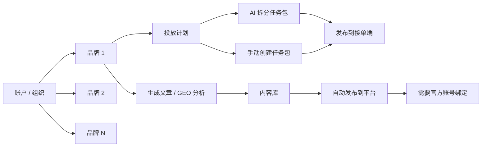
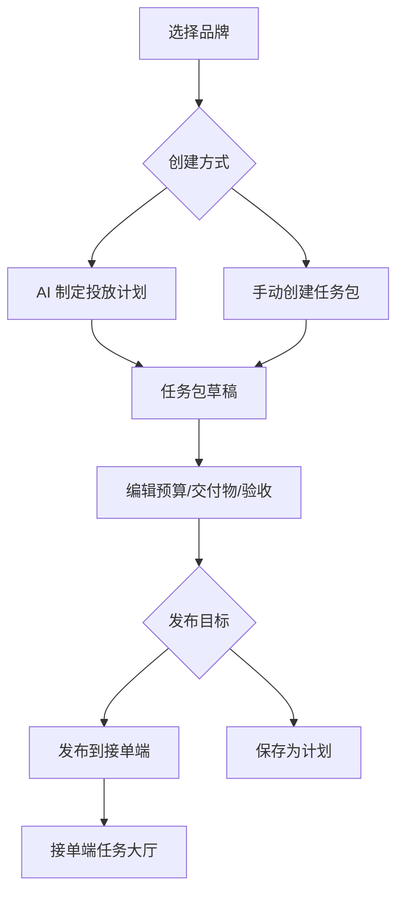

# GEO 投放助手 v1.1 产品结构优化方案

日期：2026-06-03  
关联主文档：[GEO投放助手_正式开发版_PRD_v1.1_最新设计风格.md](./GEO投放助手_正式开发版_PRD_v1.1_最新设计风格.md)  
优化主题：多品牌账户、投放计划与找人投放合并、发布任务不依赖官方账号绑定、算力与投放资金双账户统一  

---

## 目录

- [1. 优化结论](#1-优化结论)
- [2. 问题一：一个账户需要支持多个品牌](#2-问题一一个账户需要支持多个品牌)
- [3. 问题二：投放计划和找人投放功能重复](#3-问题二投放计划和找人投放功能重复)
- [4. 问题三：发布任务不应该需要官方绑定账户](#4-问题三发布任务不应该需要官方绑定账户)
- [5. 问题四：算力账户与投放账户统一但分池](#5-问题四算力账户与投放账户统一但分池)
- [6. 信息架构调整](#6-信息架构调整)
- [7. 数据对象调整](#7-数据对象调整)
- [8. 页面与交互调整](#8-页面与交互调整)
- [9. 研发影响](#9-研发影响)
- [10. 验收标准](#10-验收标准)
- [11. 协议与隐私政策草案](#11-协议与隐私政策草案)

---

## 1. 优化结论

### 1.1 必须调整

1. 一个登录账户必须支持管理多个品牌。品牌是组织下的业务资产，不是账户本身。
2. “投放计划”和“找人投放”存在功能重叠，应合并为一个“投放计划”主入口，内部支持 AI 拆分任务包和手动创建任务包。
3. 发布任务到接单端不需要绑定小红书、知乎、公众号等官方账号。官方账号绑定只影响“自动发布到平台”或“数据回传”，不影响“把任务发给别人接单”。
4. 算力的钱在 Agent 云 Token 工场注册充值，投放的钱在 GEO 投放助手本平台充值；两个平台账号身份统一，但资金池、用途和流水必须分离。

### 1.2 调整后的产品逻辑

---

## 2. 问题一：一个账户需要支持多个品牌

### 2.1 当前问题

主 PRD 中“品牌账户”容易被理解成“一个账户对应一个品牌”。真实使用场景中，一个商家主体、代理商或运营人员通常需要管理多个品牌，例如：

1. 一个连锁集团管理多个门店品牌。
2. 一个代理商代运营多个客户品牌。
3. 一个商家同时经营主品牌、子品牌、区域品牌。

如果账户和品牌绑定过死，会导致：

1. 用户频繁切换账号。
2. 投放余额、AI 算力、团队权限难以共享。
3. 代理商场景无法落地。
4. 品牌数据隔离和权限管理混乱。

### 2.2 优化方案

账户体系调整为：

| 层级 | 说明 |
|---|---|
| User | 登录用户，代表一个自然人 |
| Organization | 商家主体、代理商主体或团队 |
| Brand | 组织下的品牌，可有多个 |
| BrandMemberPermission | 用户在某品牌下的权限 |

### 2.3 页面调整

#### 品牌账户

“品牌账户”模块改为“品牌与账户”，内部结构：

| 页面 | 说明 |
|---|---|
| 品牌列表 | 展示当前组织下全部品牌 |
| 品牌资料 | 新增/编辑单个品牌 |
| 账号绑定 | 按品牌维度绑定平台账号，可选 |
| AI 算力 | 组织级算力账户，可按品牌记录消耗 |
| 投放余额 | 组织级余额账户，可按品牌记录预算和流水 |
| 团队权限 | 组织成员和品牌权限 |
| 系统设置 | 组织级设置 |

#### 顶部品牌切换器

发布端顶部需要增加品牌切换器：

1. 默认选中最近使用品牌。
2. 支持搜索品牌名称。
3. 支持“全部品牌”视图，用于内容库、订单、流水聚合。
4. 创建任务时必须选择具体品牌。

### 2.4 权限规则

1. 组织管理员可查看全部品牌。
2. 普通成员只可查看授权品牌。
3. 财务角色可看组织级余额，但品牌流水按权限展示。
4. 品牌被归档后，不出现在默认任务创建入口，但历史数据仍可查。

---

## 3. 问题二：投放计划和找人投放功能重复

### 3.1 当前问题

主 PRD 中“投放计划”和“找人投放”都在做：

1. 选择品牌。
2. 填投放目标。
3. 选择平台和任务类型。
4. 设置预算、交付物、验收标准。
5. 发布给接单端。

这会导致：

1. 用户不知道应该从哪个入口创建任务。
2. 页面和接口重复。
3. 后续统计和订单归因混乱。
4. AI 生成任务包和手动发单割裂。

### 3.2 优化方案

保留一个主入口：**投放计划**。

“找人投放”不再作为一级导航独立存在，改为投放计划内的一种创建方式：

| 入口 | 新位置 | 说明 |
|---|---|---|
| 制定投放计划 | 投放计划 / AI 制定计划 | 基于目标或 GEO 报告生成任务包 |
| 找人投放 | 投放计划 / 手动创建任务包 | 用户直接创建一个或多个任务包 |
| 发布到接单端 | 投放计划详情页动作 | 将选中的任务包发布到任务大厅 |

### 3.3 新投放计划页面结构

| 区域 | 内容 |
|---|---|
| 顶部 | 品牌、投放目标、来源报告，可选 |
| 创建方式 | AI 制定计划 / 手动创建任务包 |
| 任务包列表 | 平台、任务类型、接单方类型、预算、交付物、验收 |
| 预算摘要 | 可用余额、预计占用、余额不足提示 |
| 右侧助手 | 规划助手、预算建议、风险提示 |
| 操作 | 保存计划、发布选中任务包、全部发布 |

### 3.4 任务包创建方式

#### AI 制定计划

1. 用户输入目标。
2. 可选择 GEO 报告作为依据。
3. Hermes Skill 生成任务包草稿。
4. 用户编辑后发布。

#### 手动创建任务包

1. 用户点击“新建任务包”。
2. 手动填写平台、类型、预算、交付物、验收方式。
3. 可一次创建多个任务包。
4. 发布逻辑与 AI 任务包一致。

### 3.5 导航调整

发布端一级导航建议：

| 原导航 | 新导航 |
|---|---|
| 生成文章 | 保留 |
| GEO 分析 | 保留 |
| 投放计划 | 保留并强化 |
| 创建网页 | 保留 |
| 找人投放 | 移除一级导航，合并进投放计划 |
| 内容库 | 保留 |
| 订单交付 | 保留 |
| Agent 任务 | 保留 |
| 品牌账户 | 调整为品牌与账户 |

---

## 4. 问题三：发布任务不应该需要官方绑定账户

### 4.1 当前问题

主 PRD 中存在“发布文章必须检查账号绑定”“发布任务包前可能校验账号绑定”的表述，容易把两种不同动作混在一起：

1. **发布到接单端**：把任务包发给服务商/达人/写手接单。
2. **自动发布到内容平台**：把文章或内容发布到小红书、知乎、公众号等官方平台。

发布到接单端不需要官方账号绑定，因为接单方可能使用自己的账号、达人账号、媒体资源或人工执行。要求商家绑定官方账号会阻塞核心投放任务。

### 4.2 优化规则

| 动作 | 是否需要官方账号绑定 | 需要校验 |
|---|---|---|
| 发布任务包到接单端 | 否 | 品牌、预算、交付物、验收方式 |
| 手动创建任务包 | 否 | 品牌、任务类型、预算、验收方式 |
| AI 生成投放计划 | 否 | 品牌资料、可选 GEO 报告、AI 算力 |
| 接单方交付内容 | 否 | 接单方资质、交付物 |
| 商家自动发布文章到小红书/知乎/公众号 | 是 | 账号绑定、平台权限、发布确认 |
| 自动获取平台数据回传 | 是 | 授权状态、回传权限 |

### 4.3 账号绑定的新定位

账号绑定模块只服务：

1. 商家自己的官方账号自动发布。
2. 官方账号内容数据回传。
3. 官方账号授权健康度检查。
4. 发布后链接/数据自动同步。

账号绑定不服务：

1. 发布任务到接单端。
2. 找达人/写手/服务商接单。
3. 平台派单。
4. 接单方使用自己资源交付。

### 4.4 页面提示调整

在投放计划发布任务包时：

1. 不提示“请先绑定小红书/知乎/公众号账号”。
2. 只提示“任务将发布到接单端，由接单方按交付要求完成”。
3. 如果任务要求“使用商家官方账号发布”，才提示需绑定对应账号或改为“接单方账号发布/人工交付”。

---

## 5. 问题四：算力账户与投放账户统一但分池

### 5.1 当前问题

AI 算力、投放余额、后台加款和账号体系如果混在一个“账户中心”语义下，会导致用户和研发都误解资金用途：

1. 用户可能误以为在本平台充值的投放余额可以用于大模型 API 调用。
2. 用户可能误以为在 Agent 云充值的算力可以用于支付接单端任务。
3. 若继续使用“后台加款/人工入账”为主路径，不符合真实产品前台自助充值要求。
4. 两个平台如果分别注册，会导致用户身份、发票、流水、权限和品牌归属割裂。

### 5.2 优化结论

1. 算力的钱在 Agent 云 Token 工场注册和充值，入口为 `https://www.agentsyun.com/hub/keys`。
2. 投放的钱在 GEO 投放助手本平台充值，用于发布任务、冻结预算、订单验收和投放交付结算。
3. 两个平台账户应统一：同一手机号/账号主体可在 Agent 云和 GEO 投放助手间打通身份。
4. 两个平台资金池必须分离：算力余额和投放余额不能互相抵扣、混用或自动划转。
5. 本平台不走“后台加款”为主逻辑，前台必须提供真实充值方案；后台只保留异常处理、退款、人工校正和审计能力。

### 5.3 双账户模型

| 账户 | 所属平台 | 充值入口 | 用途 | 是否可互转 |
|---|---|---|---|---|
| AI 算力账户 | Agent 云 Token 工场 | `https://www.agentsyun.com/hub/keys` | 模型调用、GEO 分析、文章生成、Hermes Skill 消耗 | 否 |
| 投放余额账户 | GEO 投放助手 | GEO 投放助手前台充值页 | 任务包预算、接单端任务、网站订单、冻结和验收结算 | 否 |

### 5.4 统一账户规则

| 能力 | 规则 |
|---|---|
| 登录身份 | 两个平台使用统一手机号/账号主体，支持同一用户身份映射 |
| 组织主体 | GEO 投放助手以 `Organization` 管理多品牌；Agent 云可关联同一主体的算力账户 |
| 品牌维度 | 算力消耗和投放支出都需要记录 `brand_id`，便于品牌成本核算 |
| 流水展示 | GEO 投放助手可展示算力同步摘要，但算力充值详情跳转 Agent 云 |
| 发票/账单 | 两个平台分别按实际收费主体和服务内容出具账单或发票 |
| 协议同意 | 用户首次使用两个平台时，应分别同意对应用户协议和隐私政策 |

### 5.5 前台充值方案

#### AI 算力充值

1. GEO 投放助手的“AI 算力”页面展示当前算力余额、最近同步时间和消耗流水摘要。
2. 点击“充值算力”跳转 Agent 云 Token 工场：`https://www.agentsyun.com/hub/keys`。
3. 用户在 Agent 云完成注册、登录、充值和密钥管理。
4. GEO 投放助手通过账户映射或接口同步算力余额和消耗记录。
5. 算力不足时，生成文章、GEO 分析、网页生成等 AI 能力应提示前往 Agent 云充值。

#### 投放余额充值

1. GEO 投放助手提供本平台前台充值页，不以后台加款作为主流程。
2. 用户选择充值金额、支付方式、开票信息，确认后生成充值订单。
3. 支付成功后自动入账到 `BudgetAccount`，并写入 `BudgetLedger`。
4. 支付失败、取消、退款、人工校正都必须有状态和审计日志。
5. 平台端只处理异常订单、退款审核、流水校正和财务对账。

### 5.6 页面调整

| 页面 | 调整 |
|---|---|
| 品牌与账户 / AI 算力 | 展示算力余额和消耗，充值按钮跳转 Agent 云 |
| 品牌与账户 / 投放余额 | 展示投放可用余额、冻结金额、充值按钮、充值订单和流水 |
| 账户中心 | 明确“AI 算力”和“投放余额”为两个资金池 |
| 任务发布页 | 发布任务包只校验投放余额，不校验 AI 算力 |
| GEO 分析/生成文章页 | 创建 AI 任务校验算力，不校验投放余额 |

---

## 6. 信息架构调整

### 6.1 发布端新导航

| 导航 | 说明 |
|---|---|
| 生成文章 | 生成 GEO 友好文章，可进入内容库或自动发布 |
| GEO 分析 | 分析品牌表现，输出报告和建议 |
| 投放计划 | AI 制定计划、手动任务包、发布到接单端 |
| 创建网页 | 创建落地页/品牌页需求和预览 |
| 内容库 | 管理文章、报告摘要、网页内容 |
| 订单交付 | 查看任务订单、网站订单、验收返修 |
| Agent 任务 | 查看异步任务和执行日志 |
| 品牌与账户 | 多品牌、账号绑定、AI 算力、投放余额、团队权限 |

### 6.2 任务创建路径

---

## 7. 数据对象调整

### 7.1 多品牌账户

新增或明确：

| 对象 | 说明 |
|---|---|
| Organization | 组织/商家主体/代理商主体 |
| Brand | 组织下品牌 |
| OrganizationMember | 组织成员 |
| BrandMemberPermission | 成员在品牌维度的权限 |
| BrandSwitchContext | 前端当前品牌上下文，可由 session 或用户偏好保存 |
| ExternalAccountLink | GEO 账户与 Agent 云账户的统一身份映射 |

### 7.2 投放计划与任务包

统一模型：

| 对象 | 说明 |
|---|---|
| CampaignPlan | 投放计划，承载目标、来源报告、品牌、预算摘要 |
| TaskPackageDraft | 任务包草稿，既可 AI 生成，也可手动创建 |
| TaskOrder | 发布到接单端后的真实任务订单 |

废弃独立语义：

| 原对象/概念 | 调整 |
|---|---|
| 找人投放独立入口 | 合并到 `CampaignPlan` 的手动任务包创建 |
| FindPublisherTaskDraft | 不单独新增，使用 `TaskPackageDraft` |

### 7.3 账号绑定

`AccountBinding` 需要绑定到品牌维度：

| 字段 | 说明 |
|---|---|
| organization_id | 所属组织 |
| brand_id | 所属品牌 |
| platform | 平台 |
| account_name | 账号名称 |
| permissions | 授权范围 |
| status | 授权状态 |

### 7.4 算力与投放资金

| 对象 | 说明 |
|---|---|
| AiCreditAccountMirror | Agent 云算力账户在 GEO 投放助手中的同步镜像 |
| AiCreditSyncLog | 算力同步记录 |
| BudgetAccount | GEO 投放助手投放余额账户 |
| BudgetRechargeOrder | 前台充值订单 |
| BudgetLedger | 投放余额流水 |
| BudgetAdjustment | 异常校正记录，不作为正常充值入口 |

---

## 8. 页面与交互调整

### 8.1 品牌列表

新增品牌列表作为品牌与账户的默认页：

1. 展示组织下全部品牌。
2. 支持搜索、状态筛选、行业筛选。
3. 支持新增品牌、编辑品牌、归档品牌。
4. 支持设置默认品牌。

### 8.2 顶部品牌切换器

所有发布端业务页面都应带品牌上下文：

1. 生成文章、GEO 分析、投放计划、创建网页必须选择单个品牌。
2. 内容库、订单交付、流水支持单品牌或全部品牌。
3. 无品牌时引导新增品牌。

### 8.3 投放计划页面

调整后页面动作：

1. “AI 制定计划”。
2. “手动新建任务包”。
3. “发布选中任务包到接单端”。
4. “保存计划”。

不再出现独立“找人投放”一级页面。

### 8.4 账号绑定提示

账号绑定提示只在以下动作出现：

1. 自动发布文章到平台。
2. 自动同步官方账号数据。
3. 检查官方账号授权健康度。

发布任务包到接单端不展示账号绑定拦截。

### 8.5 AI 算力页

1. 展示 Agent 云算力余额、已消耗、最近同步时间。
2. 主按钮为“前往 Agent 云充值”。
3. 充值跳转到 `https://www.agentsyun.com/hub/keys`。
4. 页面说明：算力用于 AI 分析、内容生成、Hermes Skill 调用，不用于投放任务支付。

### 8.6 投放余额页

1. 展示本平台可用余额、冻结金额、累计充值、累计消耗。
2. 主按钮为“充值投放余额”。
3. 充值在 GEO 投放助手前台完成，生成充值订单和支付流水。
4. 页面说明：投放余额用于任务预算、接单端订单和网站订单，不用于 AI 模型调用。

---

## 9. 研发影响

### 9.1 必改

1. 主导航移除“找人投放”一级入口。
2. 投放计划支持 AI 生成和手动任务包两种创建方式。
3. 发布任务包接口不能依赖 `AccountBinding`。
4. 账户模型支持组织下多品牌。
5. 账号绑定改为品牌维度，并只影响自动发布/数据回传。
6. AI 算力充值跳转 Agent 云，不在 GEO 投放助手内直接收取算力费用。
7. 投放余额必须在 GEO 投放助手前台直接充值，不以后台加款为主流程。
8. 两个平台账户身份需要统一映射，但资金池必须分离。

### 9.2 PRD 需同步修订位置

| 主 PRD 位置 | 调整 |
|---|---|
| 5.1 发布端导航 | 移除找人投放，品牌账户改为品牌与账户 |
| 6.3 投放计划流程 | 加入手动创建任务包 |
| 6.5 找人投放流程 | 合并进投放计划，章节标记废弃或迁移 |
| 7.3 制定投放计划 | 增加创建方式切换 |
| 7.5 找人投放 | 改为投放计划内说明 |
| 7.9 品牌账户 | 明确多品牌 |
| 13.3 发布前校验 | 发布任务包不校验账号绑定 |
| 16 验收标准 | 增加多品牌和任务发布不依赖绑定账号 |
| 品牌与账户 / AI 算力 | 充值入口改为 Agent 云 |
| 品牌与账户 / 投放余额 | 改为本平台前台直充和充值订单 |

---

## 10. 验收标准

1. 一个组织下可以创建多个品牌。
2. 用户可以在发布端顶部切换品牌。
3. 生成文章、GEO 分析、投放计划创建时必须绑定一个品牌。
4. 内容库和订单交付可以按品牌筛选，也可以查看全部品牌。
5. “找人投放”不再作为一级导航出现。
6. 投放计划页面可以 AI 生成任务包，也可以手动创建任务包。
7. 发布任务包到接单端不要求绑定小红书/知乎/公众号官方账号。
8. 只有自动发布到官方平台或同步官方账号数据时，才校验账号绑定。
9. 发布任务包成功后生成真实 `TaskOrder`，进入接单端任务大厅。
10. AI 算力充值入口跳转 Agent 云 Token 工场。
11. GEO 投放助手提供投放余额前台充值页，充值成功后自动入账。
12. 后台加款不作为正常充值流程，只作为异常校正并写审计。
13. AI 算力余额和投放余额在页面上明确分池展示，不允许互相抵扣。

---

## 11. 协议与隐私政策草案

> 说明：以下为产品与研发评审用草案，结构参考 Agent 云注册充值场景下的用户协议和隐私政策入口，但未直接复制第三方协议正文。正式上线前必须由法务根据运营主体、支付通道、发票、退款、数据处理、模型服务商和第三方平台规则复核。

### 11.1 Agent 云算力服务用户协议草案

#### 服务范围

1. Agent 云算力服务面向用户提供大模型 API 聚合、推理调用、密钥管理、算力充值、用量查询和相关技术服务。
2. 用户可在 `https://www.agentsyun.com/hub/keys` 注册、充值、创建或管理 API Key。
3. 算力余额仅用于模型调用、AI 分析、内容生成、Hermes Skill 调用等技术服务，不用于 GEO 投放助手内的任务预算、接单服务或网站订单支付。

#### 账户与安全

1. 用户应使用真实、有效的手机号、邮箱或第三方登录方式注册。
2. 用户应妥善保管账号、密码、API Key、访问令牌和调用凭据。
3. 因用户泄露 API Key、共享账号或未及时停用密钥造成的损失，由用户自行承担，但平台应提供必要的密钥停用、重置和风险提示能力。
4. Agent 云账户可与 GEO 投放助手账户进行身份映射，但不代表两个平台资金可互转或混用。

#### 充值、消耗与退款

1. 用户在 Agent 云完成算力充值后，充值金额进入 AI 算力账户。
2. 算力消耗按实际模型、服务商、调用量、上下文长度、工具调用等计费规则扣减。
3. 用户应在充值前确认价格、计费规则、有效期和发票规则。
4. 已消耗算力不支持退款；未消耗余额的退款、赠送额度、活动额度处理，以 Agent 云页面规则和适用法律为准。
5. 因模型服务商波动、网络异常、限流或不可抗力导致调用失败的，应按平台展示的失败记录、重试记录和实际扣费记录处理。

#### 用户行为规范

用户不得利用 Agent 云服务：

1. 生成、传播违法违规、侵权、欺诈、骚扰、仇恨、色情低俗或危害公共安全的内容。
2. 侵犯他人知识产权、商业秘密、个人信息或隐私。
3. 进行攻击、爬取、滥用接口、绕过限流、倒卖 API Key 或破坏系统安全。
4. 将服务用于法律法规、平台规则或模型服务商政策禁止的场景。

#### 服务变更与中止

1. 平台可根据模型服务商、政策合规、安全风控或产品调整变更模型、价格、速率限制和功能。
2. 对存在滥用、欠费、异常调用、违法违规风险的账户，平台可限制调用、暂停密钥或要求用户整改。

#### 责任限制

1. AI 输出可能存在错误、遗漏、偏见或不适合特定用途的内容，用户应自行判断并承担使用结果的责任。
2. 平台不承诺 AI 输出一定满足商业收益、排名提升、投放效果或第三方平台审核要求。

### 11.2 Agent 云算力服务隐私政策草案

#### 收集的信息

Agent 云可能收集：

1. 注册信息：手机号、邮箱、账号 ID、登录凭据。
2. 充值与账务信息：充值订单、支付状态、发票信息、余额和消耗流水。
3. API 调用信息：API Key 标识、调用时间、模型、token 用量、状态码、错误信息。
4. 安全日志：IP、设备、浏览器、登录时间、异常行为记录。
5. 用户主动提交的 prompt、上下文、文件、图片或其他调用输入，具体以服务配置和模型调用需要为限。

#### 使用目的

1. 完成注册、登录、充值、密钥管理和模型调用。
2. 计算用量、扣减余额、生成账单和发票。
3. 排查故障、优化服务、保障账户和系统安全。
4. 满足法律法规、监管要求和争议处理需要。

#### 与 GEO 投放助手的数据共享

1. 在用户授权或账户统一映射后，Agent 云可向 GEO 投放助手同步算力余额摘要、消耗流水摘要、账户绑定状态和必要的调用状态。
2. GEO 投放助手不得直接获取或展示用户 API Key 明文。
3. 两个平台共享数据应以实现 AI 任务创建、算力校验、用量展示和故障排查为限。

#### 数据安全

1. API Key、token、支付信息等敏感数据应加密存储或脱敏展示。
2. 访问敏感数据应进行权限控制和审计。
3. 当发生数据安全事件时，应按法律法规要求通知用户并采取补救措施。

#### 用户权利

用户有权依法查询、更正、删除个人信息，注销账号，撤回授权，获取隐私政策说明。涉及账务、审计、安全和法律留存的数据，可在必要期限内保留。

### 11.3 GEO 投放助手用户协议草案

#### 服务范围

GEO 投放助手为商家、品牌方、代理商、接单方和平台运营提供：

1. 多品牌管理。
2. GEO 分析、文章生成、投放计划、网页需求生成等 AI 辅助能力。
3. 投放任务包创建、发布到接单端、接单交付、验收返修。
4. 投放余额充值、冻结、释放、订单预算和流水管理。
5. 自动发布、Hermes Skill 调用和本地电脑自动化能力。

#### 账户与多品牌

1. 一个用户账户可加入一个或多个组织。
2. 一个组织可管理多个品牌。
3. 用户在不同组织和品牌下的权限可能不同。
4. 用户应保证品牌资料、任务需求、预算信息和交付要求真实、合法、准确。

#### AI 能力与算力

1. GEO 投放助手中的文章生成、GEO 分析、网页生成、Hermes Skill 调用等 AI 能力可能消耗 Agent 云算力。
2. 算力充值在 Agent 云完成，GEO 投放助手仅展示同步信息和消耗摘要。
3. AI 输出仅为辅助建议，不构成确定的营销承诺、排名承诺或法律、医疗、金融等专业意见。
4. 用户应对 AI 生成内容进行审核后再使用、发布或交付。

#### 投放余额与充值

1. 投放余额在 GEO 投放助手本平台前台充值。
2. 投放余额用于任务包预算、接单端订单、网站订单、冻结预算、验收结算等投放相关场景。
3. 投放余额不得用于 Agent 云模型调用或算力消耗。
4. 用户发布任务包时，平台可根据预算规则冻结相应金额。
5. 任务取消、预算调整、验收完成、争议处理后，平台按规则释放、扣减或调整余额。
6. 后台人工调整仅用于异常处理、退款、财务校正，不作为正常充值入口。

#### 发布任务与接单交付

1. 发布任务到接单端不要求绑定小红书、知乎、公众号等官方账号。
2. 接单方可使用自身资源或按任务要求完成内容、链接、截图、网页等交付。
3. 用户应在发布任务前明确交付物、预算、截止时间和验收标准。
4. 用户不得发布违法违规、侵权、虚假宣传、恶意刷量或违反第三方平台规则的任务。

#### 官方账号绑定与自动发布

1. 官方账号绑定仅用于商家自有账号自动发布、数据回传和授权健康检查。
2. 自动发布前必须由用户确认内容、平台、账号和风险提示。
3. 对于无官方接口的平台，Hermes 可在用户授权和确认后通过本地电脑自动化执行发布。
4. 自动发布可能受到第三方平台规则、登录状态、风控、验证码、接口限制等影响，平台不承诺一定发布成功。

#### 争议与责任

1. 用户和接单方应依据任务需求、交付物和验收标准处理验收、返修和争议。
2. 平台可根据证据、日志、交付物、沟通记录作出处理建议或平台结论。
3. 因用户提供资料错误、违反第三方规则、未审核 AI 内容或滥用自动化造成的后果，由责任方承担。

### 11.4 GEO 投放助手隐私政策草案

#### 收集的信息

GEO 投放助手可能收集：

1. 账户信息：手机号、邮箱、用户 ID、组织、角色、权限。
2. 品牌信息：品牌名称、行业、城市、官网、主营业务、关键词、竞品、禁用词。
3. 任务信息：文章生成参数、GEO 分析参数、投放计划、任务包、订单、交付物、验收记录。
4. 资金信息：投放充值订单、支付状态、余额、冻结、释放、扣减、退款、发票信息。
5. AI 与自动化信息：AgentTask、Skill 调用日志、本地电脑自动化执行环境、截图证据、发布链接、失败原因。
6. 账号绑定信息：平台账号名称、授权状态、权限范围、最近校验时间；不应展示第三方 token、cookie、密码明文。
7. 设备与日志：IP、浏览器、设备、操作记录、审计日志。

#### 使用目的

1. 提供多品牌管理、AI 生成、GEO 分析、投放计划和任务交付服务。
2. 完成投放余额充值、冻结、释放、对账和发票处理。
3. 校验账户权限、品牌权限、账号绑定和自动发布授权。
4. 进行任务匹配、交付验收、争议处理和平台运营监管。
5. 保障系统安全、排查故障、记录审计和满足法律法规要求。

#### 与 Agent 云的数据共享

1. 为完成 AI 任务和算力校验，GEO 投放助手可与 Agent 云共享账户映射、算力余额摘要、AI 调用状态和必要任务上下文。
2. GEO 投放助手不将投放余额划转给 Agent 云，也不将 Agent 云算力余额作为投放余额使用。
3. 涉及 prompt、品牌资料、任务上下文的数据共享应以完成用户请求为限。

#### 与接单方的数据展示

1. 发布到接单端的任务会向接单方展示完成任务所需的品牌、任务、预算、交付物和验收信息。
2. 不应向接单方展示商家敏感账号凭据、未授权财务信息、API Key 或非必要隐私信息。
3. 商家可在任务发布前确认将展示给接单方的信息范围。

#### 自动化与截图证据

1. 本地电脑自动化可能产生页面截图、发布链接、平台提示和执行日志。
2. 该类信息用于证明发布结果、排查失败、处理争议和审计。
3. 平台应对截图中的敏感信息进行权限控制和必要脱敏。

#### 用户权利与数据留存

1. 用户可依法查询、更正、删除个人信息或申请注销账号。
2. 订单、资金、审计、争议和安全相关数据会按法律法规和业务必要期限保留。
3. 用户撤回授权后，平台应停止非必要数据处理，但不影响撤回前基于授权完成的处理。
