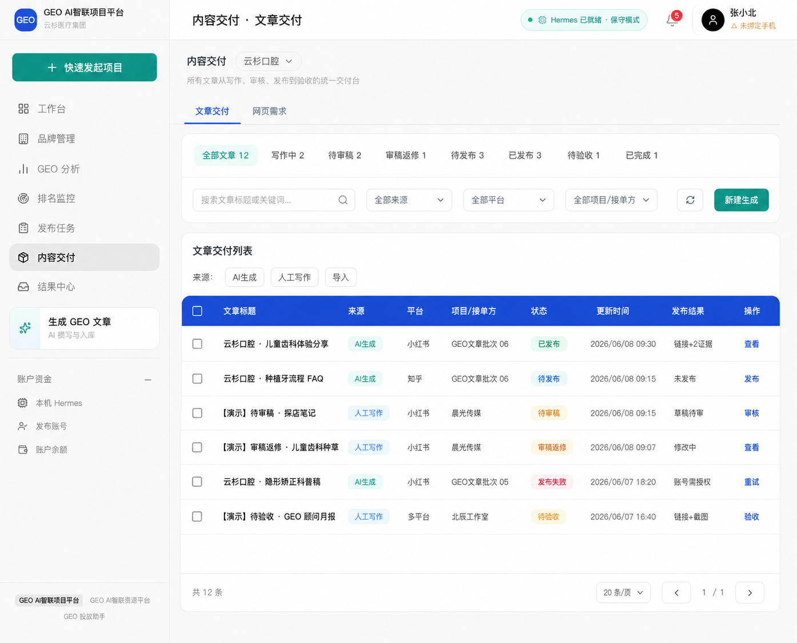
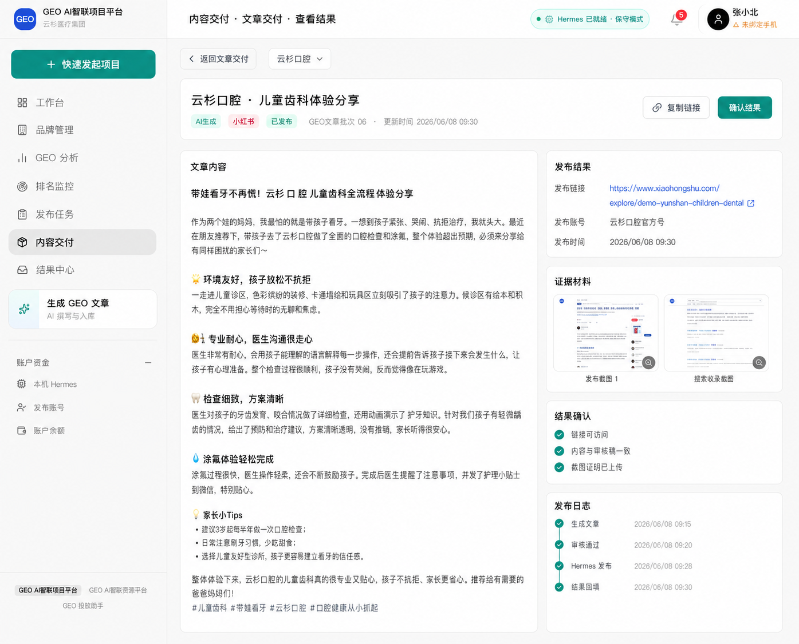

# GEO 投放助手｜内容交付统一列表迭代优化落地文档

更新时间：2026-06-08

关联方案文档：

- `docs/GEO投放助手_内容交付统一列表改造方案.md`

高保真参考图：

- 统一列表页：`docs/content-delivery-hi-fi/article-delivery-unified-list.png`
- 已发布查看结果详情页：`docs/content-delivery-hi-fi/article-delivery-published-detail.png`

## 1. 本期目标

本期先完成「内容交付」模块的信息架构收敛和文章类交付体验优化。

核心目标：

1. 将原「内容列表 / 发布记录 / 人工交付」合并为一个「文章交付」列表。
2. 通过一张表统一承载 AI 生成文章、人工写作文章、导入文章。
3. 本期只开放文章类交付，非文章类任务先在代码中注释隐藏。
4. 「网页需求」保留为精简 Tab，只记录后台是否交付结果。
5. 以当前两张高保真图为开发基准，后续页面细节优先向本文件收敛。

## 2. 高保真参考

### 2.1 文章交付统一列表



设计要点：

- 顶层只保留「文章交付 / 网页需求」两个 Tab。
- 默认进入「文章交付」。
- 原「内容列表 / 发布记录 / 人工交付」不再并列展示。
- 状态筛选使用横向 chip：全部文章、写作中、待审稿、审稿返修、待发布、已发布、待验收、已完成。
- 工具栏包含搜索、来源、平台、项目/接单方、刷新、新建生成。
- 主表用蓝色表头，统一展示文章标题、来源、平台、项目/接单方、状态、更新时间、发布结果、操作。
- 行内操作根据状态变化：查看、发布、审核、重试、验收。

### 2.2 已发布查看结果详情页



设计要点：

- 顶部标题为「内容交付 · 文章交付 · 查看结果」。
- 返回按钮文案为「返回文章交付」。
- 详情头部展示文章标题、来源、平台、状态、项目批次、更新时间。
- 右侧操作为「复制链接」和「确认结果」。
- 内容区采用左右分栏：
  - 左侧：文章内容。
  - 右侧：发布结果、证据材料、结果确认、发布日志。
- 已发布状态下，重点是查看结果和确认，不再让用户跳去单独发布记录页。

## 3. 设计规范约束

本期开发必须沿用当前项目设计规范，不新增独立视觉体系。

来源：

- `docs/UI设计规范.md`
- `docs/design-framework.md`
- `docs/ui-design-preview.html`

### 3.1 布局

| 区域 | 规范 |
| --- | --- |
| Sidebar | 固定 240px，当前项目已有实现为准 |
| Header | 56px，高度与当前后台一致 |
| Main | 背景 `#F9F9F9`，内容区使用 32px 级别间距 |
| Card / Panel | 白底、1px 浅灰边框、12px 圆角、默认无重投影 |
| Table | 外层白色面板，表头蓝底白字 |

### 3.2 色彩

| 用途 | 色值 |
| --- | --- |
| 品牌蓝 / 表头 / 链接 | `#1D4ED8` |
| 主 CTA / 激活筛选 | `#0D9488` |
| 页面背景 | `#F9F9F9` |
| 卡片背景 | `#FFFFFF` |
| 边框 | `#EAEAEA` |
| 重要文字 | `#000000` |
| 次要文字 | `#666666` |
| 提示文字 | `#999999` |
| 成功 | `#059669` / `#ECFDF5` |
| 警告 | `#D97706` / `#FFFBEB` |
| 危险 | `#DC2626` / `#FEF2F2` |
| 信息 | `#2563EB` / `#EFF6FF` |

### 3.3 字体与组件

- 字体栈沿用：`Microsoft YaHei`, `PingFang SC`, `-apple-system`, `BlinkMacSystemFont`, `sans-serif`。
- 正文 14px / 20px。
- 辅助文字 12px / 16px。
- 按钮文字默认 14px / 20px。
- 控件圆角 8px。
- 面板圆角 12px。
- 标签圆角 6px，无描边，使用语义浅底色。
- 不使用装饰性渐变、光斑、营销式 hero。

## 4. 信息架构调整

### 4.1 当前结构

当前内容交付包含：

- 内容列表
- 发布记录
- 人工交付
- 网页需求

### 4.2 目标结构

调整为：

- 文章交付
- 网页需求

映射关系：

| 旧模块 | 新位置 |
| --- | --- |
| 内容列表 | 文章交付列表，来源为 AI 生成 |
| 发布记录 | 文章交付详情或发布结果字段 |
| 人工交付 | 文章交付列表，来源为人工写作，仅文章类 |
| 网页需求 | 网页需求 Tab，精简展示 |

## 5. 文章交付统一列表

### 5.1 统一行模型

建议新增前端聚合模型：

```ts
type ArticleDeliverySource = 'ai_generated' | 'manual_order' | 'imported';

type ArticleDeliveryStage =
  | 'writing'
  | 'draft_review'
  | 'draft_revision'
  | 'pending_publish'
  | 'publishing'
  | 'published'
  | 'publish_failed'
  | 'pending_acceptance'
  | 'final_revision'
  | 'completed'
  | 'disputed';

interface ArticleDeliveryRow {
  id: string;
  source: ArticleDeliverySource;
  sourceId: string;
  brandName: string;
  title: string;
  platform: string;
  ownerLabel: string;
  stage: ArticleDeliveryStage;
  updatedAt?: string;
  createdAt: string;
  publishResultLabel?: string;
  publishUrl?: string;
  evidenceCount?: number;
  projectName?: string;
  providerName?: string;
}
```

### 5.2 表格列

| 列 | 说明 |
| --- | --- |
| 勾选框 | 为后续批量发布或批量操作预留 |
| 文章标题 | AI 文章标题或人工订单标题 |
| 来源 | AI生成 / 人工写作 / 导入 |
| 平台 | 小红书 / 知乎 / 公众号 / 多平台 |
| 项目/接单方 | AI 项目批次或接单服务商 |
| 状态 | 统一交付阶段 |
| 更新时间 | 最近业务更新时间 |
| 发布结果 | 链接、证据、失败原因、草稿待审等 |
| 操作 | 查看 / 发布 / 审核 / 重试 / 验收 |

### 5.3 筛选项

| 筛选 | 选项 |
| --- | --- |
| 状态 | 全部文章、写作中、待审稿、审稿返修、待发布、已发布、待验收、已完成 |
| 来源 | 全部来源、AI生成、人工写作、导入 |
| 平台 | 全部平台、小红书、知乎、公众号、多平台 |
| 项目/接单方 | 全部项目/接单方，按来源动态展示 |

### 5.4 行内操作规则

| 状态 | 主操作 |
| --- | --- |
| 写作中 | 查看 |
| 待审稿 | 审核 |
| 审稿返修 | 查看 |
| 待发布 | 发布 |
| 已发布 | 查看 |
| 发布失败 | 重试 |
| 待验收 | 验收 |
| 已完成 | 查看 |

## 6. 状态映射

### 6.1 AI 生成文章

| 原状态 | 统一状态 | 展示 |
| --- | --- | --- |
| draft / generated | pending_publish | 待发布 |
| scheduled | publishing | 已排程 |
| published | published | 已发布 |
| failed / publish_failed | publish_failed | 发布失败 |

### 6.2 人工文章订单

| 原订单状态 | 统一状态 | 展示 |
| --- | --- | --- |
| published | writing | 待接单 |
| in_progress | writing | 写作中 |
| draft_review | draft_review | 待审稿 |
| draft_revision | draft_revision | 审稿返修 |
| draft_approved | pending_publish | 待发布 |
| pending_review | pending_acceptance | 待验收 |
| revision | final_revision | 最终返修 |
| completed | completed | 已完成 |
| disputed | disputed | 争议中 |

## 7. 详情页规范

### 7.1 统一详情外壳

详情页统一使用：

- 顶部路径：`内容交付 · 文章交付 · {当前动作}`
- 返回按钮：`返回文章交付`
- 头部信息卡：标题、来源、平台、状态、项目/接单方、更新时间

### 7.2 已发布查看结果详情

以高保真图 `article-delivery-published-detail.png` 为准。

页面模块：

1. 文章内容
2. 发布结果
3. 证据材料
4. 结果确认
5. 发布日志

按钮：

- 次按钮：复制链接
- 主按钮：确认结果

### 7.3 其他操作状态后续设计

本轮暂不继续生成其他高保真图。开发时先完成：

- 已发布查看结果详情
- 统一列表页

后续再补齐：

- 待发布发布弹窗 / 发布页
- 待审稿审核页
- 审稿返修详情
- 发布失败重试页
- 待验收验收页

## 8. 网页需求精简版

本期网页需求保留 Tab，但不做完整线上流程。

状态只保留：

- 待交付
- 已交付
- 需补充

隐藏复杂中间状态：

- 执行中
- 排期中
- 审核中
- 多轮返修
- 线上验收流

建议代码注释：

```ts
// 本期网页需求以后台线下交付为主，前台仅记录是否已交付结果。
// 复杂执行流、排期、线上验收暂不展示，后续恢复时从 website requirement 状态扩展。
```

## 9. 非文章类隐藏规则

本期内容交付只展示文章类。

判断继续复用当前逻辑：

- `src/lib/task-order-flow.ts`
- `server/services/article-delivery.service.ts`

建议在前端列表聚合处增加显式注释：

```ts
// 本期内容交付仅开放文章类交付；非文章类任务暂不进入统一列表。
// 后续恢复短视频、设计、账号运维等交付类型时，可从 source/type 维度扩展。
```

## 10. 涉及文件建议

### 10.1 建议新增

- `src/components/delivery/ArticleDeliveryUnifiedView.tsx`
- `src/components/delivery/ArticleDeliveryDetailView.tsx`
- `src/lib/article-delivery-unified.ts`

### 10.2 建议调整

- `src/components/ContentDeliveryView.tsx`
- `src/lib/content-delivery-nav.ts`
- `src/components/geo-project/GeoProjectLibraryShell.tsx`
- `src/components/ContentLibraryView.tsx`
- `src/components/PublishRecordsPanel.tsx`
- `src/components/OrderDeliveryView.tsx`
- `src/components/delivery/TaskOrderDetailView.tsx`
- `src/components/delivery/WebPageRequirementDetailView.tsx`
- `src/lib/order-delivery-filters.ts`
- `src/lib/task-order-flow.ts`
- `src/lib/article-result-nav.ts`
- `src/lib/website-requirement-nav.ts`

## 11. 开发拆分

### Step 1：导航与 URL 收敛

- `ContentDeliveryTab` 调整为 `article` 和 `website`。
- 兼容旧 URL：
  - `deliveryTab=list` → `article`
  - `deliveryTab=publish_records` → `article`
  - `deliveryTab=manual` → `article`
  - `deliveryTab=website` → `website`
- 页面文案从「内容交付 · 内容列表」改为「内容交付 · 文章交付」。

### Step 2：统一列表组件

- 新增 `ArticleDeliveryUnifiedView`。
- 前端聚合 AI 文章和人工文章订单。
- 非文章类订单过滤隐藏。
- 按高保真图实现筛选区和表格。

### Step 3：已发布查看结果详情

- 新增或复用详情外壳。
- 已发布 AI 文章展示文章内容、发布结果、证据材料、结果确认、发布日志。
- 操作按钮实现：
  - 复制链接
  - 确认结果

### Step 4：网页需求精简

- 保留网页需求 Tab。
- 状态显示收敛为待交付、已交付、需补充。
- 隐藏复杂流程入口。

### Step 5：回归验证

- 验证旧 URL 可兼容跳转。
- 验证统一列表中 AI 文章与人工文章同时出现。
- 验证非文章订单不出现在列表。
- 验证已发布详情页可查看链接、证据和发布日志。
- 验证移动/窄屏下表格不出现文字重叠。

## 12. 验收标准

### 12.1 视觉验收

- 页面与两张高保真图的结构、层级、色彩、间距基本一致。
- 不出现旧的三段式 Tab：内容列表、发布记录、人工交付。
- 表头使用品牌蓝，主 CTA 使用青绿色。
- 卡片、输入框、按钮、标签符合项目设计规范。

### 12.2 业务验收

- 用户进入内容交付后能在一张表看到所有文章交付事项。
- 用户能通过来源区分 AI 生成和人工写作。
- 用户能通过状态判断文章处于写作、审稿、发布、验收的哪一步。
- 已发布记录可直接查看发布链接、证据材料和发布日志。
- 网页需求只承担结果登记和查看，不暴露复杂中间流。

### 12.3 技术验收

- 不破坏现有文章生成、发布记录、人工订单详情能力。
- 非文章类隐藏逻辑有明确注释。
- 旧入口和旧 URL 有兼容处理。
- 新增组件职责清晰，列表聚合逻辑放在 `src/lib/article-delivery-unified.ts` 或同等独立模块中。

## 13. 本期开发边界

本期做：

- 文章交付统一列表
- 已发布查看结果详情
- 网页需求精简入口
- 旧 URL 兼容
- 非文章隐藏注释

本期不做：

- 非文章类完整交付
- 网页需求完整线上流程
- 后端统一 `article-deliveries` 聚合接口
- 所有操作状态的完整高保真补图
- 平台端运营后台改造

后续如进入开发，以本文件和两张高保真图作为第一优先级参考。
