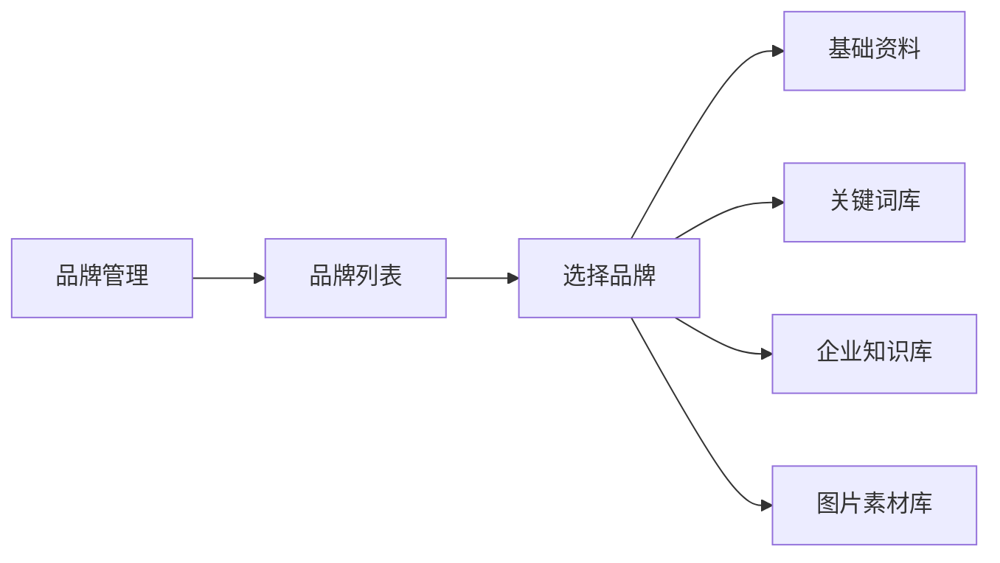
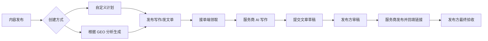

# GEO 投放助手发布端信息架构优化方案

日期：2026-06-04  
关联文档：
- [GEO投放助手_v1.1_产品结构优化方案.md](./GEO投放助手_v1.1_产品结构优化方案.md)
- [GEO投放助手_正式开发版_PRD_v1.1_最新设计风格.md](./GEO投放助手_正式开发版_PRD_v1.1_最新设计风格.md)

## 1. 背景

当前发布端侧边栏同时存在以下入口：

| 当前入口 | 当前实现 | 主要问题 |
|---|---|---|
| 投放计划 | `DeliveryPlanView` | 与“发布计划”名称接近，用户容易混淆 |
| 发布计划 | `PublishScheduleView` | 当前做自有账号发布排程，不应命名为“内容发布” |
| 发布记录 | `PublishRecordsView` | 当前做自有账号发布结果，不应和接单端写作发布混用 |
| 生成 GEO 文章 | `GenerateArticleView` | 当前在发布端生成文章并可走自有账号发布，但目标产品口径应下沉为接单端服务商能力 |
| 订单交付 | `OrderDeliveryView` | 与 Agent 任务都展示状态，但业务对象不同 |
| Agent 任务 | `AgentTasksView` | 名称偏技术，容易被理解为业务任务/订单 |
| 基础资料、关键词库、企业知识库、图片素材库 | `BrandCenterView` 内部 Tab 已支持 | 品牌资产配置不应长期占据侧边栏入口 |
| 收录排名 | `IndexingRankView` | 属于效果监测功能，不应放在品牌配置分组里 |

本次优化目标是：侧边栏只放“模块级工作流入口”，品牌列表承载“多品牌管理和品牌资产维护”，具体业务页内各自选择服务品牌。

## 2. 核心结论

1. 服务商或代理商可能同时管理多个品牌，因此不应在侧边栏提供“某个品牌详情”这类悬空入口。
2. 品牌切换应下沉到具体业务功能中，例如 GEO 分析、内容发布、接单投放、订单交付。
3. 品牌资料、关键词、知识库、素材库应从“品牌管理 / 品牌列表 / 某品牌工作区”进入。
4. “生成 GEO 文章”是发布端核心内容生产能力，必须保留；它负责 AI 生成、编辑、入库，可从生成结果进入自有账号发布。
5. “内容发布”和“接单投放”的手动发单存在重复，应合并为一个“发起订单”入口，内部按任务类型区分文章写作、达人投放、顾问、网页等。
6. “发布计划 + 发布记录 + 自有账号发布”不应作为独立一级入口；自有账号发布应从内容库/生成结果发起，执行结果统一回到订单交付查看。
7. “订单交付”是所有结果和阶段的唯一查看入口：接单订单、文章审稿、发布链接回填、自有发布记录、网站订单都在这里。
8. “Agent 任务”建议改名为“运行日志”，定位为 AI/Hermes 后台执行记录。
9. “收录排名”应从品牌模块移出，作为一级监测功能保留，建议命名为“收录监测”或继续使用“收录排名”。

## 3. 推荐侧边栏

| 顺序 | 新入口 | 来源 | 定位 |
|---:|---|---|---|
| 1 | 工作台 | 保留 | **数据驾驶舱优先**；待办为顶部细条；**不设快捷入口**（见 [工作台优化计划](./GEO投放助手_工作台优化计划.md)） |
| 2 | 品牌管理 | 品牌列表 + 品牌资产入口 | 管理组织下多个品牌 |
| 3 | GEO 分析 | 保留 | 诊断品牌在 AI 平台中的可见度 |
| 4 | 收录排名 | 从品牌分组移出 | 多平台收录和排名监测 |
| 5 | 内容库 | 保留但重新定位 | 管理已生成、已审稿、已交付的内容资产 |
| 6 | 发起订单 | 内容发布 + 接单投放 | 创建文章写作、达人投放、顾问、网页等订单 |
| 7 | 订单交付 | 保留并增强 | 所有订单阶段、审稿、验收、自有发布记录 |
| 8 | 运行日志 | 原 Agent 任务 | 查看 AI/Hermes 执行状态、日志、失败重试 |
| — | 生成 GEO 文章 | `GenerateArticleView` | **紧挨运行日志下方**；独立卡片样式（`geo-sidebar-create`），非普通 nav 项 |
| 9 | 账户资金 | 发布账号 + 账户余额 | 自有账号授权、资金与余额 |

侧栏顶部 **「快速发起项目」**（`QuickStartModal` / `src/lib/quick-start-nav.ts`）为**功能快捷入口**，不是创建「投放项目」档案；落地说明见 [快速发起项目轻量优化小迭代方案](./GEO投放助手_快速发起项目轻量优化小迭代方案.md)。远期「项目工作台」见同目录重设计文档（已搁置）。

侧边栏不再展示：

- 基础资料
- 关键词库
- 企业知识库
- 图片素材库
- 发布计划
- 发布记录
- 内容发布
- 自有账号发布
- 接单投放

## 4. 品牌管理设计

### 4.1 品牌管理入口

侧边栏只保留一个“品牌管理”入口，进入后默认展示品牌列表。

品牌列表面向多品牌服务商场景，不承担全局品牌切换的唯一职责。它应支持：

1. 新增品牌。
2. 查看组织下全部品牌。
3. 标记当前工作品牌。
4. 切换默认工作品牌。
5. 从品牌行进入该品牌的资料维护。
6. 从品牌行跳转到具体业务功能，并携带品牌上下文。

### 4.2 品牌行操作

| 操作 | 行为 |
|---|---|
| 资料 | 进入品牌工作区，默认打开基础资料 |
| 词库 | 进入品牌工作区，打开关键词库 |
| 知识库 | 进入品牌工作区，打开企业知识库 |
| 素材 | 进入品牌工作区，打开图片素材库 |
| 分析 | 跳转 GEO 分析，并使用当前品牌 |
| 收录 | 跳转收录排名，并使用当前品牌 |
| 发布 | 跳转「发起订单 → 文章写作」，并使用当前品牌 |
| 投放 | 跳转「发起订单 → AI 任务包」，并使用当前品牌 |

### 4.3 品牌工作区

品牌工作区不是侧边栏一级入口，而是从品牌列表下钻进入：

`品牌管理 / 云杉口腔`

内部 Tab：

| Tab | 当前可复用实现 |
|---|---|
| 基础资料 | `BrandProfileView` |
| 关键词库 | `KeywordLibraryView` |
| 企业知识库 | `KnowledgeBaseView` |
| 图片素材库 | `AssetLibraryView` |

当前项目已有 `BrandCenterView` 聚合这些 Tab，后续可保留该组件，但入口改为品牌列表行内操作，而不是侧边栏独立子导航。

## 5. 五个易混功能的边界

### 5.1 内容发布

定位：发布方向接单端发起“写作 + 审稿 + 发布链接回填”的**文章类** `TaskOrder`（仅发单，不跟踪阶段）。

已实现页面（`ContentPublishView`）：

| 区块 | 内容 |
|---|---|
| 发写作单 | 平台、方向、篇数、字数、关键词、预算、双阶段验收模板；`POST /api/orders`（`type: 文章`） |
| 待领取摘要 | 最多 3 条 `published` 状态订单，跳转订单交付 |

**不在本页**：待审稿 / 待回填 / 已完成列表与审稿操作 → 统一在「订单交付」按 `orderStage` 筛选。

后续可选：根据 GEO 分析生成内容发布计划（独立迭代）。

说明：

1. 内容发布面向接单端，不要求绑定自有平台账号。
2. 发单成功后跳转「订单交付」查看阶段与审稿/验收。
3. 与「接单投放 → 手动创建」去重：文章类仅能从本页发单（`create-task-order.ts`）。

### 5.2 自有账号发布

合并来源：

- `PublishScheduleView`
- `PublishRecordsView`
- `GenerateArticleView` 内的 `publish-draft`
- `ContentLibraryView` 内的 Hermes 发布

定位：商家使用已绑定/本机登录账号进行**发布计划排程**（`PublishScheduleView`）。

**发布记录**（`PublishRecord` / Hermes 执行结果）已迁入「订单交付 → 自有发布记录」Tab（`PublishRecordsPanel`），本页不再展示记录 Tab。

说明：

1. 需要自有账号授权或本机登录。
2. 不等于「内容发布」（向服务商发写作单）。
3. 内容库 / 生成文章中的 Hermes 发布仍走本能力链路，结果在订单交付查看。

### 5.3 接单投放

来源：原 `DeliveryPlanView`。

定位：创建非文章类或综合推广任务包，并发布到接单端。

页面结构：

| 模式 | 内容 |
|---|---|
| AI 制定计划 | 基于品牌、目标、平台、预算生成任务包草稿 |
| 手动创建任务包 | 直接填写任务标题、平台、预算、交付物、验收标准 |

说明：

1. 接单投放不需要商家绑定官方平台账号。
2. 发布成功后形成接单端订单，后续在“订单交付”中验收。
3. 文章写作/发布类任务优先归入“内容发布”；达人探店、顾问、网页、综合投放等任务归入“接单投放”。
4. 建议保留数据对象 `CampaignPlan`，但界面文案从“投放计划”逐步调整为“接单投放”。

### 5.4 订单交付

来源：`OrderDeliveryView`（履约中枢）。

定位：统一管理接单订单、网站订单、自有账号发布记录的查看与操作。

顶栏 Tab：

| Tab | 数据 | 能力 |
|---|---|---|
| 接单订单 | `TaskOrder` | 阶段筛选（待审稿/待验收等）、文章/非文章类型筛选、审稿、最终验收、返修、争议 |
| 网站订单 | `WebsiteOrder` | 预览与验收 |
| 自有发布记录 | `PublishRecord` | Hermes 执行结果；失败可链运行日志 |

URL：`orderStage` 兼容旧 `contentTab`；`orderTab=publish_records` 兼容旧 `publish_records` 视图。

说明：

1. 不是后台执行日志（见运行日志）。
2. 内容发布各阶段进度仅在本页查看，不在内容发布页重复列表。

### 5.5 运行日志

来源：原 `AgentTasksView`。

定位：统一查看 AI/Hermes 异步任务执行状态、日志、失败原因和重试入口。

用户关心：

1. AI 文章生成是否成功。
2. GEO 分析是否完成。
3. Hermes 发布是否失败。
4. 失败原因是什么。
5. 是否可以重试。

说明：

1. 运行日志是横跨业务模块的底层执行记录。
2. 不负责业务验收、返修、结算。
3. 命名上建议降低技术感，避免和“接单任务、订单任务”混淆。

### 5.6 收录排名

来源：`IndexingRankView`。

定位：品牌效果监测，不属于品牌资料配置。

说明：

1. 虽然收录排名需要选择品牌，但用户心智是“看效果”，不是“维护品牌资料”。
2. 应从品牌分组移出，作为一级功能保留。
3. 可继续命名“收录排名”，也可改成更动作化的“收录监测”。

## 6. 推荐用户路径

### 6.1 多品牌维护

### 6.2 接单端内容发布

### 6.3 自有账号发布

### 6.4 接单端投放交付

### 6.5 异常排查

## 7. 研发迭代计划

### P0：导航和命名收口

目标：先降低侧边栏认知负担，不大改业务逻辑。

改动：

1. 侧边栏移除品牌分组下的基础资料、关键词库、企业知识库、图片素材库。
2. 侧边栏移除发布计划、发布记录。
3. 增加一级入口“品牌管理”。
4. 增加一级入口“内容发布”，用于向接单端发布写作/发文订单。
5. 增加或保留“自有账号发布”，承接原发布计划、发布记录、Hermes 发布。
6. 将“投放计划”改名为“接单投放”。
7. 将“Agent 任务”改名为“运行日志”。
8. 将“收录排名”保留为一级入口。

涉及文件：

| 文件 | 调整 |
|---|---|
| `src/components/Sidebar.tsx` | 调整导航配置 |
| `src/components/Header.tsx` | 更新页面标题映射 |
| `src/types.ts` | 视情况新增或保留 ViewType |
| `src/App.tsx` | 调整路由映射和兼容旧 view |

兼容建议：

1. 旧 `view=publish_schedule` 跳到新“自有账号发布 / 发布计划”。
2. 旧 `view=publish_records` 跳到新“自有账号发布 / 发布记录”。
3. 旧 `view=delivery_plan` 保留，但展示文案改为“接单投放”。
4. 旧 `view=agent_tasks` 保留，但标题展示为“运行日志”。

### P1：内容发布页重建

目标：把“内容发布”改造成接单端写作/发文订单入口。

改动：

1. 新建 `ContentPublishView`，不要复用 `PublishScheduleView` 作为主语义。
2. 增加创建方式：自定义计划、根据 GEO 分析生成。
3. 自定义计划表单字段包括品牌、平台、文章类型、篇数、字数、关键词、参考资料、预算、审稿要求、发布证明要求。
4. 根据 GEO 分析生成时，选择已有 GEO 分析报告，AI 根据内容缺口、关键词、竞品建议生成写作/发文任务包。
5. 提交后统一创建 `TaskOrder(type: article_writing_publish)`。
6. 接单端领取后进入文章写作流程。
7. 发布端订单交付页增加审稿和最终验收两个阶段。

内容发布计划字段建议：

| 字段 | 自定义计划 | 根据 GEO 分析生成 |
|---|---|---|
| `brandName` | 必填 | 来自报告或用户选择 |
| `sourceType` | `custom` | `geo_analysis` |
| `sourceReportId` | 空 | GEO 分析报告 ID |
| `goal` | 用户填写 | 从报告建议生成，可编辑 |
| `platforms` | 用户选择 | 根据报告建议生成，可编辑 |
| `keywords` | 用户选择/填写 | 从报告缺口和关键词库生成，可编辑 |
| `articleCount` | 用户填写 | AI 建议，可编辑 |
| `budget` | 用户填写 | AI 建议，可编辑 |
| `reviewRequirement` | 用户填写 | 根据品牌和平台生成，可编辑 |
| `publishProofRequirement` | 用户填写 | 根据平台生成，可编辑 |

建议：

1. `PublishScheduleView` 和 `PublishRecordsView` 迁到“自有账号发布”。
2. `GenerateArticleView` 从发布端一级导航移除或弱化为内部工具；服务商侧补 AI 写作工具。
3. 内容发布不要要求发布方选择自有账号。

内容发布订单状态建议：

| 状态 | 操作方 | 含义 | 下一步 |
|---|---|---|---|
| `published` | 发布方 | 写作/发文单已上架，等待服务商领取 | 服务商领取 |
| `in_progress` | 服务商 | 服务商正在写作 | 提交草稿 |
| `draft_review` | 发布方 | 服务商已提交文章草稿，等待发布方审稿 | 审稿通过或要求修改 |
| `draft_revision` | 服务商 | 发布方要求修改草稿 | 重新提交草稿 |
| `draft_approved` | 服务商 | 草稿已通过，可以按要求发布 | 回填发布链接 |
| `pending_review` | 发布方 | 服务商已回填发布链接/截图，等待最终验收 | 验收通过或返修/争议 |
| `completed` | 发布方 | 最终验收通过，进入结算 | 结束 |
| `disputed` | 平台 | 双方有争议，平台介入 | 平台结案 |

服务商侧页面需要拆成两个提交动作：

| 动作 | 接口建议 | 结果状态 |
|---|---|---|
| 提交文章草稿 | `POST /api/provider/orders/:id/article-draft` | `draft_review` |
| 重新提交草稿 | `POST /api/provider/orders/:id/article-draft` | `draft_review` |
| 回填发布链接 | `POST /api/provider/orders/:id/publish-proof` | `pending_review` |

发布方侧页面需要补两个审稿动作：

| 动作 | 接口建议 | 结果状态 |
|---|---|---|
| 审稿通过 | `POST /api/orders/:id/draft-approval` | `draft_approved` |
| 要求改稿 | `POST /api/orders/:id/draft-revision` | `draft_revision` |

数据模型建议：

| 当前模型 | 建议增强 |
|---|---|
| `TaskOrder.type` | 增加 `article_writing_publish` 或约定文章类任务类型 |
| `TaskOrder.status` | 增加 `draft_review`、`draft_revision`、`draft_approved` |
| `OrderDelivery.status` | 区分 `draft_submitted`、`publish_proof_submitted` |
| `OrderDelivery.link` | 最终发布链接 |
| `OrderDelivery.attachments` | 截图、发布证明、草稿附件 |
| 新字段或新表 | 可增加 `reviewNote`、`approvedAt`、`publishedAt` |

当前代码对应缺口：

| 文件 | 当前问题 | 建议 |
|---|---|---|
| `src/apps/provider/views/ProviderOrderView.tsx` | 只有通用“提交交付”，没有提交草稿和回填链接两阶段 | 按订单类型和状态展示不同表单 |
| `src/components/OrderDeliveryView.tsx` | 只有最终验收、返修、争议，没有审稿通过/改稿 | 增加草稿审稿区 |
| `server/services/order.service.ts` | `submitDelivery` 一提交就进入 `pending_review` | 拆成 `submitArticleDraft` 和 `submitPublishProof` |
| `server/routes/provider.ts` | 只有 `/deliver` | 增加 `/article-draft` 和 `/publish-proof` |
| `server/routes/orders.ts` | 只有最终验收和返修 | 增加草稿审核接口 |

### P1.5：自有账号发布页合并

目标：把原发布计划、发布记录和内容库 Hermes 发布合并到独立的“自有账号发布”能力。

改动：

1. 新建 `SelfAccountPublishView`。
2. 内部复用 `PublishScheduleView` 和 `PublishRecordsView`。
3. 内容库中的“发布到自有账号”跳转到该页面。
4. `GenerateArticleView` 中的“自动发布”能力也归入该页面或降级为生成后的快捷动作。

### P2：品牌列表增强

目标：让品牌资产维护从品牌列表自然进入。

改动：

1. `BrandListView` 每行增加快捷操作：资料、词库、知识库、素材、分析、收录、发布、投放。
2. 点击资料/词库/知识库/素材时进入 `BrandCenterView` 对应 Tab。
3. 点击分析/收录/发布/投放时跳转业务页，并带上品牌上下文。

涉及文件：

| 文件 | 调整 |
|---|---|
| `src/components/BrandListView.tsx` | 增加品牌行操作 |
| `src/components/BrandCenterView.tsx` | 支持从品牌列表传入 initialTab |
| `src/App.tsx` | 支持品牌管理内部 hint 和品牌上下文跳转 |
| `src/lib/brand-center.ts` | 复用或扩展 Tab 映射 |

### P3：业务页链路打通（已落地）

1. 发单成功跳转订单交付。（内容发布 / 接单投放）
2. 内容库链自有账号发布。（非内容发布）
3. 订单交付空态、未选详情、发布记录失败：链运行日志。（`OrderDeliveryEmptyState`）
4. GEO 报告页：发起订单、根据报告生成任务包、收录排名、生成文章。

### P1 补充：根据 GEO 分析生成任务包（已落地）

| 能力 | 实现 |
|---|---|
| API | `POST /api/campaign-plans/generate-from-geo` |
| AI 任务包 | `DeliveryPlanView` + URL `geoReportId` |
| 文章预填 | `ContentPublishView`「根据 GEO 报告预填」 |

### P4：数据和权限强化

目标：适配服务商管理多品牌。

改动：

1. 品牌列表支持按权限展示品牌。
2. 业务页品牌选择器支持搜索和最近使用。
3. “全部品牌”只在内容库、订单交付、运行日志、账户资金等聚合视图开放。
4. 创建类动作必须选择单个具体品牌。

## 8. 验收标准

1. 侧边栏不再出现基础资料、关键词库、企业知识库、图片素材库这类品牌子功能。
2. 用户从“品牌管理”进入品牌列表后，可维护任意品牌的资料、词库、知识库和素材。
3. 用户在 GEO 分析、内容发布、接单投放等页面仍可独立选择品牌。
4. 「自有账号发布」仅含发布计划；发布记录在「订单交付 → 自有发布记录」。
5. 「内容发布」无待审稿/待回填/已完成 Tab；上述阶段在「订单交付」筛选查看。
6. 用户能明确区分「发起订单」内三种模式与「自有账号发布」：
   - 文章写作：向接单端发布文章写作/发文单。
   - AI 任务包 / 手动发单：向接单端发布投放任务包（手动发单不含文章类）。
   - 自有账号发布：从内容库或生成结果发起，商家用自己的账号发布已有内容（不进侧栏）。
7. 用户能明确区分“订单交付”和“运行日志”：
   - 订单交付：验收服务商交付。
   - 运行日志：查看 AI/Hermes 后台执行状态。
8. 收录排名作为一级功能出现，不再作为品牌资料子项。
9. 旧 URL `?view=content_publish&contentTab=draft_review` 等重定向到 `order_delivery` + `orderStage`；`?view=content_publish` / `?view=delivery_plan` 重定向到 `create_order` + `orderMode`。

## 9. 建议的最终文案

| 当前文案 | 建议文案 | 说明 |
|---|---|---|
| 品牌列表 | 品牌管理 | 侧边栏入口 |
| 投放计划 | 接单投放 | 区分自有账号发布 |
| 发布计划 | 自有账号发布 / 发布计划 Tab | 合并到自有账号发布 |
| 发布记录 | 订单交付 / 自有发布记录 Tab | 不再在自有账号发布页 |
| 生成 GEO 文章 | 生成 GEO 文章 | 发布端保留；接单端为「AI 写作」辅助工具 |
| Agent 任务 | 运行日志 | 降低技术感 |
| 收录排名 | 收录排名或收录监测 | 一级监测功能 |

## 10. 当前代码落点（2026-06-04 已落地）

| 模块 | 文件 | 状态 |
|---|---|---|
| 侧边栏 | `Sidebar.tsx` | §3 推荐导航：工作台 → 品牌 → GEO → 收录 → 内容库 → **发起订单** → 订单交付 → 运行日志 → **生成 GEO 文章**（`geo-sidebar-create` 卡片）；无内容发布/自有账号发布/接单投放一级入口 |
| 发起订单 | `CreateOrderView.tsx` + `create-order-nav.ts` | Tab：**自定义发单**（`CustomOrderView`）/ **AI 生成任务包**（`DeliveryPlanView`） |
| 自定义发单 | `CustomOrderView.tsx` + `custom-order-types.ts` | 任务类型含「文章写作+发布」（双阶段）及达人/顾问/网页/其他 |
| 订单交付 | `OrderDeliveryView.tsx` + `order-delivery-filters.ts` | 接单订单阶段筛选 + 审稿验收 + 自有发布记录 Tab |
| 自有账号发布 | `SelfAccountPublishView.tsx` | 仅 `PublishScheduleView`；路由保留，从内容库/生成页进入 |
| 发布记录 | `PublishRecordsPanel.tsx` | 嵌入订单交付；旧路由兼容 |
| 接单投放表单 | `DeliveryPlanView.tsx` | 嵌入发起订单；手动发单拦截文章类 |
| AI 生成 GEO 文章 | `GenerateArticleView` + `ProviderAiWritingView` | 发布端侧栏一级 + 接单端「AI 写作」 |
| 运行日志 | `AgentTasksView.tsx` | 侧边栏「运行日志」 |
| 路由 | `App.tsx` | `content_publish` / `delivery_plan` → `create_order?orderMode=`；`geoReportId` 驱动 AI 任务包生成；旧 `contentTab` → `order_delivery` |
| GEO→任务包 | `geo-report.ts` + `campaign.service` | 报告生成任务包 + 文章单预填 |
| 订单交付空态 | `OrderDeliveryEmptyState.tsx` | 链运行日志 / 发起订单 |
| 工作台 | `WorkbenchView.tsx` | 无快捷入口宫格；空态仅文案引导侧栏 |
