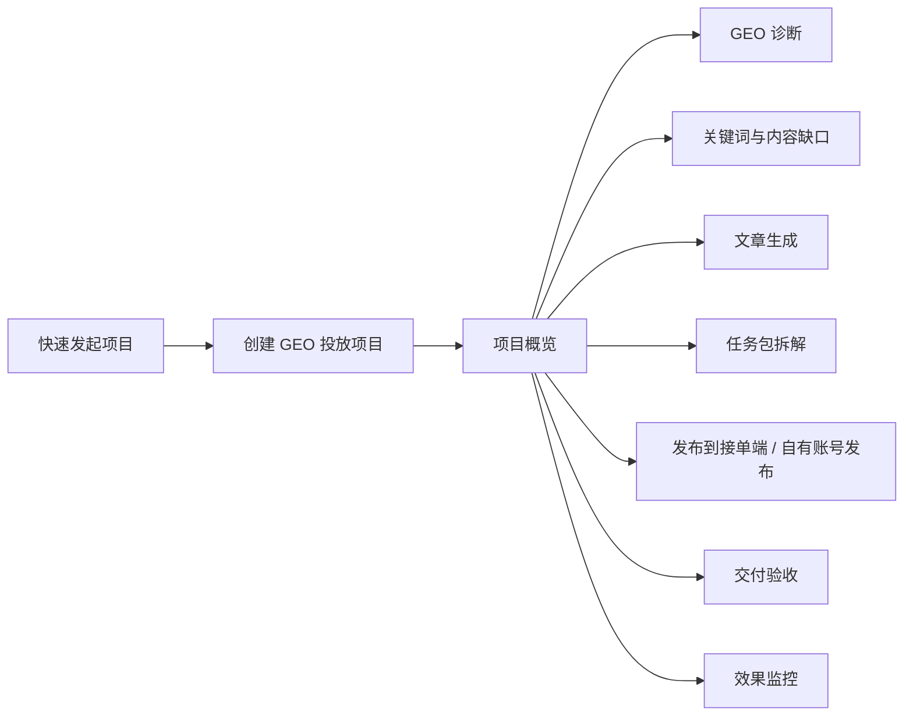
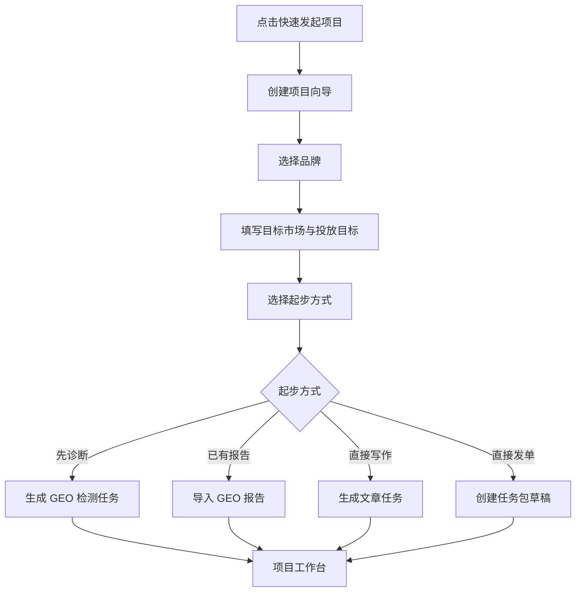

# GEO 投放助手「快速发起项目」项目化重设计需求文档

> **状态：搁置（远期愿景）** — 描述「GEO 投放项目」顶层对象与项目工作台，与当前代码不一致。  
> **轻量落地文档**：[GEO投放助手_快速发起项目轻量优化小迭代方案.md](./GEO投放助手_快速发起项目轻量优化小迭代方案.md)

日期：2026-06-06  
适用端：发布端 / 商家端  
关联页面：`快速发起项目`、`GEO 分析`、`生成 GEO 文章`、`发布任务`、`任务交付`、`排名监控`  
设计目标：将当前“快速发起单点任务”的入口重构为“创建并驱动完整 GEO 投放项目”的入口。

---

## 1. 背景

当前侧栏入口名为「快速发起项目」，弹窗内提供关键词挖掘、生成 GEO 文章、发布任务、开启 GEO 分析四个单点入口。用户点击后实际进入的是某个独立功能页，而不是一个可持续推进的项目。

这会造成三个问题：

1. 用户理解偏差：入口叫项目，但操作结果更像创建单个任务。
2. 链路断裂：诊断、写作、发单、交付、监控之间没有统一项目容器承接。
3. 归因困难：后续内容、任务包、订单、报告、效果数据难以回到同一个投放目标下。

---

## 2. 重设计结论

「快速发起项目」应改为创建一个完整的 **GEO 投放项目**。

项目是顶层业务对象，单一任务是项目内的执行单元。用户可以从任一步开始，但系统都应把后续动作沉淀到同一个项目链路中。

---

## 3. 目标与非目标

### 3.1 目标

1. 让「快速发起项目」符合用户预期：点击后创建或进入完整项目。
2. 建立统一项目工作台，聚合报告、内容、任务包、订单、交付、监控。
3. 支持用户从诊断、写作、发单任一步开始，并补全上下游链路。
4. 将 AI 拆解能力前置为项目计划，而不是散落在单点页面。
5. 保留手动发单能力，但归入项目内的「任务包」。

### 3.2 非目标

1. 不取消现有 `GEO 分析`、`生成 GEO 文章`、`发布任务` 等功能页。
2. 不强制所有项目必须完成全链路。
3. 不要求首版完成真实自动化执行闭环，可先用项目状态、任务包和跳转打通。
4. 不把自有账号自动发布和接单端发单混为同一动作。

---

## 4. 核心概念

| 概念 | 定义 | 示例 |
|---|---|---|
| GEO 投放项目 | 围绕某个品牌、目标市场、投放目标建立的完整工作容器 | “青岚咖啡上海新品 GEO 增长项目” |
| 项目阶段 | 项目的链路步骤 | 诊断、内容、任务包、发布、交付、监控 |
| 任务包 | 项目下可发布、可接单、可验收的执行单元 | 小红书种草笔记、知乎问答覆盖、官网落地页改装 |
| Agent 任务 | Hermes / 模型执行的后台自动化任务 | GEO 检测、AI 写作、任务包拆解 |
| 交付物 | 任务包或自有发布产生的结果 | 文章链接、截图、网页预览、检测报告 |

---

## 5. 用户角色与场景

### 5.1 商家运营

想快速知道品牌在 AI 平台里是否可见，并马上生成内容和发起投放任务。

核心诉求：

1. 少填表。
2. 能从诊断直接生成下一步。
3. 能看到整个项目进度。

### 5.2 代理商运营

同时管理多个客户品牌，需要按项目归档每次投放计划、预算和交付数据。

核心诉求：

1. 项目归属清楚。
2. 预算和任务包可拆分。
3. 后续复盘可追溯。

### 5.3 平台运营

需要检查项目链路是否卡住、Agent 是否失败、任务是否交付。

核心诉求：

1. 能看到项目阶段状态。
2. 能看到失败 Agent 任务。
3. 能介入异常订单。

---

## 6. 信息架构调整

### 6.1 发布端一级导航建议

| 当前导航 | 建议处理 |
|---|---|
| 工作台 | 保留 |
| 品牌管理 | 保留 |
| GEO 分析 | 保留，作为项目阶段入口 |
| 排名监控 | 保留，作为项目效果入口 |
| 发布任务 | 改名为「投放项目」或「投放计划」 |
| 任务交付 | 保留 |
| 生成 GEO 文章 | 可保留为快捷功能，但结果应可关联项目 |

### 6.2 侧栏主按钮

当前：`快速发起项目`  
建议：保留文案，但行为改为打开「创建 GEO 投放项目」向导。

---

## 7. 主要流程

### 7.1 新建项目主流程

### 7.2 项目推进流程

---

## 8. 页面需求

### 8.1 创建项目向导

入口：侧栏「快速发起项目」

页面形式：弹窗或抽屉，首版建议使用大弹窗，避免打断当前页面上下文。

字段：

| 字段 | 类型 | 必填 | 说明 |
|---|---|---|---|
| 品牌 | 品牌选择器 | 是 | 不允许用“全部品牌”创建项目 |
| 项目名称 | 输入框 | 是 | 默认按品牌、城市、目标生成 |
| 目标市场 | 输入框 / 地区级联 | 是 | 城市、区域或全国 |
| 投放目标 | 多选 | 是 | AI 可见度、内容覆盖、排名提升、引流转化 |
| 起步方式 | 单选卡片 | 是 | 先诊断、已有报告、直接写作、直接发单 |
| 已有材料 | 链接 / 文件 / 文本 | 否 | 官网、产品资料、竞品链接 |

主要操作：

1. `创建项目`
2. `创建并开始诊断`
3. `取消`

校验：

1. 未选择具体品牌时不可提交。
2. 项目名称为空时自动生成，但提交前可编辑。
3. 直接发单时必须至少选择一个任务类型或投放平台。

### 8.2 项目工作台

功能定位：单个项目的总控台。

模块：

| 模块 | 内容 |
|---|---|
| 项目头部 | 项目名称、品牌、目标市场、项目状态、预算摘要 |
| 阶段进度 | 诊断、策略、内容、任务包、发布、交付、监控 |
| 下一步建议 | AI 根据当前阶段推荐动作 |
| 任务包列表 | 平台、类型、预算、状态、负责人、交付期限 |
| 关联内容 | 文章草稿、内容库素材、发布记录 |
| 关联报告 | GEO 检测报告、排名监控报告 |
| 右侧助手 | 项目助手、风险提示、预算建议 |

### 8.3 项目列表

入口：一级导航「投放项目」。

列表字段：

| 字段 | 说明 |
|---|---|
| 项目名称 | 支持进入详情 |
| 品牌 | 当前项目归属品牌 |
| 目标市场 | 城市 / 区域 |
| 当前阶段 | 诊断中、待发单、执行中、监控中 |
| 任务包 | 总数、进行中、异常 |
| 预算 | 预计预算、已占用、已结算 |
| 更新时间 | 最近活动时间 |

筛选：

1. 品牌
2. 状态
3. 当前阶段
4. 负责人
5. 创建时间

### 8.4 任务包管理

任务包从属于项目。

来源：

1. AI 从项目目标或 GEO 报告拆解。
2. 用户手动创建。
3. 从文章结果页一键生成。

任务包字段：

| 字段 | 说明 |
|---|---|
| 平台 | 小红书、知乎、公众号、网站等 |
| 任务类型 | 文章、问答、网页改装、达人种草等 |
| 预算 | 单包预算 |
| 交付物 | 链接、截图、文件、报告 |
| 验收标准 | 字数、关键词、发布时间、收录或截图要求 |
| 发布方式 | 接单端、自有账号、仅保存草稿 |

---

## 9. 状态设计

### 9.1 项目状态

| 状态 | 说明 |
|---|---|
| 草稿 | 已创建但未启动任何 Agent 或发布动作 |
| 诊断中 | 有 GEO 检测 Agent 正在执行 |
| 待规划 | 诊断完成，等待生成计划或任务包 |
| 待发布 | 已有任务包草稿，尚未发布 |
| 执行中 | 任务包已发布或自有账号发布执行中 |
| 待验收 | 存在已提交交付物的任务包 |
| 监控中 | 已进入效果监控 |
| 已完成 | 项目手动归档或全部任务完成 |
| 异常 | Agent 失败、预算不足、交付逾期等 |

### 9.2 阶段状态

| 状态 | 表现 |
|---|---|
| 未开始 | 灰色 |
| 可开始 | 蓝色描边 |
| 进行中 | 青绿色进度 |
| 已完成 | 绿色对勾 |
| 有异常 | 红色提示 |

---

## 10. 数据模型建议

### 10.1 GeoCampaignProject

| 字段 | 类型 | 说明 |
|---|---|---|
| id | string | 项目 ID |
| organizationId | string | 组织 ID |
| brandId | string | 品牌 ID |
| name | string | 项目名称 |
| market | string | 目标市场 |
| objectives | string[] | 投放目标 |
| status | enum | 项目状态 |
| currentStage | enum | 当前阶段 |
| sourceGeoReportId | string? | 来源 GEO 报告 |
| budgetEstimate | number? | 预计预算 |
| createdBy | string | 创建人 |
| createdAt | datetime | 创建时间 |
| updatedAt | datetime | 更新时间 |

### 10.2 GeoProjectTaskPackage

| 字段 | 类型 | 说明 |
|---|---|---|
| id | string | 任务包 ID |
| projectId | string | 所属项目 |
| platform | string | 平台 |
| taskType | string | 任务类型 |
| title | string | 任务包标题 |
| budget | number | 预算 |
| deliverables | json | 交付物要求 |
| acceptanceCriteria | json | 验收标准 |
| publishMode | enum | 接单端 / 自有账号 / 草稿 |
| status | enum | 状态 |
| orderId | string? | 对应订单 |
| agentTaskId | string? | 关联 Agent 任务 |

### 10.3 ProjectArtifact

| 字段 | 类型 | 说明 |
|---|---|---|
| id | string | 产物 ID |
| projectId | string | 所属项目 |
| type | enum | 报告、文章、素材、发布记录、交付截图 |
| refId | string | 关联业务对象 ID |
| title | string | 展示标题 |
| createdAt | datetime | 创建时间 |

---

## 11. 与现有功能的映射

| 现有功能 | 新项目化位置 |
|---|---|
| `GeoQuickStartView` | 项目阶段：诊断 |
| `GenerateArticleView` | 项目阶段：内容 |
| `DeliveryPlanView` | 项目阶段：任务包规划 |
| `CustomOrderView` | 项目内手动新建任务包 |
| `OrderDeliveryView` | 项目阶段：交付验收 |
| `IndexingRankView` | 项目阶段：效果监控 |
| `AgentTasksView` | 项目关联 Agent 任务日志 |

---

## 12. 首版 MVP 范围

### 12.1 必做

1. 改造「快速发起项目」为创建项目向导。
2. 新增项目列表页。
3. 新增项目详情工作台。
4. 支持从项目内跳转到诊断、写作、发单，并带上 `projectId`。
5. 任务包归属项目。
6. 项目详情展示关联 Agent 任务和任务包状态。

### 12.2 可延后

1. 项目预算真实冻结。
2. 全自动跨阶段执行。
3. 排名监控自动归因。
4. 多人协作权限。
5. 项目复盘报告自动生成。

---

## 13. 验收标准

1. 用户点击「快速发起项目」后，看到的是项目创建向导，而不是单点功能列表。
2. 创建项目后进入项目工作台，并能看到阶段进度。
3. 从项目内发起 GEO 检测后，Agent 任务完成结果能回到项目。
4. 从项目内生成文章后，文章结果能作为项目产物展示。
5. 从项目内创建任务包后，任务包能发布到接单端或保存为草稿。
6. 项目列表能按品牌、状态、阶段筛选。
7. 未选择具体品牌时不能创建项目。
8. 旧入口仍可使用，但应提示“可关联到项目”或默认创建轻量项目。

---

## 14. 文案调整

| 位置 | 当前文案 | 建议文案 |
|---|---|---|
| 侧栏主按钮 | 快速发起项目 | 快速发起项目 |
| 弹窗标题 | 快速发起项目 | 创建 GEO 投放项目 |
| 弹窗副标题 | 从 GEO 诊断、写作、发布到监控快速开启项目 | 从诊断、内容、任务包、交付到监控，一次建立完整链路 |
| 发布任务入口 | 发布任务 | 新建任务包 |
| AI 拆包 | AI 生成任务包 | AI 制定投放计划 |
| 项目详情 CTA | 提交 Hermes 检测 | 开始 GEO 诊断 |

