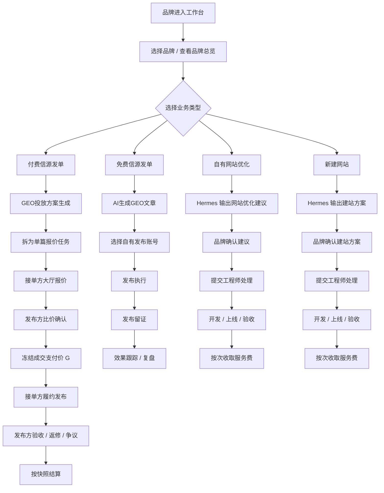

# GEO 投放助手：最新撮合交易链路与线框图

版本：v0.1  
日期：2026-06-25  
用途：在最新 PRD v2.2 与老板沟通结论基础上，先统一撮合交易逻辑链路、模块边界与页面线框，作为后续高保真与开发改造的共同底稿。

---

## 1. 本次先记住的产品结论

### 1.1 交易逻辑的核心调整

1. 发布方不再直接填写单篇媒体价格。
2. 发布方先给出任务需求与隐藏控制条件，由接单方报价。
3. 接单方填写的是 `期望到手价 P0`，系统反算 `发布方成交支付价 G`。
4. 发布方只看 `G`，不看 `P0 / F`。
5. 平台服务费 `F` 从接单方分成中扣除，默认 30%。
6. 冻结时机从“发单即冻结”改为“确认报价后冻结”。

### 1.2 三类业务必须拆开，不再混成一个流程

1. `付费信源发单`
   面向付费媒体/媒体信源发布，核心是 `拆单 -> 报价 -> 比价 -> 确认 -> 履约 -> 验收 -> 结算`。
2. `免费信源发单`
   原 `AI 生成 GEO 文章`，核心是 `AI生成内容 -> 自有账号发布 -> 留证 -> 效果跟踪`，不是报价撮合。
3. `自有网站优化`
   面向已有官网/站点，核心是 `AI建议 -> 方案确认 -> 工程处理 -> 上线验收 -> 服务费结算`。
4. `新建网站`
   面向专题站/新站搭建，核心是 `建站方案 -> 方案确认 -> 工程处理 -> 上线验收 -> 服务费结算`。

### 1.3 工作台结构约束

1. 工作台要结果导向，不要功能导向。
2. `优化任务看板` 与 `待你处理` 不能重复承载同一批任务。
3. 工作台只放：
   - 品牌总览
   - 当前任务结果
   - 真正待决策事项
   - 最近完成
4. 功能入口放导航，不放工作台主体。
5. 侧栏顶部 `快速发起` 保留，工作台主体不再重复放快捷入口。

---

## 2. 最新业务总图



---

## 3. 按业务拆开的逻辑链路

## 3.1 付费信源发单链路

### 业务目标

把“品牌不懂单篇媒体价格”的问题，变成“平台拆单后由接单方报价，品牌只做比价确认”。

### 链路

```text
品牌资料 / GEO分析 / 投放目标
  -> AI 生成投放方案
  -> 拆为 N 条报价任务
  -> 任务进入接单方大厅
  -> 多个接单方提交报价
  -> 品牌查看比价页
  -> 确认某一报价
  -> 冻结 G
  -> 任务进入履约
  -> 提交链接/截图/收录证明
  -> 验收 / 返修 / 争议
  -> 结算
```

### 关键规则

1. 发单时不冻结。
2. 大厅不展示客户预算。
3. 当前先不展示建议区间，接单方只看任务信息与隐藏后的任务约束。
4. 发布方只看成交支付价 `G`。
5. 接单方报价输入 `P0`，系统反算 `G/F`。
6. 确认报价后才冻结 `G`。

### 涉及模块

#### 发布端

1. 工作台
2. 品牌管理
3. GEO 分析
4. 付费信源发单
5. 报价比价页
6. 内容交付
7. 账户余额

#### 接单端

1. 任务大厅
2. 任务详情
3. 提交报价
4. 我的报价
5. 我的订单
6. 交付上传
7. 收益中心

#### 平台端

1. 订单监管
2. 报价监管
3. 冻结/结算流水
4. 争议处理

---

## 3.2 免费信源发单链路

### 业务目标

承接原 `AI 生成 GEO 文章`，重点是 AI 生产内容并通过品牌自有账号发布，不进入外部报价撮合。

### 链路

```text
品牌选择内容方向
  -> AI 生成 GEO 文章
  -> 选择自有发布账号
  -> 发布执行
  -> 留证（链接/截图）
  -> 效果跟踪
  -> 复盘优化
```

### 关键规则

1. 这不是撮合报价流程。
2. 没有接单方报价环节。
3. 主要消耗的是内容生成能力与自有账号发布能力。
4. 结果沉淀到内容交付与效果复盘。

### 涉及模块

#### 发布端

1. 工作台
2. 免费信源发单
3. 发布账号
4. 内容交付
5. GEO 监控 / 效果复盘

#### 平台端

1. 发布账号监管
2. 内容留证抽查
3. 复盘数据看板

---

## 3.3 自有网站优化链路

### 业务目标

把已有官网/品牌站的优化从“内容发单”里独立出来，成为单独的品牌优化业务线。

### 链路

```text
品牌发起网站优化需求
  -> Hermes 输出优化建议 / 页面建议
  -> 品牌确认方案
  -> 提交工程师处理
  -> 开发 / 上线
  -> 品牌验收
  -> 按次服务费结算（开发 + 年度维护）
```

### 关键规则

1. 这不是接单方大厅报价流程。
2. 这更接近“AI 方案 + 工程交付”。
3. 应进入工程师处理池，而不是内容接单大厅。
4. 费用表达为服务费，不是媒体发稿费。

### 涉及模块

#### 发布端

1. 工作台
2. 自有网站优化
3. 网站优化任务详情
4. 方案确认
5. 工程进度查看
6. 验收与服务费记录

#### 平台端 / 内部交付侧

1. 网站优化方案池
2. 工程任务池
3. 上线验收
4. 服务费结算

---

## 3.4 新建网站链路

### 业务目标

把专题站、城市站、独立承接站的搭建单独成线，不和自有网站优化混为一个模块。

### 链路

```text
品牌发起新建网站需求
  -> Hermes 输出建站方案
  -> 品牌确认页面结构 / 栏目 / 内容方向
  -> 提交工程师处理
  -> 开发 / 上线
  -> 品牌验收
  -> 按次服务费结算（开发 + 年度维护）
```

### 关键规则

1. 这是独立模块，不挂在“自有网站优化”里做子页兜底。
2. 页面结构、栏目配置、页面模板是这里的核心信息。
3. 仍然属于工程交付，不进入接单大厅。

### 涉及模块

#### 发布端

1. 工作台
2. 新建网站
3. 建站方案详情
4. 方案确认
5. 工程进度查看
6. 验收与服务费记录

#### 平台端 / 内部交付侧

1. 建站方案池
2. 工程任务池
3. 上线验收
4. 服务费结算

---

## 4. 统一状态视角

为了避免把“品牌级优化任务”和“单次子任务”混成一个线性时间轴，状态拆成两层。

### 4.1 品牌级任务状态

用于工作台总览：

1. 待生成
2. 报价确认中
3. 执行中
4. 待验收
5. 已完成
6. 已争议

### 4.2 子任务分布状态

用于任务详情页：

1. 已完成
2. 执行中
3. 待确认报价
4. 待生成
5. 待验收
6. 待工程处理
7. 已上线

### 4.3 不再推荐的表达方式

不要把品牌总任务画成单一的 `1 -> 2 -> 3 -> 4 -> 5` 线性进度条，因为：

1. 一个品牌任务会拆成多个子任务。
2. 多个子任务会并行推进。
3. 内容优化与网站优化天然不是同一条时序链。

---

## 5. 模块清单总表

| 端 | 模块 | 是否进入本轮主链路 |
|---|---|---|
| 发布端 | 工作台 | 是 |
| 发布端 | 品牌管理 | 是 |
| 发布端 | GEO分析 | 是 |
| 发布端 | GEO监控 | 是 |
| 发布端 | 付费信源发单 | 是 |
| 发布端 | 免费信源发单 | 是 |
| 发布端 | 自有网站优化 | 是 |
| 发布端 | 新建网站 | 是 |
| 发布端 | 内容交付 | 是 |
| 发布端 | 账户余额 / 发布账号 | 是 |
| 接单端 | 任务大厅 | 仅付费信源发单链路 |
| 接单端 | 提交报价 | 仅付费信源发单链路 |
| 接单端 | 我的报价 | 仅付费信源发单链路 |
| 接单端 | 我的订单 | 仅付费信源发单链路 |
| 接单端 | 收益中心 | 仅付费信源发单链路 |
| 平台端 | 报价监管 | 是 |
| 平台端 | 订单监管 | 是 |
| 平台端 | 价目带管理 | 是 |
| 平台端 | 争议处理 | 是 |
| 平台端 | 网站优化工程池 | 是 |

---

## 6. 工作台信息架构建议

## 6.1 工作台应该回答的问题

品牌一进来要先看到：

1. 我当前品牌总体有多少任务在推进？
2. 哪些事情等我决策？
3. 哪些任务正在执行？
4. 哪些任务最近已经完成？
5. 我的账户余额是否够支撑后续操作？

### 6.1.1 当前真实账户模型

目前工作台只应展示两类余额：

1. `词元账户余额`
2. `投放账户余额`

不展示 `网站优化服务余额`，因为网站优化当前走线下交付，不走账户余额扣减。

## 6.2 工作台不应该做的事

1. 不做功能入口汇总页。
2. 不同时放“优化任务看板”和“待你处理”去展示同一批任务。
3. 不把品牌总任务画成单一流程线。

## 6.3 工作台推荐结构

```text
品牌总览
  -> 词元账户余额 / 投放账户余额 / 可用账号

待你处理
  -> 只放真正待确认、待验收、待审核事项

优化任务看板
  -> 只放任务推进概览，不重复列待处理项

最近完成
  -> 最近完成与最近上线
```

### 去重原则

1. `待你处理` 只放“需要当前品牌方点击处理”的事项。
2. `优化任务看板` 只放“任务状态概览和入口”。
3. 同一条任务不要同时以完整卡片形式出现在两个模块里。

### 6.4 导航侧的快速开始仍然保留

工作台主体不放功能入口，不代表侧栏不保留 `快速发起 / 快速开始`。

建议保留当前侧栏顶部快速入口按钮，用于：

1. 快速进入付费信源发单
2. 快速进入免费信源发单
3. 快速进入自有网站优化
4. 快速进入新建网站

---

## 7. 关键页面线框图

## 7.1 发布端工作台线框

```text
┌──────────────────────────────────────────────────────────────────────────────┐
│ 工作台                                              [搜索框] [Hermes状态]    │
├──────────────┬───────────────────────────────────────────────────────────────┤
│ 侧边导航      │ 品牌总览                                                       │
│              │ 云杉口腔                                      [切换品牌][管理] │
│ 工作台        │ 进行中 3   待处理 5   本周完成 12                              │
│ 品牌管理      │ 词元账户余额 128,000   投放账户余额 ¥86,500   可用发布账户 12   │
│ GEO分析       ├───────────────────────────────┬──────────────────────────────┤
│ GEO监控       │ 待你处理                        │ 最近完成                     │
│ 付费信源发单   │ 1. 确认3个媒体报价 [去处理]     │ 1. 品牌词问答覆盖 已完成      │
│ 免费信源发单   │ 2. 审核官网优化建议 [去处理]    │ 2. 城市专题站 已上线          │
│ 自有网站优化   │ 3. 确认建站方案 [去处理]        │ [查看全部]                    │
│ 新建网站       │                                  │                              │
│ 内容交付       ├──────────────────────────────────────────────────────────────┤
│ Hermes日志    │ 优化任务看板                                                  │
│              │ [全部] [内容优化] [网站优化]                     [查看全部]    │
│              │ ┌──────────────────────┐ ┌──────────────────────┐            │
│              │ │ 品牌权威内容铺设      │ │ 官网口腔种植页优化     │            │
│              │ │ 报价确认中            │ │ 待工程排期            │            │
│              │ │ 已完成2 待确认3 执行4 │ │ 建议已出1 待处理1     │            │
│              │ │ [查看报价]            │ │ [查看建议]            │            │
│              │ └──────────────────────┘ └──────────────────────┘            │
│              │ ┌──────────────────────┐ ┌──────────────────────┐            │
│              │ │ 重点医生口碑问答覆盖   │ │ 城市专题新站搭建       │            │
│              │ │ 执行发布中            │ │ 方案确认中            │            │
│              │ │ 已完成5 执行中6 待验收2│ │ 待确认1 开发中0       │            │
│              │ │ [查看进度]            │ │ [查看方案]            │            │
│              │ └──────────────────────┘ └──────────────────────┘            │
└──────────────┴───────────────────────────────────────────────────────────────┘
```

---

## 7.1.1 付费信源发单：任务发布表单线框

说明：这张线框专门补“发单表单本体”。它的目标不是展示流程感，而是让产品、老板、研发一眼看清楚发布时到底要填哪些关键信息，避免高保真阶段继续漏字段。

```text
┌──────────────────────────────────────────────────────────────────────────────┐
│ 付费信源发单                                                                  │
│ 云杉口腔                                                   [保存草稿] [下一步] │
├──────────────────────────────────────────────────────────────────────────────┤
│ 一、任务基础信息                                                              │
│ 任务名称：        [ 品牌权威内容铺设                                    ]      │
│ 任务类型：        [ 官方媒体 / 行业媒体 / 问答 / 测评 / 探店 / 综合投放 ]      │
│ 目标平台类型：    [ 官方媒体 ] [ 行业媒体 ] [ 知乎 ] [ 小红书 ] [ 网站 ]       │
│ 需求来源：        [ 按品牌资料 ] [ 根据 GEO 报告 ] [ 根据排名缺口 ]            │
│                                                                              │
│ 二、品牌与内容判断信息                                                        │
│ 品牌名称：        [ 云杉口腔                                            ]      │
│ 品牌介绍：        [ 多行文本                                                ]   │
│ 产品/服务卖点：   [ 多行文本                                                ]   │
│ 目标关键词：      [ 种植牙 / 隐形矫正 / 口腔医院排名 ]                         │
│ 内容方向：        [ 品牌介绍稿 / 医生口碑问答 / 科普测评 / 城市专题 ]           │
│ 参考文章/案例：   [ 链接 / 附件 / 素材列表                                  ]   │
│ 官网链接：        [ https://...                                           ]    │
│ 资质材料：        [ 营业执照 / 医疗资质 / 授权证明 / 其他附件 ]                │
│                                                                              │
│ 三、交付要求                                                                  │
│ 字数要求：        [ 800-1200 ] [ 1200-2000 ] [ 自定义 ]                      │
│ 上线时效：        [ 24小时 ] [ 48小时 ] [ 72小时 ] [ 指定时间 ]                │
│ 是否必须带链接：  (√)                                                        │
│ 是否必须带截图：  (√)                                                        │
│ 是否必须带收录证明：( )                                                       │
│ 交付说明：        [ 发布后需回传链接、截图，并补充平台后台留证 ]               │
│ 验收标准：        [ 链接可访问 / 内容符合要求 / 截图完整 / 收录达标 ]          │
│                                                                              │
│ 四、限制与补充说明                                                            │
│ 行业限制：        [ 医疗健康 ]                                                │
│ 地区限制：        [ 南京 / 苏州 / 不限 ]                                      │
│ 禁用词/合规要求： [ 多行文本                                                ]   │
│ 补充说明：        [ 多行文本                                                ]   │
│                                                                              │
│ 五、预算控制                                                                  │
│ 隐藏总上限：      [ ¥20,000 ]                                                 │
│ 单任务上限：      [ ¥3,000 ]                                                  │
│ 冻结说明：        确认报价后才冻结，不在发布时冻结                             │
│                                                                              │
│                                            [生成报价任务] [预览发单详情]       │
└──────────────────────────────────────────────────────────────────────────────┘
```

### 表单目的说明

1. 让发布方把“接单方判断是否可接”的信息一次给全。
2. 让接单方在查看任务时，不需要反复追问品牌基础资料。
3. 让比价时能同时比较“价格 + 案例匹配度 + 交付能力”。

---

## 7.2 付费信源发单：方案拆单页线框

```text
┌──────────────────────────────────────────────────────────────────────────────┐
│ 付费信源发单                                                                  │
├──────────────────────────────────────────────────────────────────────────────┤
│ 品牌：云杉口腔                                                               │
│ 来源：投品资料 / GEO报告 / 排名缺口                                           │
│                                                                              │
│ 投放方向建议                                                                  │
│ 1. 品牌权威内容铺设      官方媒体                           篇数 3            │
│ 2. 医生口碑问答覆盖      知乎/问答                           篇数 5            │
│ 3. 种植牙科普测评        垂类媒体                            篇数 2            │
│                                                                              │
│ 发单信息补充                                                                   │
│ 品牌目标：提高品牌权威回答覆盖 / 指定关键词触达                                 │
│ 必带资料：品牌介绍、产品卖点、禁用词、参考文章、资质材料、官网链接               │
│ 交付要求：是否带链接 / 是否带截图 / 是否带收录证明 / 预计上线时效                │
│ 接单判断信息：平台类型、内容方向、字数要求、发布要求、行业限制、地区限制          │
│                                                                              │
│ 隐藏控制                                                                       │
│ 总隐藏上限：¥20,000    单任务上限：¥3,000                                     │
│                                                                              │
│                                            [生成报价任务]                    │
└──────────────────────────────────────────────────────────────────────────────┘
```

---

## 7.3 付费信源发单：发布方比价页线框

```text
┌──────────────────────────────────────────────────────────────────────────────┐
│ 任务比价：品牌权威内容铺设                                                    │
├──────────────────────────────────────────────────────────────────────────────┤
│ 任务要求：官方媒体 / 品牌介绍稿 / 预计3天上线                                  │
│ 品牌资料：营业资质、品牌介绍、产品卖点、禁用词、参考链接、收录要求               │
│                                                                              │
│ ┌────────┬──────────┬────────────┬──────────┬──────────────┬────────────┐ │
│ │ 接单方 │ 媒体      │ 成交支付价G │ 预计上线  │ 交付证明       │ 操作       │ │
│ ├────────┼──────────┼────────────┼──────────┼──────────────┼────────────┤ │
│ │ 晨光传媒│ 某行业站点 │ ¥1,428.58   │ 2天       │ 链接+截图       │ 确认并冻结 │ │
│ │ 蓝海内容│ 某品牌号   │ ¥1,600.00   │ 1天       │ 链接+截图+收录  │ 确认并冻结 │ │
│ │ 北辰工作室│ 某官方媒体│ ¥1,980.00   │ 3天       │ 链接+截图       │ 确认并冻结 │ │
│ └────────┴──────────┴────────────┴──────────┴──────────────┴────────────┘ │
│                                                                              │
│ 页脚提示：确认后冻结成交支付价 G；发布方不展示接单方到手价与平台服务费。       │
└──────────────────────────────────────────────────────────────────────────────┘
```

---

## 7.3.1 付费信源发单：任务列表页线框

说明：这页承接“发布后我怎么管理所有付费信源任务”。高保真里不能只画表单和比价，还要把任务管理页补齐。

```text
┌──────────────────────────────────────────────────────────────────────────────┐
│ 付费信源发单 · 任务管理                                       [搜索任务]       │
├──────────────────────────────────────────────────────────────────────────────┤
│ [全部] [待报价] [报价中] [待确认] [执行中] [待验收] [已完成]                  │
│                                                                              │
│ 任务名称             平台类型     发布时间        当前状态      报价数   操作    │
│ 品牌权威内容铺设      官方媒体      2026/06/25      报价中        3      查看    │
│ 医生口碑问答覆盖      知乎          2026/06/25      待确认        5      比价    │
│ 种植牙科普测评        垂类媒体      2026/06/25      执行中        1      查看    │
│ 城市口腔专题稿        官方媒体      2026/06/24      待验收        1      验收    │
└──────────────────────────────────────────────────────────────────────────────┘
```

---

## 7.3.2 付费信源发单：报价详情 / 接单方对比页线框

说明：这页补“看接单方案例信息”的关键页面。仅有价格表不够，发布方需要同时判断案例与资源匹配度。

```text
┌──────────────────────────────────────────────────────────────────────────────┐
│ 报价详情：品牌权威内容铺设                                                    │
├──────────────────────────────────────────────────────────────────────────────┤
│ 任务摘要：官方媒体 / 品牌介绍稿 / 3天内上线                                    │
│                                                                              │
│ 接单方 A：晨光传媒                                                            │
│ 成交支付价 G：¥1,428.58                                                       │
│ 预计上线：2天                                                                 │
│ 交付承诺：链接 + 截图                                                         │
│ 案例信息：[医疗行业稿件1] [品牌口碑问答2] [官方媒体案例3]                      │
│ 资源说明：医疗行业媒体资源、南京本地内容经验                                  │
│                                            [查看完整资料] [确认并冻结]         │
│                                                                              │
│ 接单方 B：蓝海内容                                                            │
│ 成交支付价 G：¥1,600.00                                                       │
│ 预计上线：1天                                                                 │
│ 交付承诺：链接 + 截图 + 收录证明                                              │
│ 案例信息：[知乎问答案例1] [医疗科普案例2]                                      │
│ 资源说明：问答平台经验更强                                                    │
│                                            [查看完整资料] [确认并冻结]         │
└──────────────────────────────────────────────────────────────────────────────┘
```

---

## 7.3.3 付费信源发单：已确认报价后的执行详情页线框

```text
┌──────────────────────────────────────────────────────────────────────────────┐
│ 执行详情：品牌权威内容铺设                                                    │
├──────────────────────────────────────────────────────────────────────────────┤
│ 接单方：晨光传媒       成交支付价：¥1,428.58       当前状态：执行中             │
│                                                                              │
│ 任务要求：官方媒体 / 品牌介绍稿 / 3天上线 / 链接+截图                          │
│                                                                              │
│ 执行进度                                                                       │
│ 报价已确认 -> 已冻结 -> 内容撰写中 -> 待发布 -> 已提交交付                     │
│                                                                              │
│ 交付物区                                                                       │
│ 发布链接： [ 待回传 ]                                                         │
│ 截图证明： [ 待上传 ]                                                         │
│ 收录证明： [ 非必填 ]                                                         │
│                                                                              │
│ 验收动作                                                                       │
│                                            [发起返修] [确认验收]               │
└──────────────────────────────────────────────────────────────────────────────┘
```

---

## 7.4 接单端：任务大厅线框

```text
┌──────────────────────────────────────────────────────────────────────────────┐
│ 任务大厅                                                     [搜索] [筛选]    │
├──────────────────────────────────────────────────────────────────────────────┤
│ [全部平台] [官方媒体] [垂类媒体] [知乎] [小红书] [网站]                        │
│                                                                              │
│ ┌──────────────────────────────────────────────────────────────────────────┐ │
│ │ 品牌权威内容铺设                                                         │ │
│ │ 品牌：云杉口腔   类型：官方媒体   剩余3名额                               │ │
│ │ 要求：3天内上线，提供链接+截图                                            │ │
│ │ 可判断信息：内容方向 / 字数要求 / 是否要收录证明 / 行业限制 / 品牌资料摘要    │ │
│ │                                                      [查看详情 / 提交报价] │ │
│ └──────────────────────────────────────────────────────────────────────────┘ │
│                                                                              │
│ ┌──────────────────────────────────────────────────────────────────────────┐ │
│ │ 种植牙科普测评                                                           │ │
│ │ 品牌：云杉口腔   类型：垂类媒体   剩余2名额                               │ │
│ │                                                      [查看详情 / 提交报价] │ │
│ └──────────────────────────────────────────────────────────────────────────┘ │
└──────────────────────────────────────────────────────────────────────────────┘
```

---

## 7.4.1 接单端：任务详情页线框

说明：任务大厅卡片只够筛选，真正判断“能不能接”要进详情页，所以这里必须把品牌资料、交付要求、限制条件、案例要求补全。

```text
┌──────────────────────────────────────────────────────────────────────────────┐
│ 任务详情：品牌权威内容铺设                                     [提交报价]      │
├──────────────────────────────────────────────────────────────────────────────┤
│ 一、任务摘要                                                                  │
│ 品牌：云杉口腔      类型：官方媒体      内容方向：品牌介绍稿                   │
│ 时效：3天内上线     交付：链接 + 截图     是否要收录证明：否                   │
│                                                                              │
│ 二、品牌背景                                                                  │
│ 品牌介绍：云杉口腔主营种植牙、隐形矫正……                                      │
│ 产品卖点：医生团队 / 城市连锁 / 种植技术 / 术后服务                           │
│ 官网链接：[https://...]                                                       │
│ 资质附件：[营业执照] [医疗资质] [授权证明]                                    │
│                                                                              │
│ 三、内容要求                                                                  │
│ 字数要求：1200-2000                                                           │
│ 核心关键词：种植牙、隐形矫正、口腔医院推荐                                    │
│ 禁用词：最权威 / 保证疗效 / 价格最低                                           │
│ 参考文章/案例：[链接1] [链接2]                                                │
│                                                                              │
│ 四、接单限制                                                                  │
│ 行业限制：医疗健康                                                            │
│ 地区限制：南京 / 苏州                                                         │
│ 平台要求：官方媒体优先                                                        │
│                                                                              │
│ 五、接单判断                                                                  │
│ 你当前资源：官方媒体 2 个 / 医疗行业案例 5 个 / 南京地区可接                   │
│ 平台提示：你的案例与该任务匹配度较高                                          │
│                                                                              │
│                                            [返回大厅] [提交报价]               │
└──────────────────────────────────────────────────────────────────────────────┘
```

---

## 7.5 接单端：提交报价页线框

```text
┌──────────────────────────────────────────────────────────────────────────────┐
│ 提交报价：品牌权威内容铺设                                                    │
├──────────────────────────────────────────────────────────────────────────────┤
│ 任务摘要：官方媒体 / 品牌介绍稿 / 3天内上线 / 提供链接+截图                    │
│ 品牌资料：品牌介绍 / 产品卖点 / 禁用词 / 参考文章 / 资质材料                   │
│                                                                              │
│ 期望到手金额 P0： [ ¥1000.00                ]                                │
│ 平台技术服务费 F：¥428.58                                                    │
│ 发布方成交支付价 G：¥1,428.58                                                │
│                                                                              │
│ 媒体名称：       [                    ]                                       │
│ 预计上线时间：   [                    ]                                       │
│ 交付承诺：       [ 链接 / 截图 / 收录证明 ]                                  │
│ 报价有效期：     [                    ]                                       │
│ 备注说明：       [                    ]                                       │
│                                                                              │
│                                            [提交报价]                        │
└──────────────────────────────────────────────────────────────────────────────┘
```

---

## 7.5.1 接单端：入驻信息提交线框

说明：当前实现里的 `ProviderOnboarding` 只有“媒体平台 + 地区 + 协议”这条极简链路，不足以支撑发布方查看接单方案例和能力判断。这里补的是完整入驻提交逻辑线框。

```text
┌──────────────────────────────────────────────────────────────────────────────┐
│ 接单方入驻                                                                    │
│ 步骤：基础资料 -> 平台与地区 -> 案例与资源 -> 报价规则 -> 提交审核              │
├──────────────────────────────────────────────────────────────────────────────┤
│ 一、基础资料                                                                  │
│ 主体名称：        [ 晨光传媒                                            ]      │
│ 主体类型：        [ 机构 / 达人 / 工作室 / 媒体资源方 ]                       │
│ 联系人：          [                                                        ]   │
│ 联系方式：        [                                                        ]   │
│ 实名/营业资质：   [ 上传附件 ]                                               │
│ 团队介绍：        [ 多行文本                                                ]   │
│                                                                              │
│ 二、平台与地区                                                                │
│ 可接单平台：      [ 小红书 ] [ 知乎 ] [ 官方媒体 ] [ 网站 ]                    │
│ 服务地区：        [ 南京 ] [ 苏州 ] [ 全国 ]                                  │
│ 擅长内容类型：    [ 问答 ] [ 科普 ] [ 探店 ] [ 测评 ] [ 官网优化 ]             │
│                                                                              │
│ 三、案例与资源                                                                │
│ 案例链接：        [ 链接1 ] [ 链接2 ] [ 添加 ]                                │
│ 案例附件/截图：   [ 上传附件 ] [ 上传附件 ]                                    │
│ 账号资源说明：    [ 可用账号、垂类资源、媒体关系说明 ]                         │
│ 是否可给商家展示： [ √ 可展示脱敏案例 ] [ √ 可展示资源摘要 ]                  │
│                                                                              │
│ 四、报价规则                                                                  │
│ 任务类型        最低报价        最高报价        说明                           │
│ [种草]         [1000]         [3000]         [医疗行业经验丰富]               │
│ [问答]         [800]          [2000]         [知乎口碑类可接]                 │
│                                          [添加规则]                           │
│                                                                              │
│ 五、协议与提交                                                                │
│ [ ] 同意用户协议  [ ] 同意隐私政策  [ ] 同意接单入驻与撮合服务协议            │
│                                                                              │
│                                            [保存草稿] [提交审核]               │
└──────────────────────────────────────────────────────────────────────────────┘
```

### 入驻提交流程逻辑

```text
填写基础资料
  -> 选择可接单平台与地区
  -> 维护案例链接 / 案例附件 / 账号资源说明
  -> 维护报价规则
  -> 同意协议
  -> 提交审核
  -> 平台审核通过后，任务大厅才允许正常报价与接单
```

### 当前实现与目标差异

1. 当前 `ProviderOnboarding` 只覆盖媒体平台、地区、协议与提审。
2. 当前案例与资源维护主要在 `ProviderAccountView`，而且受 `PROVIDER_CASE_SUBMISSION_ENABLED` 控制。
3. 最新业务下，案例与资源信息不应再是弱化信息，而应成为入驻与后续接单的核心资料。

---

## 7.5.2 接单端：案例与资源维护页线框

```text
┌──────────────────────────────────────────────────────────────────────────────┐
│ 账号资源 / 案例维护                                                           │
├──────────────────────────────────────────────────────────────────────────────┤
│ 平台能力：小红书 / 知乎 / 官方媒体 / 网站                                     │
│ 行业标签：医疗健康 / 本地生活                                                 │
│ 报价区间：¥1000 - ¥50000                                                      │
│                                                                              │
│ 案例列表                                                                       │
│ 1. 小红书口腔种草案例      [查看链接] [删除]                                   │
│ 2. 知乎医生口碑问答案例    [查看链接] [删除]                                   │
│ 3. 官方媒体品牌稿案例      [查看链接] [删除]                                   │
│                                                                              │
│ 资源说明                                                                       │
│ [ 多行文本：说明可接的媒体资源、账号类型、行业经验、擅长题材 ]                 │
│                                                                              │
│ 报价规则                                                                       │
│ 种草：¥1000-3000   问答：¥800-2000   官网优化：按单评估                        │
│                                                                              │
│                                            [保存资源信息]                      │
└──────────────────────────────────────────────────────────────────────────────┘
```

---

## 7.6 自有网站优化：任务详情线框

```text
┌──────────────────────────────────────────────────────────────────────────────┐
│ 自有网站优化：官网口腔种植页优化                                              │
├──────────────────────────────────────────────────────────────────────────────┤
│ 类型：自有网站优化              当前阶段：待工程排期                          │
│                                                                              │
│ AI 优化建议                                                                   │
│ 1. 增加 FAQ 结构区块                                                          │
│ 2. 增强种植页 GEO 问答文案                                                    │
│ 3. 调整页面 schema 与标题结构                                                 │
│                                                                              │
│ 处理流转                                                                       │
│ 建议已出 -> 品牌确认 -> 工程处理中 -> 已上线 -> 待验收                         │
│                                                                              │
│ 工程交付信息                                                                   │
│ 负责人：工程师A    预计上线：2026-06-30    服务费：¥6000                      │
│                                                                              │
│                                    [确认建议] [查看工程进度]                  │
└──────────────────────────────────────────────────────────────────────────────┘
```

---

## 7.7 新建网站：任务详情线框

```text
┌──────────────────────────────────────────────────────────────────────────────┐
│ 新建网站：城市专题新站搭建                                                    │
├──────────────────────────────────────────────────────────────────────────────┤
│ 类型：新建网站                当前阶段：方案确认中                            │
│                                                                              │
│ 建站方案摘要                                                                  │
│ 站点目标：承接“南京种植牙”相关品牌搜索与问答流量                              │
│ 页面结构：首页 / 项目页 / FAQ页 / 案例页 / 联系入口                            │
│ 内容方向：品牌介绍、医生介绍、种植问答、案例内容                               │
│                                                                              │
│ 工程流转                                                                       │
│ 方案已出 -> 待品牌确认 -> 开发中 -> 已上线 -> 待验收                           │
│                                                                              │
│ 交付信息                                                                       │
│ 负责人：工程师B    预计上线：2026-07-05    服务费：¥12000                     │
│                                                                              │
│                                    [确认方案] [查看工程进度]                  │
└──────────────────────────────────────────────────────────────────────────────┘
```

---

## 8. 后续高保真前的确认点

下一步高保真前，建议先把以下 6 个点拍板：

1. 工作台是否保留 `待你处理 + 优化任务看板 + 最近完成` 这 3 个主模块。
2. `待你处理` 是否只保留待报价确认 / 待验收 / 待方案确认三类事项。
3. `免费信源发单` 是否完全沿用原 `AI 生成 GEO 文章` 的页面壳子，只改名称。
4. `自有网站优化` 与 `新建网站` 是否作为两个独立模块存在。
5. 接单端 P0 是否只开放 `付费信源发单` 链路。
6. 工作台顶部余额是否固定展示：
   - 词元账户余额
   - 投放账户余额
   - 可用发布账户数

---

## 8.1 本轮补充的明确约束

1. 当前账户只有 `词元账户余额` 和 `投放账户余额`。
2. `快速发起` 保留在侧栏，不放入工作台主体。
3. `建议区间` 当前没有稳定数据源，P0 先不做。
4. 发单信息必须足够让接单方判断是否可接单，不能只给标题和平台。
5. 接单端入驻与账号资源页必须维护案例信息，因为发布端会看案例做选择。
6. 网站业务必须拆成 `自有网站优化` 与 `新建网站` 两个模块。

### 8.1.1 付费信源发单需要补齐的信息

建议发单详情至少包含：

1. 品牌名称
2. 品牌介绍
3. 产品/服务卖点
4. 投放目标
5. 内容方向
6. 目标平台类型
7. 字数/内容形式要求
8. 是否必须带链接
9. 是否必须带截图
10. 是否必须带收录证明
11. 预计上线时效
12. 禁用词/合规要求
13. 参考文章或参考案例
14. 资质材料/官网链接
15. 地区限制 / 行业限制

### 8.1.2 接单端入驻需要维护的信息

为了支持发布端判断“是否选这个接单方”，接单端入驻或账号资源页至少应维护：

1. 可接单平台
2. 服务地区
3. 擅长内容类型
4. 过往案例链接
5. 案例附件 / 截图
6. 账号资源说明
7. 报价规则
8. 团队/机构介绍
9. 联系主体与实名资质

当前仓库里已经有 `ProviderAccountView` 的案例链接与案例素材骨架，也有 `ProviderOnboarding` 与 `ProviderProfileView` 的入驻骨架；按最新业务方向，这块应该重新回到主链路里，而不是继续按“本期无需案例”弱化。

### 8.1.3 付费信源发单还缺的页面清单

除了工作台与单页表单，`付费信源发单` 这一条主链路至少还要补齐以下线框页：

1. 任务发布表单页
2. 方案拆单页
3. 任务管理列表页
4. 报价详情 / 接单方对比页
5. 已确认报价后的执行详情页
6. 验收 / 返修处理页

如果这几页不补齐，高保真会只剩“入口感”和“概念感”，不足以支撑开发与评审。

---

## 9. 建议的下一步产出顺序

1. 先确认这份链路图和模块边界。
2. 再画发布端工作台高保真。
3. 再画 `付费信源发单` 的方案拆单页与比价页。
4. 再画 `自有网站优化` 与 `新建网站` 的任务详情页。
5. 最后再补接单端 `任务大厅 -> 提交报价 -> 我的订单`。

---

## 10. 当前结论一句话版

最新版本不再把所有业务都塞进一个“发单流程”里，而是拆成：

1. `付费信源发单`：报价撮合链路  
2. `免费信源发单`：AI 生成文章并自有账号发布  
3. `自有网站优化`：AI 建议后转工程交付  
4. `新建网站`：建站方案后转工程交付

工作台则只负责展示品牌结果、待处理事项和任务推进概览，不再承担功能导航。
