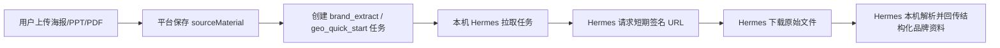

# GEO 投放助手：本机 Hermes 首启与真实调用商用迭代方案

版本：v1.4 本机 Hermes 商用接入版  
日期：2026-06-06  
适用项目：`D:\GEO-Agent`  
Hermes 产品形态：`D:\Hermes` Windows 本机客户端  
开发口径：本阶段不建设云端 Hermes，不在 Web 端另做 Agent Runtime，不由平台承担模型算力成本；所有涉及 AI 的执行、模型调用、技能运行、网页读取、文件理解和自动化动作均由用户本机 Hermes 完成。当前本机 Hermes 暂未具备 GEO 投放助手所需的任务拉取、绑定、回传协议，需要配套新开发，但协议设计必须满足真实线上 SaaS 环境，不依赖平台服务端访问用户本机 `127.0.0.1`。

---

## 1. 核心结论

GEO 投放助手的本质不是独立 Agent 平台，而是 **Hermes 面向非技术客户的行业 GUI 适配层**。

目标客户可能不会使用 Hermes、不会写 prompt、不会配置 API、也不理解 Agent 技能。GEO 投放助手要把 Hermes 的能力翻译成他们能理解的业务动作：

1. 提供品牌线索。
2. 整理品牌资料。
3. 安装并绑定本机 Hermes。
4. Hermes 使用公司内置词元/模型能力完成 AI 调用。
5. 执行首次 AI 可见度体检。
6. 查看 GEO 报告。
7. 进入专业审计、资产生成、任务包和交付。

本阶段必须坚持：

1. **没有云端 Hermes**：平台不承担 Agent 服务器和模型推理成本。
2. **没有 Web 独立 Agent**：Web 后端不直接调用模型 API 生成业务结果。
3. **本机 Hermes 唯一执行器**：所有 Agent 能力均由用户本机 Hermes 执行。
4. **中国市场多入口首启**：用户不一定有官网，允许品牌名、海报、PPT、PDF、社媒链接、门店链接、业务描述作为起点。
5. **生产环境禁止静默 mock 成功**：演示数据只能在显式 demo 模式下使用，并必须标识。
6. **首期原始文件上传平台保存**：海报、PPT、PDF、图片等资料先上传平台，Hermes 通过短期签名 URL 拉取；平台负责权限、留存和删除策略。
7. **API Key 使用公司 Hermes / 词元体系**：不在 Web 端建设用户自填 API Key 表单；由 Hermes 内置的公司词元/模型能力完成配置、校验和调用。

---

## 2. 当前项目情况

当前项目已经具备本阶段改造的基础：

| 能力 | 当前状态 | 本阶段处理 |
|---|---|---|
| AgentTask 状态机 | 已有任务、日志、重试、取消 | 扩展本机 Hermes 等待态语义 |
| GEO taskType | 已包含 `geo_quick_start`、`geo_audit`、`geo_schema`、`geo_llmstxt`、`geo_citability` 等 | 继续复用 |
| Hermes executor | 已开始恢复 `nous_hermes` 分支和 `/v1/runs` 调用 | 本地开发可先调用 `127.0.0.1:8642` 打通 POC；正式版调整为“本机 Hermes 主动拉取任务”为目标架构 |
| GeoReport | 已扩展 `scoresJson`、`findingsJson`、`artifactsJson`、`actionPlanJson`、`rawJson` | 作为 P0 报告承载模型 |
| GeoActionConfirmation | 已有确认记录模型 | 用于中高风险动作确认 |
| Hermes 状态 UI | 已有状态徽标和执行器面板 | 改为首启引导和本机状态工作流 |
| 品牌资料 | 已支持品牌资料、材料、关键词、竞品 | 新增“任意品牌线索”首启入口 |

---

## 3. 目标用户与输入现实

中国市场中，普通老板或本地商家不一定能提供标准官网。常见输入包括：

1. 一个品牌名或门店名。
2. 一张招商海报、活动海报、产品图。
3. 一份 PPT、PDF、Word 品牌介绍。
4. 小红书、抖音、公众号、大众点评、美团、淘宝店铺链接。
5. 一段微信里复制来的业务描述。
6. 老板口述的一句话。

因此首启不能只做“输入官网”，而应做“提供任意品牌线索”。

---

## 4. 首次启动总流程

```mermaid
flowchart LR
    A["提供任意品牌线索"] --> B["创建品牌草稿"]
    B --> C["整理品牌资料"]
    C --> D["用户确认品牌资料"]
    D --> E["生成首次 GEO 检测任务"]
    E --> F["引导下载 Hermes"]
    F --> G["绑定本机 Hermes"]
    G --> H["Hermes 检测词元/模型能力"]
    H --> I["Hermes 本机领取任务"]
    I --> J["执行 geo-quick-start"]
    J --> K["回传报告与 artifact"]
    K --> L["Web 展示报告与下一步动作"]
```



关键点：

1. 提供品牌线索后可以立即进入控制台，但首次检测会等待本机 Hermes 就绪。
2. Web 可创建任务和展示状态，但不直接执行 Agent。
3. 本机 Hermes 准备完成后主动领取任务并回传结果。
4. Web 端不处理 API Key；模型调用能力由公司 Hermes / 词元体系内置承接。

---

## 4.1 Hermes 新增能力建设原则

当前 `D:\Hermes` 是正式产品形态，但暂未具备本项目所需的完整商用对接协议。本阶段需要同步建设 Hermes 侧能力。

### 4.1.1 本地 POC 与线上架构分层

| 阶段 | 调用方式 | 目的 | 限制 |
|---|---|---|---|
| 本地 POC | Web 后端调用本机 `http://127.0.0.1:8642` 或本地 Hermes CLI | 快速验证 skill、输出契约、报告落库 | 仅限开发机和演示机 |
| 商用正式版 | 本机 Hermes 主动连接平台：绑定、心跳、拉任务、回传结果 | 支持真实 SaaS 用户环境 | 不依赖平台访问用户 localhost |

P0 开发可以先用本地 API/CLI 打通真实 Hermes 执行，但代码结构和接口契约必须能平滑迁移到主动拉取模式。

### 4.1.2 Hermes 侧必须新增的能力

| 能力 | 说明 |
|---|---|
| 绑定码输入与确认 | Hermes 客户端输入 GEO 平台绑定码，主动调用平台完成设备绑定 |
| 心跳上报 | 定期上报设备状态、Hermes 版本、GEO 技能版本、词元/模型能力状态 |
| 任务拉取 | 本机 Hermes 主动从平台拉取当前设备/账号可执行任务 |
| 进度回传 | 执行中回传 step、progress、日志摘要 |
| 结果回传 | 执行完成后回传标准化 JSON、summary、raw output |
| Artifact 回传 | 回传 Markdown、JSON、截图、PDF、Schema、llms.txt 等产物 |
| 文件拉取 | 使用平台短期签名 URL 拉取用户上传的海报/PPT/PDF 等原始资料 |
| 取消/停止 | 接收平台任务取消状态，停止本机执行 |
| 安全脱敏 | 日志与结果中自动脱敏 token、cookie、路径、密钥 |

---

## 5. 新增与调整页面

本阶段需要在发布端工作台新增“首启页 / 首启卡片”作为新用户默认落点，同时让侧栏「快速发起项目」复用同一套 GUI。两者不是两套表单，而是同一启动组件在不同位置的呈现：

1. **工作台首启页**：新用户、未完成首次检测、未绑定 Hermes 时优先展示。
2. **快速发起项目弹窗/页面**：老用户、代理商或已有品牌用户随时启动新项目。
3. **同一套输入契约**：品牌名、文件、链接、描述、已有品牌选择完全一致。

### 5.1 工作台首启页 / 快速发起项目：任意品牌线索入口

#### 线框图

```text
┌────────────────────────────────────────────────────────────┐
│ 发布端工作台 · 开始你的第一个 GEO 项目                     │
│                                                            │
│ 让 AI 先认识你的品牌                                      │
│ 没有官网也可以。给我一个品牌名、一张海报、一份 PPT，       │
│ 或一个小红书/抖音/公众号/门店链接，Hermes 会在本机帮你     │
│ 整理品牌资料并完成 AI 可见度体检。                        │
│                                                            │
│ ┌──────────────────────────────────────────────────────┐   │
│ │ 输入品牌名、官网、店铺链接或业务描述                 │   │
│ └──────────────────────────────────────────────────────┘   │
│                                                            │
│ [上传海报 / PPT / PDF / 产品图]                            │
│                                                            │
│ 你可以任选一种方式开始：                                  │
│ [品牌名] [官网] [海报/PPT] [小红书/抖音] [公众号] [描述]  │
│                                                            │
│ [开始整理品牌资料]                                        │
│                                                            │
│ 提示：Agent 执行发生在你的本机 Hermes，模型能力由公司词元体系支持。│
└────────────────────────────────────────────────────────────┘
```

#### 功能说明

当前项目已有侧栏「快速发起项目」入口和 `QuickStartModal`。本阶段需要新增发布端工作台首启页，并让「快速发起项目」升级为复用同一 GUI 的统一启动入口：

1. **发布端工作台首启页**：面向首次进入、未创建品牌、未完成首次 GEO 体检、未绑定 Hermes 的用户。
2. **侧栏快速发起项目**：面向已进入控制台的用户，用于快速启动任意品牌的新 GEO 项目或新一轮检测。
3. **品牌上下文内启动**：如果用户已选中具体品牌，则默认把输入线索归属到当前品牌；如果没有选品牌，则先创建品牌草稿。

这样既能满足发布端工作台需要新手首启页的要求，也能避免出现两套启动表单，并解决当前「快速发起项目」名为项目、实际只是功能快捷入口的心智偏差。

用户可以通过任意一种品牌线索启动项目，不要求有官网。

支持输入类型：

| inputType | 输入 | 示例 |
|---|---|---|
| `brand_name` | 品牌名 / 门店名 / 公司名 | 云杉口腔 |
| `website_url` | 官网 URL | `https://example.com` |
| `file` | 海报、PPT、PDF、图片 | 招商海报.jpg、品牌介绍.pptx |
| `social_link` | 社媒/门店/电商链接 | 小红书主页、大众点评门店 |
| `description` | 业务描述 | “我们是南京做儿童矫正的口腔门诊” |

提交后系统动作：

1. 创建品牌草稿。
2. 创建轻量 GEO 项目容器或项目草稿。
3. 创建品牌资料整理任务。
4. 如果 Hermes 未就绪，任务进入等待本机 Hermes 状态。
5. 进入首启控制台或项目工作台。

#### 入口复用规则

| 入口 | 使用场景 | 行为 |
|---|---|---|
| 发布端工作台首启页 | 新用户、未完成首次检测、未绑定 Hermes | 输入品牌线索后创建品牌草稿 + 项目草稿 |
| 侧栏「快速发起项目」 | 老用户、代理商、运营日常启动项目 | 打开同一套任意品牌线索弹窗 |
| 品牌页 / 工作台 CTA | 已选品牌下继续启动新项目 | 默认带入当前品牌，只补充资料或目标 |
| GEO 分析页 CTA | 已有品牌，直接做诊断 | 可跳过品牌草稿，直接生成 `geo_quick_start` |

#### 验收标准

1. 只输入品牌名也能进入下一步。
2. 上传文件后能生成品牌资料整理任务。
3. 粘贴社媒链接能识别输入类型。
4. 不要求用户先安装 Hermes 才能创建品牌草稿。
5. 页面不出现 Gateway、Runtime、API Server 等技术词。
6. 发布端工作台首启页和侧栏「快速发起项目」使用同一套输入契约，不维护两套表单。
7. 已选品牌时，快速发起默认归属当前品牌；未选品牌时，先创建品牌草稿。

#### 与当前代码的关系

当前 `src/components/common/QuickStartModal.tsx` 是 4 个单点功能入口：

1. GEO 分析。
2. 生成 GEO 文章。
3. 发布任务。
4. 关键词挖掘。

本阶段建议将其升级为两段式：

```text
第一段：提供任意品牌线索 / 选择已有品牌
第二段：选择起步目标：首次体检、专业审计、生成文章、创建任务包
```

旧的 4 个功能卡片不需要删除，而是放到第二段，成为“项目起步方式”。首期可先默认选择“首次 AI 可见度体检”。

---

### 5.2 品牌资料确认页

#### 线框图

```text
┌────────────────────────────────────────────────────────────┐
│ 确认品牌资料                                               │
│ Hermes 将基于这些信息执行首次 AI 可见度体检                │
├───────────────────────────────┬────────────────────────────┤
│ 我们整理出的品牌信息          │ 还可以补充                  │
│                               │                            │
│ 品牌名称：云杉口腔            │ 城市：南京                  │
│ 行业：口腔门诊                │ 主营服务：                  │
│ 主营服务：儿童矫正、种植牙    │ [儿童矫正] [隐形矫正]       │
│ 目标客户：家庭/宝妈           │                            │
│ 官网：暂无                    │ 竞品：                      │
│ 已有渠道：小红书、公众号      │ [北辰口腔] [瑞美齿科]       │
│                               │                            │
│ 资料来源：海报/PPT/文本描述   │ 还差信息：                  │
│                               │ - 是否有门店地址？          │
│                               │ - 是否有官网或社媒主页？    │
├───────────────────────────────┴────────────────────────────┤
│ [返回修改]                          [确认并开始 AI 体检]   │
└────────────────────────────────────────────────────────────┘
```

#### 功能说明

由于用户输入可能很弱，执行首次检测前必须让用户确认品牌资料。

信息来源可来自：

1. 用户填写。
2. 文件提取。
3. 社媒链接读取。
4. 用户后续补充。

确认后系统创建或更新：

1. `Brand`
2. `Brand.sourceMaterials`
3. `AgentTask(type=geo_quick_start)`

#### 验收标准

1. 信息不足时提示用户补充，而不是直接执行审计。
2. 用户可以修改品牌名、行业、城市、主营服务。
3. 确认后生成首次检测任务。
4. 原始文件和链接作为 source material 记录。

---

### 5.3 首启控制台：本机 Hermes 准备状态

#### 线框图

```text
┌────────────────────────────────────────────────────────────┐
│ 正在准备你的首次 GEO 检测                                  │
├────────────────────────────────────────────────────────────┤
│ ✓ 品牌草稿已创建：云杉口腔                                 │
│ ✓ 品牌资料已整理                                           │
│ ✓ 首次检测任务已生成                                       │
│ • Hermes 本机执行器未安装                                  │
│ • 词元/模型能力待检测                                      │
│ • 等待本机 Hermes 执行                                     │
├────────────────────────────────────────────────────────────┤
│ 解锁本机 Hermes 执行                                       │
│ Hermes 会在你的电脑上运行 AI 检测、网页读取和报告生成。     │
│ 模型调用由公司 Hermes / 词元体系支持，不在 Web 端配置 Key。 │
│                                                            │
│ [下载 Windows 版 Hermes] [我已安装，检测一下]              │
├────────────────────────────────────────────────────────────┤
│ 首次检测任务                                               │
│ 状态：等待安装 Hermes                                      │
│ 任务：AI 可见度快速体检                                    │
│ 品牌：云杉口腔                                             │
│ [查看任务详情]                                             │
└────────────────────────────────────────────────────────────┘
```

#### 功能说明

该页面承接首启页，展示用户从 0 到首次任务完成还差什么。

状态建议：

| 状态 | 中文展示 | 说明 |
|---|---|---|
| `not_installed` | 未安装 Hermes | 引导下载 |
| `installed_not_running` | 已安装但未运行 | 引导打开 |
| `running_not_bound` | 已运行但未绑定 | 引导生成绑定码 |
| `token_capacity_unavailable` | 词元/模型能力不可用 | 引导检查 Hermes 词元能力 |
| `ready` | 本机 Hermes 已就绪 | 可执行 |
| `running_task` | 正在执行首次检测 | 展示进度 |
| `completed` | 报告已生成 | 进入报告 |

#### 验收标准

1. 用户能清楚知道下一步该做什么。
2. 下载、绑定、词元/模型能力、技能状态分别展示。
3. Hermes 未就绪时不伪造报告成功。
4. 状态变化可通过轮询刷新。

---

### 5.4 Hermes 下载与绑定向导

#### 线框图

```text
┌────────────────────────────────────────────────────────────┐
│ 安装并绑定 Hermes                                          │
├────────────────────────────────────────────────────────────┤
│ Step 1  下载 Hermes                                        │
│ [下载 Windows 版]  当前支持 Windows，本机执行更安全         │
│                                                            │
│ Step 2  启动 Hermes                                        │
│ 安装完成后保持 Hermes 打开                                 │
│                                                            │
│ Step 3  绑定当前账号                                       │
│ 绑定码：GEO-8F3A-21BC       有效期 15 分钟                 │
│ [复制绑定码] [重新生成]                                    │
│                                                            │
│ Step 4  检测状态                                           │
│ 设备：Windows-PC                                           │
│ 版本：等待上报                                             │
│ 心跳：离线                                                 │
│ [检测本机 Hermes]                                          │
└────────────────────────────────────────────────────────────┘
```

#### 功能说明

绑定必须由本机 Hermes 主动调用平台接口完成，平台服务端不能依赖访问用户本机 `127.0.0.1`。

绑定流程：

1. Web 生成一次性绑定码。
2. 用户在 Hermes 客户端输入绑定码。
3. Hermes 调用平台 `bind-confirm`。
4. 平台记录设备绑定和心跳。
5. Web 展示已绑定。

#### 验收标准

1. 绑定码一次性使用。
2. 绑定码过期后不可用。
3. 绑定只关联当前用户/组织。
4. 设备信息只保存摘要，不保存硬件敏感信息。

---

### 5.5 Hermes 词元 / 模型能力状态引导

#### 线框图

```text
┌────────────────────────────────────────────────────────────┐
│ Hermes 词元 / 模型能力状态                                 │
├────────────────────────────────────────────────────────────┤
│ GEO 检测需要调用大模型。公司 Hermes 已内置词元 / 模型能力，│
│ Web 端不要求用户填写 API Key，也不会保存模型密钥。          │
│                                                            │
│ 能力状态：                                                 │
│ [词元可用] [模型可用] [GEO 技能可用]                       │
│                                                            │
│ 当前状态：等待 Hermes 上报                                 │
│                                                            │
│ [检测词元能力] [查看 Hermes 配置说明] [联系技术支持]        │
└────────────────────────────────────────────────────────────┘
```

#### 功能说明

平台不在 Web 端承担独立模型调用，也不建设 Web 端 API Key 配置。模型调用统一由公司 Hermes 内置的词元 / 模型能力承接。本页只展示 Hermes 上报的能力状态。

Web 只展示状态：

```json
{
  "tokenCapacityStatus": "available",
  "modelRuntimeStatus": "available",
  "provider": "ciyuan",
  "verifiedAt": "2026-06-06T14:30:00.000Z"
}
```

Web 不保存：

1. API Key 明文。
2. Provider Secret。
3. Authorization header。
4. Cookie。

#### 验收标准

1. 前端网络请求中不出现 API Key。
2. 数据库不保存用户 API Key 明文。
3. 日志不输出密钥。
4. 用户能看到“词元/模型能力是否可用”。
5. 若能力不可用，任务不得伪造成成功，应提示检查 Hermes 或联系支持。

---

### 5.6 GEO 分析页调整：首次体检 / 专业审计 / 资产生成

#### 线框图

```text
┌────────────────────────────────────────────────────────────┐
│ GEO 分析                                                   │
├────────────────────────────────────────────────────────────┤
│ [首次体检] [专业审计] [资产生成] [报告历史]                │
├───────────────────────────────┬────────────────────────────┤
│ 首次 AI 可见度体检            │ 本机 Hermes 状态            │
│                               │                            │
│ 品牌：云杉口腔                │ 状态：已绑定 / 词元能力可用 │
│ 输入来源：海报 + 文本描述     │ 技能：geo-quick-start 可用  │
│ 目标平台：DeepSeek / 豆包/Kimi│                            │
│                               │ 预计产物：                  │
│ [开始体检]                    │ - GEO 初始评分              │
│                               │ - AI 提及情况               │
│                               │ - 关键问题                  │
│                               │ - 7 天行动建议              │
└───────────────────────────────┴────────────────────────────┘
```

#### 功能说明

GEO 分析页承接首启任务，也支持已创建品牌再次发起任务。

任务入口：

| Tab | taskType | Hermes skill | 风险 |
|---|---|---|---|
| 首次体检 | `geo_quick_start` | `geo-quick-start` | low |
| 专业审计 | `geo_audit` | `geo-audit` | low |
| 资产生成 | `geo_schema` / `geo_llmstxt` / `geo_citability` | 对应技能 | medium |
| 报告历史 | - | - | - |

#### 验收标准

1. Hermes 未就绪时提示去完成向导。
2. Hermes 就绪后可提交任务。
3. 任务由本机 Hermes 执行。
4. 成功后生成 `GeoReport`。

---

### 5.7 报告详情页升级

#### 线框图

```text
┌────────────────────────────────────────────────────────────┐
│ 云杉口腔 · AI 可见度体检报告                              │
├───────────────────────────────┬────────────────────────────┤
│ 报告正文                      │ 证据与下一步               │
│                               │                            │
│ 总分：54/100                  │ Artifacts                  │
│ 分项评分：                    │ - Markdown 报告            │
│ [AI引用] [品牌权威] [技术GEO] │ - 原始 JSON                 │
│                               │ - 截图                     │
│ 关键问题：                    │                            │
│ P0 Schema 缺失                │ 下一步：                   │
│ P1 llms.txt 未部署            │ [进入专业审计]             │
│ P1 内容可引用性不足           │ [生成 Schema]              │
│                               │ [生成整改任务包]           │
│ 7 天行动计划                  │ [设为基线]                 │
└───────────────────────────────┴────────────────────────────┘
```

#### 功能说明

报告详情展示本机 Hermes 回传的结构化结果和 artifact。

展示字段：

1. `totalScore`
2. `scoresJson`
3. `findingsJson`
4. `actionPlanJson`
5. `artifactsJson`
6. `rawJson`
7. `taskId`
8. `executor`
9. `skillName`

#### 验收标准

1. 报告可追溯到 AgentTask。
2. 可展示 artifact。
3. 可设置 baseline。
4. 可发起下一步专业审计或资产生成。

---

### 5.8 运行日志页增强

#### 线框图

```text
┌────────────────────────────────────────────────────────────┐
│ 运行日志                                                   │
├───────────────┬────────────────────────────────────────────┤
│ 任务列表      │ 任务详情                                   │
│               │ 标题：云杉口腔 GEO 快速检测                │
│ geo_quick...  │ 状态：本机 Hermes 执行完成                  │
│ geo_audit     │ Executor：nous_hermes                       │
│ schema        │ Skill：geo-quick-start                      │
│ publish       │ 设备：Windows-PC                            │
│               │                                            │
│               │ Logs                                       │
│               │ - 等待本机 Hermes 领取任务                  │
│               │ - Hermes 已开始执行                         │
│               │ - 报告已回传                               │
│               │                                            │
│               │ Artifacts                                  │
│               │ [Markdown] [JSON] [Screenshot]             │
│               │                                            │
│               │ 风险确认                                   │
│               │ medium/high 动作确认记录                    │
└───────────────┴────────────────────────────────────────────┘
```

#### 功能说明

运行日志页必须帮助用户和平台运营判断：

1. 是否真实由本机 Hermes 执行。
2. 哪台设备执行。
3. 调用了哪个 skill。
4. 是否产生 artifact。
5. 是否需要人工确认。
6. 是否失败且可重试。

#### 验收标准

1. 不把 demo/direct 结果伪装为 Hermes。
2. 能看到任务等待本机执行的状态。
3. 能看到本机 Hermes 回传的 progress/result。
4. 可重试失败任务。

---

## 6. 接口方案

### 6.1 Web 前端接口

| 接口 | 方法 | 说明 |
|---|---|---|
| `/api/hermes/download-info` | GET | 获取下载入口和平台支持说明 |
| `/api/hermes/onboarding-status` | GET | 获取首启步骤状态 |
| `/api/hermes/health` | GET | 展示绑定设备、心跳、技能状态 |
| `/api/hermes/skills` | GET | 展示技能清单 |
| `/api/hermes/bind-token` | POST | 生成绑定码 |
| `/api/brand-source-materials` | POST | 上传海报、PPT、PDF、图片等原始资料 |
| `/api/brand-source-materials/:id/signed-url` | POST | 为本机 Hermes 生成短期读取 URL |
| `/api/agent-tasks` | POST | 创建任务 |
| `/api/agent-tasks/:id` | GET | 查询任务详情 |
| `/api/geo-audits/:id` | GET | 查询报告 |
| `/api/geo-audits/:id/artifacts` | GET | 查询 artifact |

### 6.2 本机 Hermes 主动调用接口

正式商用版不应依赖平台服务端访问用户本机 `127.0.0.1:8642`。应由本机 Hermes 主动连接平台。

| 接口 | 方法 | 说明 |
|---|---|---|
| `/api/hermes-local/bind-confirm` | POST | 本机 Hermes 使用绑定码完成绑定 |
| `/api/hermes-local/heartbeat` | POST | 上报心跳、版本、技能状态 |
| `/api/hermes-local/token-capacity/status` | POST | 上报词元/模型能力是否可用，不传密钥 |
| `/api/hermes-local/tasks/next` | GET | 拉取下一条待执行任务 |
| `/api/hermes-local/tasks/:id/progress` | POST | 上报进度 |
| `/api/hermes-local/tasks/:id/result` | POST | 回传结构化结果 |
| `/api/hermes-local/tasks/:id/artifacts` | POST | 回传 artifact |

### 6.3 本机 Hermes 任务拉取返回示例

```json
{
  "task": {
    "id": "agent-task-id",
    "type": "geo_quick_start",
    "skill": "geo-quick-start",
    "title": "云杉口腔 · AI 可见度快速体检",
    "input": {
      "brandName": "云杉口腔",
      "city": "南京",
      "industry": "口腔门诊",
      "services": ["儿童矫正", "隐形矫正"],
      "sourceMaterials": [],
      "platforms": ["DeepSeek", "豆包", "Kimi"]
    },
    "outputContract": {
      "format": "json",
      "requiredFields": ["audit", "data", "metrics", "findings", "artifacts", "actionPlan"]
    }
  }
}
```

---

## 7. 数据与安全

### 7.1 不得上传或保存

1. 用户模型 API Key 明文。
2. 第三方平台 Cookie。
3. 第三方平台账号密码。
4. 本机完整用户路径。
5. 明文硬件唯一 ID。
6. 浏览器登录态。

### 7.2 可保存

1. 设备名。
2. 设备 ID 哈希。
3. Hermes 版本。
4. GEO 技能版本。
5. 心跳时间。
6. 词元/模型能力状态。
7. 任务结构化结果。
8. 用户确认后的 artifact。

### 7.3 文件资料

海报、PPT、PDF 等原始资料可能包含敏感信息。

要求：

1. **首期原始文件上传平台保存**，不只保留在用户本机。
2. 默认仅所属品牌用户可见。
3. Hermes 拉取使用短期签名 URL。
4. 签名 URL 需要绑定 taskId、materialId、deviceIdHash 和过期时间。
5. 分享页不展示原始资料。
6. 可支持任务完成后删除原始资料。
7. 平台运营查看需要权限。
8. 文件解析、OCR、PPT/PDF 理解由本机 Hermes 执行，Web 只负责存储、权限和签名 URL。

首期文件链路：



---

## 8. 任务状态语义

现有 `AgentTaskStatus` 不足以清晰表达本机 Hermes 首启链路。本阶段需要新增状态枚举，避免把安装、绑定、词元能力、等待设备领取都塞进 `pending`。

### 8.1 新增 AgentTaskStatus

建议扩展为：

```ts
export type AgentTaskStatus =
  | 'pending_setup'
  | 'waiting_local_device'
  | 'queued'
  | 'running'
  | 'pending_confirm'
  | 'succeeded'
  | 'partial'
  | 'failed'
  | 'canceled';
```

| 数据状态 | 展示文案 | 说明 |
|---|---|
| `pending_setup` | 等待完成 Hermes 设置 | 品牌和任务已创建，但安装、绑定、词元能力或技能未就绪 |
| `waiting_local_device` | 等待本机 Hermes 领取任务 | 本机 Hermes 已就绪，等待设备拉取任务 |
| `queued` | 已进入执行队列 | Hermes 已领取或即将执行 |
| `running` | 本机 Hermes 执行中 | Hermes 正在运行 skill |
| `pending_confirm` | 等待用户确认 | 中高风险动作确认 |
| `succeeded` | 报告已生成 | 成功 |
| `partial` | 部分完成 | 有可用产物但存在缺失或解析问题 |
| `failed` | 执行失败 | 失败 |
| `canceled` | 已取消 | 用户取消 |

### 8.2 setup 阶段原因

`pending_setup` 需要配合 `setupReason` 或 `reviewCategory` 细分：

| reason/category | 展示 |
|---|---|
| `hermes_not_installed` | 等待安装 Hermes |
| `hermes_not_running` | 等待打开 Hermes |
| `hermes_not_bound` | 等待绑定本机 Hermes |
| `token_capacity_unavailable` | 词元/模型能力不可用 |
| `skill_missing` | GEO 技能包缺失 |
| `output_parse_failed` | 结果解析失败，待人工复核 |

### 8.3 兼容要求

1. 旧数据中的 `pending` 可在读取时映射为 `pending_setup`。
2. 前端 `TaskStatusPill`、任务详情、工作台首启页都要支持新状态。
3. 后端 `isTerminalStatus` 逻辑不变，新增状态均为非终态。
4. 本机 Hermes 拉取任务时，只允许拉取 `waiting_local_device` 或符合设备条件的 `queued` 任务。

---

## 9. 迭代拆分

### P0：首启与本机 Hermes 最小闭环

| 编号 | 功能 | 说明 |
|---|---|---|
| P0-01 | 发布端工作台首启页 | 品牌名、文件、链接、描述均可开始 |
| P0-02 | 品牌资料确认页 | 执行前确认品牌资料 |
| P0-03 | 首启控制台 | 展示 Hermes 安装、绑定、词元/模型能力、任务状态 |
| P0-04 | Hermes 下载与绑定向导 | 绑定码、下载、心跳展示 |
| P0-05 | 本机 Hermes 主动拉取任务接口 | `tasks/next`、progress、result |
| P0-06 | `geo_quick_start` 真实本机执行 | 首次 AI 可见度体检 |
| P0-07 | 报告落库与详情展示 | GeoReport + artifact |
| P0-08 | 快速发起项目复用首启 GUI | 侧栏入口使用同一套启动组件 |
| P0-09 | 新增任务状态枚举 | `pending_setup`、`waiting_local_device` 等 |

### P1：专业审计交付闭环

| 编号 | 功能 | 说明 |
|---|---|---|
| P1-01 | `geo_audit` 本机执行 | 专业 GEO 审计 |
| P1-02 | 报告详情升级 | 分项评分、findings、行动计划 |
| P1-03 | artifact 预览 | Markdown、JSON、截图 |
| P1-04 | 运行日志增强 | 设备、skill、artifact、错误 |
| P1-05 | Baseline | 报告设为基线 |

### P2：资产生成与确认

| 编号 | 功能 | 说明 |
|---|---|---|
| P2-01 | `geo_schema` | 生成 JSON-LD |
| P2-02 | `geo_llmstxt` | 生成 llms.txt |
| P2-03 | `geo_citability` | 内容可引用性分析 |
| P2-04 | 中风险确认 | 写入 GeoActionConfirmation |
| P2-05 | 加入任务包 | 从报告生成整改任务 |

### P3：本机自动化发布 POC

| 编号 | 功能 | 说明 |
|---|---|---|
| P3-01 | 账号登录态校验 | 必须本机 Hermes |
| P3-02 | 发布前确认 | high risk |
| P3-03 | 发布证据回传 | 链接、截图、失败原因 |
| P3-04 | 人工兜底 | 失败进入待人工处理 |

---

## 10. 验收标准

### 10.1 产品验收

1. 用户只输入品牌名也能进入首启流程。
2. 用户上传海报/PPT/PDF 可以创建品牌资料整理任务。
3. 用户能看到 Hermes 未安装、未绑定、词元/模型能力不可用等明确状态。
4. 用户能完成下载、绑定、词元/模型能力检测引导。
5. 本机 Hermes 就绪后能领取首次任务。
6. `geo_quick_start` 完成后生成报告。
7. 报告展示评分、问题、行动计划和 artifact。

### 10.2 技术验收

1. 生产环境 Web 不直接调用模型 API。
2. 生产环境 Web 不直接生成 Agent 结果。
3. 用户 API Key 不进入前端和业务数据库；模型能力由公司 Hermes / 词元体系承接。
4. 平台服务端不依赖访问用户本机 `127.0.0.1`。
5. 本机 Hermes 主动拉取任务和回传结果。
6. 所有结果经过后端归一化后落库。
7. mock/fixture 只能在显式 demo 模式中使用。
8. 首期原始文件上传平台保存，并通过短期签名 URL 供 Hermes 拉取。
9. 新增任务状态枚举已在前端状态组件、后端状态判断和本机任务拉取中生效。

### 10.3 安全验收

1. 日志不包含 API Key、Cookie、Authorization。
2. 设备信息只保存摘要。
3. 原始文件资料权限隔离。
4. Artifact 权限按品牌隔离。
5. 高风险动作必须确认。
6. 失败任务不得伪造成成功。

---

## 11. 待评审问题

### 11.1 Hermes 任务协议：先 POC，再上线

建议采用“双轨同契约”方案。

本地开发阶段：

1. 先用 `127.0.0.1:8642` 或 Hermes CLI 调用本机 Hermes。
2. 用真实 Hermes 验证 `skill -> outputContract -> GeoReport`。
3. 不把 localhost 直接写入业务层，统一封装为 `HermesRuntimeAdapter`。

正式上线阶段：

1. 本机 Hermes 主动调用平台完成 `bind-confirm`。
2. 本机 Hermes 定期 `heartbeat`。
3. 本机 Hermes 调用 `tasks/next` 拉取任务。
4. 本机 Hermes 调用 `progress`、`result`、`artifacts` 回传结果。

这样开发阶段能快速验证真实执行，线上阶段也能满足 SaaS 环境，不依赖平台访问用户本机。

### 11.2 `brand_extract`：先用 Hermes 通用能力，预留正式 Skill

首期不强依赖独立 `geo-brand-extract` skill。

建议：

1. 任务类型保留为 `brand_extract`。
2. Hermes 侧先用通用文件、图片、网页、文本理解能力承接。
3. 输入支持 `file`、`social_link`、`description`、`brand_name`。
4. 输出契约固定为 `brandProfile`。
5. 等 Hermes 侧沉淀成熟后，再映射到正式 skill：`geo-brand-extract`。

### 11.3 原始文件：首期上传平台，Hermes 用短期签名 URL 拉取

首期采用平台保存原始文件方案。

规则：

1. 用户上传海报、PPT、PDF、图片到平台。
2. 平台保存为 `BrandSourceMaterial` 或后续独立 `SourceMaterial`。
3. Hermes 拉任务时只拿到 material metadata。
4. Hermes 执行前请求短期签名 URL。
5. 签名 URL 绑定 `taskId + materialId + deviceIdHash + expiresAt`。
6. 分享页默认不展示原始文件。
7. 文件解析仍由本机 Hermes 执行，Web 只负责存储、权限和签名。

### 11.4 词元平台状态：只同步登录数据与余额数据

词元数据来源在词元平台，本项目不定义词元真实数据源，也不在 Web 端承载 API Key 配置。

本项目只同步和展示：

1. 词元平台登录状态。
2. 词元余额 / 可用额度。
3. 最近同步时间。
4. 同步失败原因。

建议字段：

```json
{
  "ciyuanLoginStatus": "logged_in",
  "ciyuanBalance": 12800,
  "ciyuanBalanceUnit": "tokens",
  "lastSyncAt": "2026-06-06T14:30:00.000Z",
  "syncStatus": "succeeded",
  "errorCode": null,
  "errorMessage": null
}
```

状态枚举：

| 状态 | 说明 |
|---|---|
| `logged_in` | 已登录词元平台 |
| `not_logged_in` | 未登录词元平台 |
| `expired` | 登录已失效 |
| `sync_failed` | 同步失败 |
| `unknown` | 状态未知 |

前端只展示“词元登录状态”和“余额是否可用”，不展示密钥，不在本项目内编辑词元平台数据。

### 11.5 新增状态枚举：新任务写新状态，旧任务读取兼容

首期不做历史数据强迁移。

方案：

1. 新任务使用 `pending_setup`、`waiting_local_device` 等新状态。
2. 老任务中的 `pending` 读取时映射为普通“待处理”。
3. 如果老任务存在 `reviewCategory=hermes_not_bound` 等信息，前端可展示为“等待绑定 Hermes”。
4. 稳定后再评估是否做轻量迁移。

这样不会破坏现有演示数据和任务列表。

### 11.6 工作台首启页：大卡片优先，必要时整页空态

建议采用“大卡片优先，必要时整页空态”。

规则：

1. 新用户 / 无品牌 / 无首次报告：工作台顶部展示首启大卡片，占主要视觉。
2. 已有品牌但 Hermes 未就绪：显示正常工作台 + 顶部 Hermes 引导条。
3. 已有报告和任务：工作台正常展示，只保留“快速发起项目”入口。
4. 侧栏「快速发起项目」打开同一个启动组件的弹窗版。

这样不会覆盖老用户工作台，也能让新用户有明确首启路径。

### 11.7 快速发起项目：默认首次体检，允许切换起步目标

建议默认目标为“首次 AI 可见度体检”，但允许用户切换起步目标。

流程：

```text
第一步：提供品牌线索
第二步：确认品牌资料
第三步：选择起步目标
```

起步目标：

| 目标 | 适用场景 |
|---|---|
| 首次 AI 可见度体检 | 默认选中，适合新品牌和新用户 |
| 专业审计 | 已有较完整资料，想直接做深度审计 |
| 生成文章 | 已有品牌资料或报告，要直接产内容 |
| 创建任务包 | 已有明确投放/整改目标 |

如果用户上传的是海报/PPT，默认先走 `brand_extract -> geo_quick_start`。如果用户从报告页点击“生成任务包”，则默认选“创建任务包”。

---

## 12. 一句话结论

本阶段要把 GEO 投放助手改造成“不会用 Hermes 的客户也能使用 Hermes”的行业 GUI：用户可以只提供一个品牌名、一张海报、一份 PPT 或一个社媒链接开始；Web 负责品牌资料、原始文件保存、任务状态、报告和交付，本机 Hermes 负责全部 Agent 执行和模型调用。平台不承担云端 Hermes 成本，不在 Web 端实现 AI 能力，模型调用由公司 Hermes / 词元体系承接，正式生产不允许 mock/direct 伪造成真实执行。
