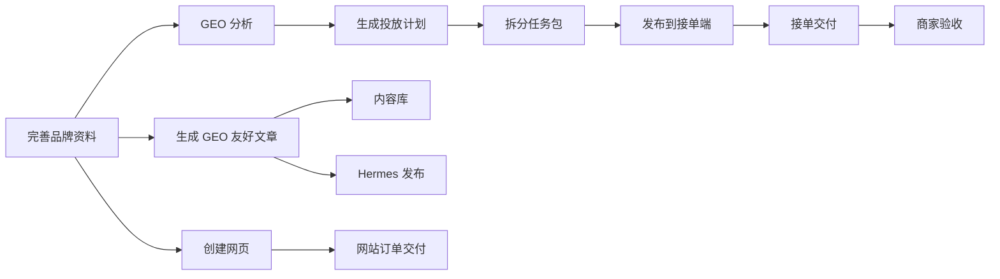
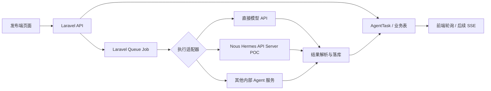
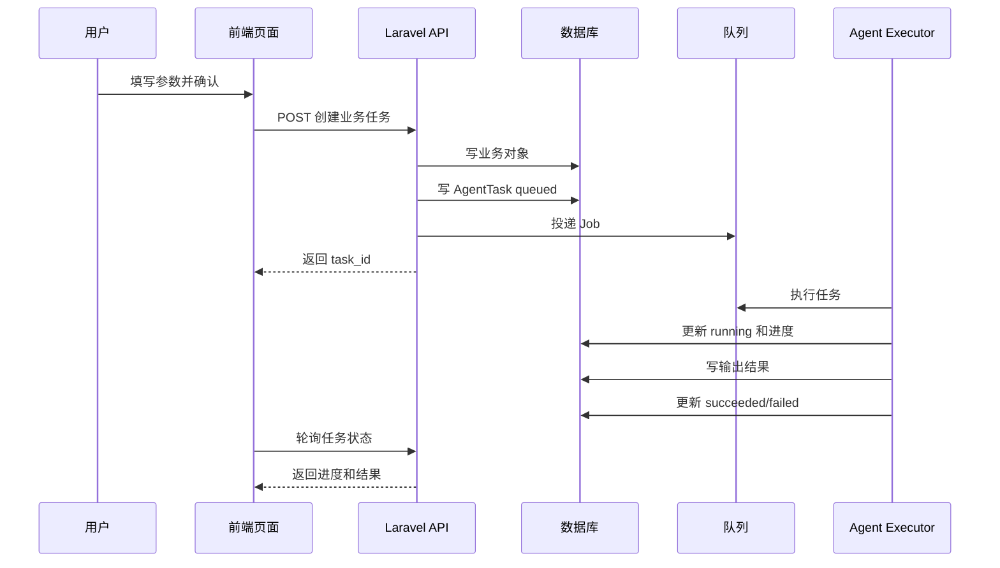
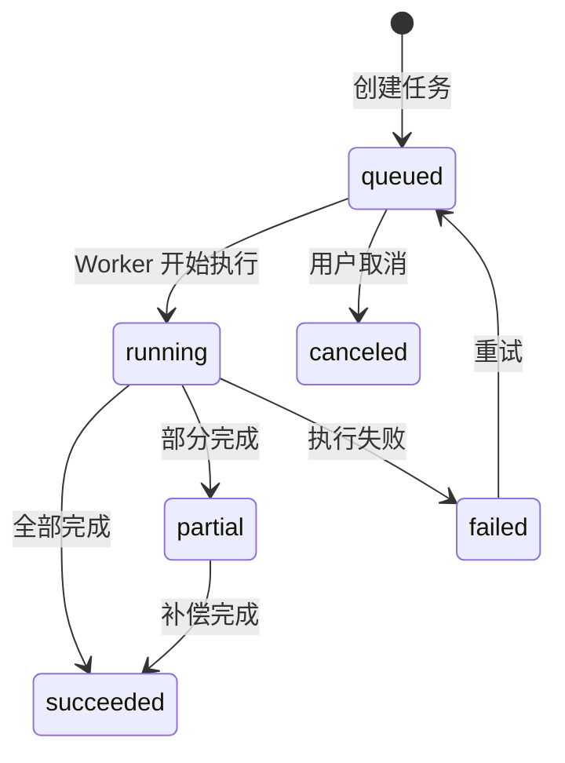

# GEO 投放助手正式开发版 PRD v1.1

版本：v1.1  
日期：2026-06-03  
产品形态：Web 发布端 + Web 接单端 + Web 平台端  
设计基线：以 `docs/UI设计规范.md` 为准  
明确排除：不做原生小程序，不做小程序 H5 首版开发  
开发口径：下一阶段按真实产品开发推进，必须接入真实后端、真实任务状态和真实 Agent 执行链路，不以 mock 数据 demo 作为交付标准  

---

## 关联文档

- [UI 设计规范](./UI设计规范.md)
- [接单端与平台端缺口迭代计划](./GEO投放助手_v1.1_接单端平台端缺口迭代计划.md)：补充接单端、平台端页面功能详情、数据对象、接口、迭代拆分和验收标准。
- [产品结构优化方案](./GEO投放助手_v1.1_产品结构优化方案.md)：修正多品牌账户、投放计划与找人投放重复、发布任务不依赖官方账号绑定、算力与投放资金双账户统一、前台充值和协议草案等产品结构问题；若与本文旧章节存在冲突，以该优化方案为准。

---

## 目录

- [0. 文档使用说明](#0-文档使用说明)
- [1. 本版结论](#1-本版结论)
- [2. 产品定位与范围](#2-产品定位与范围)
- [3. 角色与权限边界](#3-角色与权限边界)
- [4. 设计规范引用](#4-设计规范引用)
- [5. 信息架构与导航](#5-信息架构与导航)
- [6. 核心业务流程](#6-核心业务流程)
- [7. 发布端页面评审](#7-发布端页面评审)
  - [7.1 生成 GEO 友好文章](#71-生成-geo-友好文章)
  - [7.2 GEO 分析](#72-geo-分析)
  - [7.3 制定投放计划](#73-制定投放计划)
  - [7.4 创建网页](#74-创建网页)
  - [7.5 找人投放](#75-找人投放)
  - [7.6 内容库](#76-内容库)
  - [7.7 订单交付](#77-订单交付)
  - [7.8 Agent 任务](#78-agent-任务)
  - [7.9 品牌账户](#79-品牌账户)
- [8. 接单端页面评审](#8-接单端页面评审)
- [9. 平台端页面评审](#9-平台端页面评审)
- [10. 通用交互组件](#10-通用交互组件)
- [11. 功能实现方案](#11-功能实现方案)
- [12. 数据对象与状态机](#12-数据对象与状态机)
- [13. 接口与任务编排方案](#13-接口与任务编排方案)
- [14. 埋点、日志与审计](#14-埋点日志与审计)
- [15. 非功能需求](#15-非功能需求)
- [16. 验收标准](#16-验收标准)
- [17. 迭代拆分](#17-迭代拆分)
- [18. 待评审问题](#18-待评审问题)

---

## 0. 文档使用说明

### 0.1 给人类评审者

本 PRD 用于评审正式开发版范围、页面交互和功能实现方案。评审时优先看：

1. [1. 本版结论](#1-本版结论)：确认产品方向和不做范围。
2. [4. 设计规范引用](#4-设计规范引用)：确认本 PRD 对统一 UI 规范的引用口径。
3. [7. 发布端页面评审](#7-发布端页面评审)：逐页确认功能、交互和异常态。
4. [11. 功能实现方案](#11-功能实现方案)：确认工程实现边界。
5. [16. 验收标准](#16-验收标准)：确认开发完成的判断口径。

### 0.2 给 Agent / 开发助手

Agent 读取本文档时按以下顺序执行：

1. 先读取 [4. 设计规范引用](#4-设计规范引用)、`docs/UI设计规范.md` 和 [10. 通用交互组件](#10-通用交互组件)，确保 UI 与交互一致。
2. 开发某个页面前，定位 [7. 发布端页面评审](#7-发布端页面评审)、[8. 接单端页面评审](#8-接单端页面评审) 或 [9. 平台端页面评审](#9-平台端页面评审) 中对应页面。
3. 开发接口、任务、状态时，读取 [11. 功能实现方案](#11-功能实现方案)、[12. 数据对象与状态机](#12-数据对象与状态机)、[13. 接口与任务编排方案](#13-接口与任务编排方案)。
4. 不要实现小程序、小程序 H5、原生移动端页面；本版明确不包含。
5. 真实开发 Hermes 相关功能前，必须拉取 `https://github.com/NousResearch/hermes-agent` 仓库，基于当前仓库代码验证安装、API Server、任务运行和结果解析；不得只用静态 mock 数据模拟 Hermes 成功。

### 0.3 术语

| 术语 | 说明 |
|---|---|
| 发布端 | 商家、品牌方、代理商使用的 Web 后台 |
| 接单端 | 服务商、达人、内容写手、顾问使用的 Web 后台 |
| 平台端 | 运营、审核、客服、管理员使用的 Web 后台 |
| Hermes | 本项目内的 Agent 任务执行层统称；若接入 NousResearch/hermes-agent，应作为外部执行适配器使用，而不是直接等同于业务队列 |
| 配置助手 | 页面内 AI 参数助手，负责解释参数、推荐配置、提交 Hermes 前确认 |
| 任务包 | 投放计划拆分出的可发布给接单端的任务草稿 |
| GEO 友好文章 | 面向 AI 搜索、AI 推荐和品牌可见度优化的内容初稿 |

---

## 1. 本版结论

### 1.1 产品方向

GEO 投放助手正式版不是传统“后台表单系统”，而是面向商家增长任务的 Agent GUI。用户不需要直接写 prompt，而是通过清晰的参数控件完成选择，系统将参数组织为 Hermes 任务，并把生成、分析、计划、发布和交付结果转成可确认、可编辑、可追踪的业务页面。

### 1.2 本版必须做

1. Web 发布端：生成 GEO 友好文章、GEO 分析、投放计划、创建网页、找人投放、内容库、订单交付、Agent 任务、品牌账户。
2. Web 接单端：入驻、任务大厅、我的订单、交付提交、返修与结算状态。
3. Web 平台端：运营看板、Agent 任务监控、订单与交付、用户与审核、系统配置。
4. Agent 异步任务底座：文章生成、GEO 分析、投放计划、网页生成、任务发布、执行结果同步。
5. 最新设计风格落地：左侧发布端导航、浅色卡片、青绿色主按钮、右侧预估产物/状态栏、配置助手交互。
6. 真实产品链路：页面提交后必须创建真实业务记录和 `AgentTask`，任务状态必须来自队列或 Agent 执行结果，不能只用前端假状态或 mock 列表。
7. Hermes 真实接入前置：研发需拉取 `NousResearch/hermes-agent` 仓库并完成 Windows 原生 PowerShell POC，确认可运行后再进入产品化适配。

### 1.3 本版明确不做

1. 不做原生小程序开发。
2. 不做小程序 H5 首版开发。
3. 不做在线支付闭环，只支持投放余额记录、冻结、释放、人工入账、线下结算提示。
4. 不做自动建站生产发布，只做网页生成、预览、人工确认和订单交付。
5. 不做复杂 ROI 归因和广告投放平台 API 深度集成。
6. 不做完整 CRM、复杂合同、电子发票和自动分账。

---

## 2. 产品定位与范围

### 2.1 一句话定位

GEO 投放助手是面向品牌方的 AI GEO 增长交付工作台：帮助用户生成内容、分析品牌在 AI 平台中的可见度、制定投放计划、拆分任务、创建网页，并通过接单端与平台端完成交付。

### 2.2 用户价值

1. 用最少参数启动 AI 任务，减少 prompt 门槛。
2. 将 AI 输出转成可执行的业务动作：编辑、下载、发布、转任务、创建网页、验收。
3. 用品牌资料、账号绑定、算力和投放余额支撑真实运营。
4. 让平台运营能看到每个 Agent 任务、订单和异常，不再依赖人工问询。

### 2.3 业务闭环

---

## 3. 角色与权限边界

| 角色 | 使用端 | 核心动作 | 权限边界 |
|---|---|---|---|
| 商家/品牌方 | 发布端 | 维护品牌、生成文章、GEO 分析、投放计划、创建任务、验收 | 只能访问自己的品牌、内容、报告、订单、资金流水 |
| 代理商 | 发布端 | 代多个品牌创建任务和管理交付 | 按品牌归属隔离数据 |
| 内容写手/达人 | 接单端 | 申请入驻、接任务、提交交付物 | 只能访问自己可见任务和已接订单 |
| GEO 顾问/网页设计师 | 接单端 | 接专业类任务、提交方案或网页交付 | 按任务类型和入驻能力展示 |
| 平台运营 | 平台端 | 审核、监控、处理异常、配置任务规则 | 可查看业务数据，不可查看密钥明文 |
| 管理员 | 平台端 | 权限、配置、审计、系统管理 | 全局管理权限 |

---

## 4. 设计规范引用

本 PRD 不再单独维护设计规范。所有 UI 风格、色彩、排版、间距、圆角、组件状态、布局尺寸与动效口径，统一引用：

- `docs/UI设计规范.md`

开发、走查和设计评审时，以 `docs/UI设计规范.md` 为唯一设计规范来源。本文后续页面章节只描述业务目标、信息结构、功能状态和交互流程；如页面描述与 `docs/UI设计规范.md` 存在冲突，以 `docs/UI设计规范.md` 为准。

---

## 5. 信息架构与导航

### 5.1 发布端导航

| 一级导航 | 页面 | 说明 |
|---|---|---|
| 生成文章 | 生成 GEO 友好文章 | 当前设计稿主页面之一 |
| GEO 分析 | 创建分析、分析进度、报告结果 | 分析品牌在 AI 平台中的表现 |
| 投放计划 | 制定投放计划、任务包拆分 | 将报告和目标转成任务草稿 |
| 创建网页 | 网页需求、AI 预览、网站订单 | 生成品牌介绍页或落地页 |
| 找人投放 | 创建投放任务、选择接单类型 | 发布到任务大厅 |
| 内容库 | 文章批次、单篇内容、下载发布 | 管理 Agent 产物 |
| 订单交付 | 任务订单、网站订单、验收返修 | 管理交付闭环 |
| Agent 任务 | 所有异步任务和日志 | 用户侧任务追踪 |
| 品牌账户 | 品牌资料、账号绑定、AI 算力、投放余额、团队权限、系统设置 | 基础配置 |

### 5.2 接单端导航

| 一级导航 | 说明 |
|---|---|
| 任务大厅 | 可接任务列表 |
| 我的订单 | 已接任务、待交付、返修、结算 |
| 资源管理 | 账号、案例、能力标签 |
| 入驻资料 | 入驻状态、认证、服务范围 |
| 消息通知 | 任务沟通、平台提醒 |

### 5.3 平台端导航

| 一级导航 | 说明 |
|---|---|
| 运营看板 | 今日待办、任务异常、订单概览 |
| Agent 任务 | Hermes 队列、执行日志、失败重试 |
| 订单与交付 | 任务订单、网站订单、争议处理 |
| 用户与审核 | 商家、接单方、入驻审核 |
| 系统配置 | 平台、任务类型、预算规则、AI 配置 |

---

## 6. 核心业务流程

### 6.1 生成文章流程

1. 用户选择品牌。
2. 用户选择目标平台、生成数量、内容方向、语气、营销强度、本地关键词、禁用词。
3. 配置助手给出快捷建议。
4. 用户点击“提交 Hermes”。
5. 系统创建文章批次和 AgentTask。
6. Hermes 异步生成 1/3/5 篇文章。
7. 用户查看预计产物和结果。
8. 用户可编辑、下载、发布或转投放任务。

### 6.2 GEO 分析流程

1. 用户选择品牌和分析平台。
2. 系统校验品牌资料完整度和 AI 算力。
3. 创建 GEO 分析任务。
4. Hermes 调用多平台模型或分析服务。
5. 生成报告：提及率、推荐排名、情感、竞品、内容缺口、建议。
6. 用户可下载报告、生成投放计划、生成文章或创建网页。

### 6.3 投放计划流程

1. 用户输入投放目标。
2. 选择目标平台、投放目标、预算范围、接单方类型、截止时间和验收方式。
3. 规划助手拆分任务包。
4. 用户确认预算与验收。
5. 用户发布任务包到接单端，或仅保存计划。

### 6.4 创建网页流程

1. 用户选择品牌、网页类型和参考链接。
2. 上传或填写材料。
3. Hermes 生成页面结构和预览。
4. 用户确认需求。
5. 转为网站技术订单，由内部或接单方交付。

### 6.5 找人投放流程

1. 用户选择品牌和任务类型。
2. 填写预算、交付物、验收标准、平台和截止时间。
3. 系统校验投放余额或提示线下结算。
4. 发布到任务大厅。
5. 接单端接单并交付。
6. 用户验收、返修或发起争议。

---

## 7. 发布端页面评审

### 7.1 生成 GEO 友好文章

#### 页面目标

用一个低门槛参数页，让商家生成适合小红书、知乎、公众号等平台的 GEO 友好文章，并在提交前明确预计产物。

#### 页面结构

| 区域 | 内容 |
|---|---|
| 左侧导航 | 生成文章高亮 |
| 顶部状态 | 配置助手可用、Hermes 异步队列 |
| 主卡片 | 品牌、目标平台、数量、内容方向、语气、营销强度、关键词、禁用词、自动发布开关 |
| AI 快速建议 | 更像小红书、加入成都本地化、减少广告感、加入 FAQ 段落 |
| 配置助手 | 展示参数整理结果，支持自然语言补充 |
| 右侧预计产物 | 文章 1/2/3 卡片，展示平台、状态、预览结构按钮 |
| 返回后动作 | 编辑、下载、发布、转投放任务 |

#### 关键交互

1. 品牌选择后自动带出关键词、禁用词、行业和城市。
2. 目标平台使用卡片按钮，允许多选或单选，由业务配置决定。
3. 生成数量使用分段控件：1、3、5。
4. 内容方向使用图标卡片：种草、探店、FAQ、测评。
5. 营销强度使用滑杆，左侧“低”，右侧“高”。
6. 自动发布默认关闭；开启后必须提示“生成后仍需确认，不会绕过商家确认直接发布”。
7. 自动写文章、GEO 分析、自动发布等 AI 能力优先通过 Hermes Skill 暴露的接口执行；若目标平台没有稳定接口，则通过 Hermes 控制本地电脑完成浏览器/客户端自动化操作。
8. 点击“提交 Hermes”前弹出确认摘要。
9. 提交后页面进入任务态：待生成、生成中、部分完成、已完成、失败。

#### 功能点

| 功能 | 优先级 | 说明 |
|---|---|---|
| 参数表单 | P0 | 生成任务核心入口 |
| 预计产物 | P0 | 提交前显示将生成几篇文章 |
| Hermes 异步生成 | P0 | 不阻塞页面 |
| 文章结果编辑 | P0 | 生成后可编辑 |
| 下载/复制 | P0 | 支持用户取走内容 |
| 发布确认 | P1 | 对接账号绑定和 Hermes 发布 |
| 转投放任务 | P1 | 将文章需求转成接单任务 |
| 参数助手 | P1 | 提供快捷建议和自然语言补充 |

#### 实现方案

1. 前端页面使用表单状态保存参数，提交前组装 `ArticleGenerationInput`。
2. 后端创建 `ContentBatch` 和 `AgentTask`，任务类型为 `article_generation`。
3. Hermes Worker 根据参数生成多篇 `ContentItem`。
4. 前端通过轮询或 WebSocket/SSE 获取任务进度。
5. 生成失败时保留已完成文章，并允许对失败单篇重试。

---

### 7.2 GEO 分析

#### 页面目标

让用户知道品牌在 AI 平台中的可见度、竞品差距和下一步内容策略。

#### 页面结构

| 区域 | 内容 |
|---|---|
| 主参数区 | 品牌、分析平台、分析深度、竞品、关键词 |
| 右侧任务状态 | Hermes 当前步骤、预计耗时、算力消耗 |
| 报告结果区 | 综合评分、提及率、排名、内容缺口、引用来源、建议 |

#### 关键交互

1. 进入页面先校验品牌资料完整度。
2. 算力不足时提示前往 AI 算力页同步或充值，不允许直接发起。
3. 分析平台用平台卡片展示，例如豆包、Kimi、通义、DeepSeek。
4. 报告完成后首屏展示“下一步建议”，不是只展示数据。
5. 报告可一键生成投放计划或生成文章。

#### 功能点

| 功能 | 优先级 | 说明 |
|---|---|---|
| 品牌资料校验 | P0 | 缺少品牌名称、行业、主营业务时拦截 |
| 算力校验 | P0 | 避免任务执行失败 |
| 多平台分析任务 | P0 | 生成 GEO 报告 |
| 报告结果页 | P0 | 展示可理解结论 |
| 下载报告 | P1 | PDF/Markdown/HTML 至少一种 |
| 生成投放计划 | P1 | 将报告建议转成任务草稿 |

#### 实现方案

1. 使用 `GeoAnalysisTask` 记录分析请求。
2. `AgentTask` 负责统一异步状态。
3. 分析结果落 `GeoReport`，细分数据落 `GeoReportMetric` 或 JSON 字段。
4. 报告建议结构化保存，供投放计划页面引用。

---

### 7.3 制定投放计划

#### 页面目标

将用户的增长目标拆成可发布的任务包，并明确预算、接单方、交付物和验收方式。

#### 页面结构

| 区域 | 内容 |
|---|---|
| 目标输入 | “你想达成什么投放目标”文本框 |
| 步骤条 | 填写目标、拆分任务包、确认预算与验收、发布到接单端 |
| 参数区 | 平台、投放目标、预算范围、接单方类型、截止时间、验收方式 |
| 规划助手 | 根据目标自动拆分任务包 |
| 右侧任务包 | 任务名称、平台、预算、交付物、验收方式、发布开关 |

#### 关键交互

1. 预算范围滑杆展示当前区间。
2. 投放目标用图标卡片：品牌曝光、本地探店、问答覆盖、测评种草。
3. 接单方类型用分段按钮：达人、内容写手、SEO/GEO 顾问、网页设计师。
4. 右侧任务包可逐个编辑、启用/停用。
5. 点击“发布 4 个任务到接单端”前校验余额和验收方式。
6. 若余额不足，允许保存计划或申请人工入账。

#### 功能点

| 功能 | 优先级 | 说明 |
|---|---|---|
| 投放目标参数 | P0 | 计划生成输入 |
| 任务包拆分 | P0 | 生成可发布任务草稿 |
| 任务包编辑 | P0 | 用户确认预算和交付物 |
| 发布到接单端 | P0 | 创建任务订单 |
| 保存计划 | P1 | 暂不发布 |
| 预算校验 | P1 | 与投放余额联动 |

#### 实现方案

1. 创建 `CampaignPlan` 保存目标和参数。
2. Hermes 生成 `TaskPackageDraft[]`。
3. 用户确认后将草稿转为 `TaskOrder`。
4. 发布时冻结预算，写入 `BudgetLedger`。

---

### 7.4 创建网页

#### 页面目标

帮助商家快速创建品牌介绍页、活动页或 GEO 落地页需求，并由 AI 生成结构预览后转为技术订单。

#### 页面结构

| 区域 | 内容 |
|---|---|
| 参数区 | 品牌、网页类型、页面目标、参考网站、必含模块、材料上传 |
| 预览区 | 页面结构、首屏文案、模块顺序 |
| 右侧状态 | Hermes 网页生成进度、预计交付项 |

#### 关键交互

1. 选择品牌后带出主营业务和关键词。
2. 页面类型使用卡片：品牌介绍页、服务落地页、活动页、FAQ 页。
3. 材料可上传图片、文档、链接。
4. 生成预览后用户可调整模块顺序。
5. 确认后创建网站技术订单。

#### 功能点

| 功能 | 优先级 | 说明 |
|---|---|---|
| 网页需求采集 | P0 | 创建订单前必填 |
| AI 结构预览 | P0 | 降低沟通成本 |
| 转网站订单 | P0 | 进入交付流程 |
| 材料管理 | P1 | 支持附件和链接 |

#### 实现方案

1. `WebsiteRequest` 保存需求。
2. Hermes 生成 `WebsitePreview`。
3. 用户确认后创建 `WebsiteOrder`。
4. 预览 HTML 不直接发布生产站点，只作为需求和验收参考。

---

### 7.5 找人投放

#### 页面目标

让商家发布明确可交付、可验收的投放任务。

#### 页面结构

| 区域 | 内容 |
|---|---|
| 参数区 | 品牌、任务类型、平台、预算、交付物、验收标准、截止时间 |
| 右侧摘要 | 任务费用、接单方要求、风险提示 |
| 发布区 | 保存草稿、发布到任务大厅 |

#### 关键交互

1. 任务类型决定后续字段，例如达人探店需要门店地址，问答覆盖需要问题清单。
2. 预算低于平台规则时给出提示。
3. 验收标准必须至少选择一种：截图证明、链接回传、数据复盘、人工确认。
4. 发布前展示任务摘要和预算冻结提示。

#### 实现方案

1. 表单创建 `TaskOrderDraft`。
2. 发布后转 `TaskOrder`，状态为 `published`。
3. 若启用预算冻结，写入冻结流水。

---

### 7.6 内容库

#### 页面目标

统一管理由 Hermes 生成的文章、网页预览、报告摘要和可复用内容。

#### 页面结构

| 区域 | 内容 |
|---|---|
| 列表 | 批次、品牌、平台、状态、生成时间 |
| 编辑区 | 标题、摘要、Markdown 正文、关键词 |
| 动作区 | 复制、下载、发布、转任务、归档 |

#### 关键交互

1. 支持按品牌、平台、状态、关键词筛选。
2. 多篇文章批次左侧列表，右侧预览编辑。
3. 发布必须检查账号绑定。
4. 转任务时自动带入标题、平台、交付物。

#### 实现方案

1. `ContentBatch` 管理批次。
2. `ContentItem` 管理单篇内容。
3. 编辑保存版本号，避免覆盖生成原稿。

---

### 7.7 订单交付

#### 页面目标

管理任务订单和网站订单的履约、返修、验收和争议。

#### 页面结构

| 区域 | 内容 |
|---|---|
| 订单列表 | 类型、品牌、预算、状态、接单方、更新时间 |
| 订单详情 | 需求、交付物、沟通记录、验收标准 |
| 操作区 | 验收通过、要求返修、发起争议 |

#### 关键交互

1. 状态统一中文化：待接单、执行中、待验收、返修中、已完成、争议中。
2. 交付物必须包含链接或附件。
3. 验收前展示验收标准 checklist。
4. 返修必须填写原因。

#### 实现方案

1. `TaskOrder` 和 `WebsiteOrder` 可共用 `OrderDelivery` 表记录交付物。
2. `OrderRevision` 记录返修。
3. `Dispute` 记录争议。

---

### 7.8 Agent 任务

#### 页面目标

让用户查看所有异步任务的状态、进度、输入摘要、输出摘要和错误原因。

#### 页面结构

| 区域 | 内容 |
|---|---|
| 任务列表 | 类型、标题、状态、进度、创建时间 |
| 任务详情 | 输入参数、执行日志、输出结果、错误信息 |
| 操作 | 重试、取消、查看产物 |

#### 关键交互

1. 所有 Agent 任务使用统一状态。
2. 失败任务必须展示用户可理解的失败原因。
3. 支持按任务类型筛选。
4. 结果可跳转到内容、报告、计划或订单。

#### 实现方案

1. 所有 AI/Hermes 动作统一写 `AgentTask`。
2. 任务日志写 `AgentTaskLog`。
3. 前端复用 `AgentTaskPanel`。

---

### 7.9 品牌账户

#### 7.9.1 品牌资料

页面目标：管理用于分析、生成和投放的品牌基础资料。

关键字段：

| 字段 | 必填 | 说明 |
|---|---|---|
| 品牌名称 | 是 | 任务核心对象 |
| 行业 | 是 | 影响模板和分析 prompt |
| 城市/区域 | 否 | 本地服务品牌建议填写 |
| 门店数量 | 否 | 本地投放参考 |
| 主营业务 | 是 | AI 理解品牌的核心文本 |
| 官网/参考网址 | 否 | 支持 AI 提取 |
| 目标关键词 | 否 | 用于文章和分析 |
| 竞品 | 否 | 用于对比 |
| 禁用词 | 否 | 用于内容风控 |

交互要求：

1. 页面使用“完善品牌资料 + 品牌完整度 + 最近 GEO 报告 + 关联任务”结构。
2. 官网输入后可点击“AI 提取品牌资料”。
3. 品牌完整度低于阈值时，在生成文章、GEO 分析、投放计划前提示补全。
4. 已关联未完成任务的品牌只能归档，不能物理删除。

实现方案：

1. `Brand` 保存基础字段。
2. `BrandKeyword` 保存关键词和禁用词。
3. `BrandCompetitor` 保存竞品。
4. AI 提取创建 `AgentTask`，结果回填为待确认字段，不自动覆盖用户已填内容。

#### 7.9.2 账号绑定

页面目标：管理小红书、知乎、公众号、任务接单端等发布或回传账号。

交互要求：

1. 账号列表展示平台、账号、授权状态、权限、最近校验、操作。
2. 状态包括：已授权、待授权、授权过期、校验失败、正常。
3. 解绑必须二次确认。
4. 发布内容前校验目标平台是否已绑定并具备权限。
5. 安全提醒支持授权过期提醒、异地登录提醒、解绑二次确认。

实现方案：

1. `AccountBinding` 保存绑定记录。
2. 凭据密文保存，前端永不展示 token。
3. 通过定时任务刷新授权状态。
4. 每次校验写入 `AccountBindingLog`。

#### 7.9.3 AI 算力

页面目标：展示 AI 分析和生成所需额度，不与投放余额混淆。

交互要求：

1. 展示当前算力、赠送额度、已消耗、同步状态。
2. 算力不足时引导外部充值或同步。
3. 记录赠送、消耗、同步、失败、人工调整流水。

实现方案：

1. `AiCreditAccount` 保存余额。
2. `AiCreditLedger` 保存流水。
3. 分析或生成任务创建前先冻结或预扣估算额度。

#### 7.9.4 投放余额

页面目标：管理任务订单和项目预算，不等同于 AI 算力。

交互要求：

1. 资金池展示可用余额、冻结金额、累计入账。
2. 流水支持投放流水、冻结记录、入账申请三个 Tab。
3. 右侧展示待占用预算和资金池说明。
4. 线下结算模式下，人工入账必须显示“待财务确认”。
5. 余额不足时，任务可保存为计划，但不能全部发布。

实现方案：

1. `BudgetAccount` 保存账户余额。
2. `BudgetLedger` 保存入账、冻结、释放、扣减、人工调整。
3. 发布任务时根据规则冻结预算。
4. 取消任务或预算变更时释放差额。

#### 7.9.5 团队权限

页面目标：支持代理商或商家团队内多人协作。

功能点：

1. 邀请成员。
2. 角色分配：管理员、运营、财务、只读。
3. 品牌级权限。
4. 操作审计。

#### 7.9.6 系统设置

页面目标：发布端个人和组织基础设置。

功能点：

1. 基本资料。
2. 通知设置。
3. 安全设置。
4. 默认品牌和默认平台。

---

## 8. 接单端页面评审

> 接单端详细页面功能、交互、数据对象、接口和迭代拆分见：[接单端与平台端缺口迭代计划](./GEO投放助手_v1.1_接单端平台端缺口迭代计划.md#3-接单端页面功能详情)。本节保留主 PRD 的页面范围摘要，真实开发以补充计划中的页面级细节为准。

### 8.1 入驻申请

页面目标：让服务商提交可审核、可匹配任务的能力资料。

功能点：

1. 基础身份信息。
2. 服务类型：达人、内容写手、GEO 顾问、网页设计师。
3. 接单平台和案例。
4. 报价区间。
5. 审核状态。

实现方案：

1. `ProviderProfile` 保存入驻资料。
2. `ProviderCapability` 保存能力标签。
3. 平台端审核通过后可进入任务大厅。

### 8.2 任务大厅

页面目标：展示可接任务，让接单方按能力筛选。

功能点：

1. 任务列表。
2. 任务详情。
3. 申请接单。
4. 平台派单或自动匹配。

关键交互：

1. 未入驻通过不可接单。
2. 超出能力标签的任务默认不展示或弱提示。
3. 接单前必须确认交付物和截止时间。

### 8.3 我的订单

页面目标：管理已接任务的执行和交付。

功能点：

1. 状态筛选。
2. 提交交付物。
3. 查看返修。
4. 查看验收和结算状态。

实现方案：

1. `ProviderOrderAssignment` 记录接单关系。
2. `DeliverySubmission` 记录交付。

---

## 9. 平台端页面评审

> 平台端详细页面功能、交互、数据对象、接口和迭代拆分见：[接单端与平台端缺口迭代计划](./GEO投放助手_v1.1_接单端平台端缺口迭代计划.md#4-平台端页面功能详情)。本节保留主 PRD 的页面范围摘要，真实开发以补充计划中的页面级细节为准。

### 9.1 运营看板

页面目标：让运营知道今天最需要处理什么。

核心模块：

1. 待审核接单方。
2. Agent 失败任务。
3. Hermes 发布失败。
4. 网站订单待处理。
5. 待验收超时。
6. 争议订单。

### 9.2 Agent 任务监控

页面目标：统一监控文章生成、GEO 分析、投放计划、网页生成、Hermes 发布等任务。

功能点：

1. 任务筛选。
2. 状态统计。
3. 日志查看。
4. 失败重试。
5. 取消任务。
6. 查看关联业务对象。

实现方案：

1. 所有异步任务统一进入 `AgentTask`。
2. Worker 上报进度和日志。
3. 平台端只展示密钥脱敏后的日志。

### 9.3 订单与交付

页面目标：监管任务订单和网站订单。

功能点：

1. 订单列表。
2. 订单详情。
3. 交付物审查。
4. 争议处理。
5. 人工改派。

### 9.4 用户与审核

页面目标：管理商家账号、接单方入驻和账号状态。

功能点：

1. 商家账号列表。
2. 接单方审核。
3. 禁用/启用账号。
4. 角色和权限。
5. 操作审计。

### 9.5 系统配置

页面目标：维护任务类型、平台、预算、AI 和 Hermes 配置。

功能点：

1. 平台配置：小红书、知乎、公众号等。
2. 任务类型配置。
3. 预算规则配置。
4. AI 模型和分析服务配置。
5. Hermes 客户端配置。

---

## 10. 通用交互组件

### 10.1 AgentInputCard

用途：承载 Agent 参数采集表单。

要求：

1. 标题明确。
2. 必填字段有中文校验。
3. 控件优先使用卡片选择、分段控件、标签输入、滑杆和开关。
4. 提交前可生成输入摘要。

### 10.2 AssistantPanel

用途：页面内配置助手、规划助手、资料助手、预算助手。

要求：

1. 展示当前系统已理解的参数。
2. 提供 2-4 个快捷建议按钮。
3. 支持自然语言输入补充参数。
4. 助手建议必须先应用到表单，不直接提交业务任务。

### 10.3 TaskStatusPill

用途：展示任务、授权、入账、发布等状态。

中文状态示例：

| 状态 | 显示 |
|---|---|
| pending | 待处理 |
| pending_confirm | 待确认 |
| queued | 已入队 |
| running | 执行中 |
| succeeded | 已完成 |
| partial | 部分完成 |
| failed | 失败 |
| canceled | 已取消 |

### 10.4 RightPreviewPanel

用途：页面右侧辅助决策区。

可展示：

1. 预计产物。
2. 任务包。
3. 品牌完整度。
4. 授权健康度。
5. 待占用预算。
6. 最近提醒。

### 10.5 ResultWorkspace

用途：多产物结果页。

结构：

1. 左侧结果列表。
2. 中间编辑/预览区。
3. 右侧任务状态和下一步动作。

---

## 11. 功能实现方案

### 11.1 技术架构建议

| 层 | 方案 |
|---|---|
| 前端 | Laravel + Inertia + React/Vue 以当前项目实际栈为准 |
| UI | 遵循 shadcn-lar 组件约定，外观贴近最新高保真稿 |
| 后端 | Laravel 模块化业务服务 |
| 异步任务 | Queue Job + AgentTask 统一任务表 |
| Agent 执行层 | Laravel Queue 为主；Nous Hermes 仅作为可选外部执行适配器 |
| 文件 | 本地或对象存储，交付物和报告附件统一管理 |
| 权限 | 用户角色 + 组织/品牌数据隔离 |

### 11.2 Agent 任务统一模型

所有 AI 或 Hermes 动作都必须创建 `AgentTask`。业务表只保存业务对象，任务执行状态由 `AgentTask` 承接。

适用任务：

1. 文章生成。
2. GEO 分析。
3. 投放计划生成。
4. 网页预览生成。
5. AI 提取品牌资料。
6. Hermes 发布。
7. 授权状态校验。

### 11.3 Nous Hermes 对接可行性校正

经对 `NousResearch/hermes-agent` 当前仓库能力核对，本项目不能把它直接描述为“业务 Worker 拉取本平台任务并回调”的现成组件。更准确的判断如下：

| 项目 | 结论 | 对本项目影响 |
|---|---|---|
| Windows 原生 PowerShell | 英文 README 和安装脚本显示支持 Windows 原生安装，安装器会处理 uv、Python 3.11、Node.js、ripgrep、ffmpeg 和便携 Git Bash | 可以作为研发 POC 环境，但必须实测，不应承诺所有功能天然稳定 |
| 中文 README | 中文 README 仍写“原生 Windows 不受支持，请安装 WSL2” | 仓库文档存在版本不一致，评审时必须列为风险 |
| API 能力 | 仓库包含 OpenAI-compatible API Server，支持 `/v1/chat/completions`、`/v1/responses`、`/v1/runs`、SSE events、approval、stop、health | 可作为外部 Agent 服务调用，但不是本项目的业务状态机 |
| Gateway 能力 | 面向 Telegram、Discord、Slack、WhatsApp、Signal、Email 等消息平台 | 不等同于本项目的商家发布链路 |
| 回调/业务队列 | 未看到可直接拉取本项目业务队列、写本项目表、按本项目状态回调的内建协议 | 本项目必须自建 Laravel 队列、AgentTask 状态机和结果落库 |
| 内容发布 | Hermes Agent 具备工具调用和终端执行能力，但不等同于小红书/知乎/公众号官方发布 API | 发布动作首版应设计为“生成内容 + 人工确认 + 可选本地自动化 POC”，不能承诺稳定自动发布 |

因此，研发评审版应采用以下边界：

1. `AgentTask`、状态机、业务结果、预算、算力和审计由本项目后端负责。
2. 文章生成、投放计划、网页结构等文本型任务，首选直接调用模型 API 或本项目自建 Worker。
3. Nous Hermes 可作为“外部 Agent 执行适配器”进行 POC：通过 API Server 的 `/v1/runs` 或 `/v1/chat/completions` 调起，业务系统轮询或订阅事件后自行落库。
4. Windows 原生 PowerShell 只作为候选执行环境；评审前必须完成最小 POC：安装、启动 API Server、发起一次文章生成、获取状态、停止任务。
5. 不要在 PRD 中承诺“Hermes 客户端天然支持本项目发布回调”；如需要回调，需研发实现中间适配服务。
6. 正式开发时必须在本地或指定开发环境拉取 `NousResearch/hermes-agent` 仓库，记录 commit hash、安装方式、配置项和 POC 结果，作为研发评审附件。
7. 前端可以保留加载态、空状态和演示数据种子，但验收不能以 mock 数据为准；验收必须基于真实接口、真实数据库记录、真实任务状态流转。

### 11.4 推荐落地架构

首版推荐采用“业务队列优先，Hermes 可插拔”的架构。

实现要求：

1. 定义 `AgentExecutor` 接口，至少包含 `submit()`、`poll()`、`cancel()`、`normalizeResult()`。
2. 首版内置 `DirectModelExecutor`，保证文章生成和计划生成不依赖第三方 Agent 运行时。
3. 可选实现 `NousHermesExecutor`，只承担 POC 或特定复杂任务。
4. `NousHermesExecutor` 不直接访问业务数据库，只返回标准化事件和结果。
5. 所有业务状态转换必须由 Laravel 服务层完成。

### 11.5 Windows 原生 PowerShell POC 要求

研发评审前至少完成以下验证：

| 验证项 | 命令/动作 | 通过标准 |
|---|---|---|
| 安装 | PowerShell 执行官方 `install.ps1` 一键安装 | 能安装到 `%LOCALAPPDATA%\hermes`，无管理员权限依赖 |
| 基础诊断 | `hermes doctor` | 关键依赖通过，能识别 Python、Node、Git Bash |
| 模型配置 | `hermes setup` 或配置 OpenAI/OpenRouter/Nous Portal | 能完成一次普通对话 |
| Gateway/API Server | 启用 `API_SERVER_ENABLED`、`API_SERVER_KEY`、`API_SERVER_PORT` 后启动 gateway | `/health` 返回正常 |
| 异步运行 | 调用 `/v1/runs` | 返回 `run_id`，可查询状态 |
| 事件读取 | 调用 `/v1/runs/{run_id}/events` | 能接收 SSE 事件或至少可轮询状态 |
| 停止任务 | 调用 `/v1/runs/{run_id}/stop` | 任务进入 stopping/停止态 |
| 结果解析 | 生成一篇文章并转为本项目 `ContentItem` | 标题、摘要、正文、关键词可结构化保存 |

若以上 POC 未通过，本项目仍可继续评审，但 Hermes 相关范围必须降级为“后续适配”，首版使用直接模型 API 和 Laravel Queue 完成。

### 11.6 Hermes Skill 调用策略

自动写文章、GEO 分析、自动发布、账号校验、网页结构生成等 AI 能力，统一按 Hermes Skill 能力编排。产品侧只定义业务动作和验收结果，具体执行由执行适配器选择“接口调用”或“本地电脑自动化”。

#### 11.6.1 能力分层

| 能力 | 优先执行方式 | 无接口时的执行方式 | 结果要求 |
|---|---|---|---|
| 自动写文章 | 调用 Hermes 写作/内容生成 Skill 或模型接口 | 不适用，必须有模型或 Skill 能力 | 返回标题、摘要、关键词、正文、平台建议 |
| GEO 分析 | 调用 Hermes GEO 分析 Skill、模型接口或内部分析服务接口 | 若需要人工网页检索，可由 Hermes 操作本地浏览器采集公开结果 | 返回结构化报告、指标、证据和建议 |
| 自动发布 | 调用平台官方 API、开放平台接口或 Hermes 发布 Skill 接口 | 通过 Hermes 控制本地电脑上的浏览器/客户端完成登录态发布 | 返回发布链接、截图、状态、失败原因 |
| 账号绑定/校验 | 调用平台授权接口或本项目绑定接口 | 通过本地浏览器检查登录态和权限页 | 返回授权状态、权限范围、最近校验时间 |
| 网页生成 | 调用 Hermes 网页生成 Skill 或内部页面生成接口 | 通过本地文件/浏览器预览辅助生成和截图 | 返回页面结构、HTML/预览图、可编辑模块 |

#### 11.6.2 Skill 接口优先原则

1. 只要 Hermes Skill 已提供稳定接口，就必须优先走接口调用，不要绕到本地电脑自动化。
2. 接口调用必须记录 skill 名称、输入参数摘要、输出摘要、耗时、模型或服务商、失败原因。
3. Skill 输出必须经过本项目适配层归一化，再写入 `AgentTask`、业务表和 `AgentTaskLog`。
4. Skill 不直接写业务数据库，不直接修改预算、订单和验收状态。
5. 同一业务动作可配置多个 Skill 候选，按平台端配置的优先级和健康度选择。

#### 11.6.3 本地电脑自动化原则

当平台没有可用接口，或接口无法覆盖发布、截图、登录态验证等动作时，允许 Hermes 通过本地电脑完成自动化。

要求：

1. 自动化执行前必须完成用户确认，不允许无确认直接发布。
2. 本地电脑自动化必须运行在明确的 Windows 原生 PowerShell / 浏览器 / 客户端环境中，并记录执行环境。
3. 自动化过程中不得明文回传账号密码、cookie、token。
4. 每次发布必须保存关键证据：发布前摘要、发布后链接、截图、平台返回提示、失败截图。
5. 自动化失败时任务进入“待人工处理”或“可重试”，不得伪造成成功。
6. 用户可以随时取消或停止自动化任务。

#### 11.6.4 发布安全边界

1. 自动发布必须经过三段式状态：`待确认` -> `执行中` -> `已发布/失败/待人工处理`。
2. 自动发布前必须校验品牌、账号绑定、平台权限、内容禁用词、预算或任务状态。
3. 自动发布成功后，结果只可由执行适配层回写到本项目，前端不得自行标记成功。
4. 对外平台接口或本地自动化均需写审计日志。

### 11.7 异步任务创建流程

### 11.8 前端状态获取

首版建议使用轮询，后续可升级 SSE 或 WebSocket。

规则：

1. 任务创建后每 2-3 秒轮询一次。
2. 任务成功、失败、取消后停止轮询。
3. 页面离开后不取消任务。
4. 用户返回页面时根据 `task_id` 恢复状态。

### 11.9 错误处理

| 场景 | 处理 |
|---|---|
| 参数校验失败 | 表单内中文错误提示 |
| 算力不足 | 引导 AI 算力页 |
| 余额不足 | 允许保存草稿，禁止发布超额任务 |
| Hermes 超时 | 标记失败，可重试 |
| 部分文章生成失败 | 保留成功结果，支持单篇重试 |
| 授权过期 | 引导账号绑定页重新授权 |
| 交付物缺失 | 禁止提交验收 |

---

## 12. 数据对象与状态机

### 12.1 核心数据对象

| 对象 | 说明 |
|---|---|
| User | 用户账号 |
| Organization | 组织/商家主体 |
| Brand | 品牌资料 |
| BrandKeyword | 品牌关键词和禁用词 |
| AccountBinding | 平台账号绑定 |
| AiCreditAccount | AI 算力账户 |
| AiCreditLedger | AI 算力流水 |
| BudgetAccount | 投放余额账户 |
| BudgetLedger | 投放余额流水 |
| AgentTask | 统一异步任务 |
| AgentTaskLog | 任务日志 |
| ContentBatch | 文章生成批次 |
| ContentItem | 单篇文章 |
| GeoAnalysisTask | GEO 分析请求 |
| GeoReport | GEO 分析报告 |
| CampaignPlan | 投放计划 |
| TaskPackageDraft | 任务包草稿 |
| TaskOrder | 投放任务订单 |
| WebsiteRequest | 网页需求 |
| WebsitePreview | 网页预览 |
| WebsiteOrder | 网站技术订单 |
| ProviderProfile | 接单方资料 |
| DeliverySubmission | 交付提交 |
| Dispute | 争议 |

### 12.2 AgentTask 状态机

### 12.3 任务订单状态机

| 状态 | 中文显示 | 说明 |
|---|---|---|
| draft | 草稿 | 未发布 |
| published | 待接单 | 已发布到任务大厅 |
| assigned | 已接单 | 接单方已确认 |
| in_progress | 执行中 | 正在交付 |
| submitted | 待验收 | 已提交交付物 |
| revision_requested | 返修中 | 商家要求返修 |
| completed | 已完成 | 验收通过 |
| disputed | 争议中 | 平台介入 |
| canceled | 已取消 | 任务取消 |

### 12.4 预算流水类型

| 类型 | 说明 |
|---|---|
| manual_deposit | 人工入账 |
| freeze | 冻结预算 |
| release | 释放预算 |
| spend | 确认扣减 |
| adjust | 人工调整 |
| refund | 退款/退回 |

---

## 13. 接口与任务编排方案

### 13.1 发布端接口分组

| 分组 | 示例 |
|---|---|
| 品牌 | `GET /brands`、`POST /brands`、`PUT /brands/{id}` |
| 文章 | `POST /content-batches`、`GET /content-batches/{id}` |
| GEO 分析 | `POST /geo-analyses`、`GET /geo-reports/{id}` |
| 投放计划 | `POST /campaign-plans`、`POST /campaign-plans/{id}/publish` |
| 网页 | `POST /website-requests`、`POST /website-requests/{id}/confirm` |
| 订单 | `GET /orders`、`POST /orders/{id}/acceptance` |
| Agent | `GET /agent-tasks`、`GET /agent-tasks/{id}`、`POST /agent-tasks/{id}/retry` |
| 账户 | `GET /account-bindings`、`POST /budget/deposit-requests` |

### 13.2 Agent 执行结果同步

无论执行器是直接模型 API、内部 Worker，还是 Nous Hermes API Server 适配层，执行结果同步都必须满足：

1. 使用签名或客户端 token 校验。
2. 只允许更新所属 `AgentTask`，不得跨组织或跨品牌写入。
3. 不允许前端传入任意任务状态。
4. 失败原因分为技术日志和用户可见文案。
5. 执行事件写入 `AgentTaskLog`。
6. Nous Hermes 的 `/v1/runs` 状态和 SSE 事件需要经过本项目适配层归一化后再落库。

### 13.3 发布前校验

| 动作 | 校验 |
|---|---|
| 生成文章 | 品牌必填字段、AI 算力 |
| GEO 分析 | 品牌完整度、AI 算力 |
| 发布文章 | 账号绑定、发布确认、平台权限 |
| 发布任务包 | 投放余额、验收方式、交付物 |
| 创建网页订单 | 品牌、页面类型、材料或需求 |
| 验收订单 | 交付物、验收 checklist |

---

## 14. 埋点、日志与审计

### 14.1 公共埋点字段

| 字段 | 说明 |
|---|---|
| user_id | 用户 |
| organization_id | 组织 |
| brand_id | 品牌 |
| page | 页面 |
| action | 动作 |
| source | Web 发布端 / 接单端 / 平台端 / Hermes |
| task_id | AgentTask ID |
| created_at | 时间 |

### 14.2 必须埋点事件

| 事件 | 说明 |
|---|---|
| article_generation_submit | 提交生成文章 |
| article_generation_complete | 文章生成完成 |
| geo_analysis_submit | 提交 GEO 分析 |
| campaign_plan_generate | 生成投放计划 |
| task_package_publish | 发布任务包 |
| website_preview_generate | 生成网页预览 |
| account_binding_start | 开始账号绑定 |
| account_binding_check | 校验账号绑定 |
| budget_deposit_apply | 申请人工入账 |
| order_delivery_submit | 提交交付物 |
| order_acceptance_confirm | 验收通过 |
| agent_task_retry | 重试 Agent 任务 |

### 14.3 审计日志

必须记录：

1. 登录、退出、账号禁用。
2. 品牌创建、编辑、归档。
3. 账号绑定、解绑、授权刷新。
4. 预算入账、冻结、释放、调整。
5. 任务发布、取消、验收、返修、争议。
6. 平台端人工处理动作。

---

## 15. 非功能需求

### 15.1 安全

1. 第三方账号 token、AI key、Hermes token 不得进入前端。
2. 所有用户数据按组织和品牌隔离。
3. 重要动作必须二次确认。
4. 平台端操作必须写审计日志。

### 15.2 稳定性

1. AI 和 Hermes 任务必须异步执行。
2. 任务失败可重试。
3. 部分成功结果必须保留。
4. Worker 回调必须幂等。

### 15.3 性能

1. 发布端首屏接口控制在可感知快速范围内。
2. 列表分页，不一次性加载全部记录。
3. Agent 日志按需加载。
4. 大附件上传使用异步或分片方案。

### 15.4 可维护性

1. 页面优先复用通用组件。
2. 状态中文映射集中管理。
3. 任务类型配置化。
4. 预算和算力分离，不混用字段。

---

## 16. 验收标准

### 16.1 P0 验收

1. 发布端可以完成品牌资料维护。
2. 发布端可以提交生成 GEO 友好文章任务，并看到 Hermes 状态。
3. 文章结果可查看、编辑、下载。
4. 发布端可以提交 GEO 分析并查看报告。
5. 发布端可以制定投放计划并生成任务包。
6. 投放计划任务包可以发布到接单端。
7. 接单端可以接单并提交交付物。
8. 发布端可以验收或返修。
9. 平台端可以查看 Agent 任务和失败日志。
10. 不出现小程序入口和小程序开发范围。

### 16.2 P1 验收

1. 生成文章页面符合最新高保真风格。
2. 投放计划页面符合最新高保真风格。
3. 品牌账户下的品牌资料、账号绑定、AI 算力、投放余额可用。
4. 账号绑定状态会影响发布动作。
5. 投放余额不足时不能发布超额任务。
6. 配置助手能提供快捷建议并应用到表单。

### 16.3 P2 验收

1. 所有页面状态中文化。
2. 表单错误提示清晰。
3. 列表空状态可引导下一步。
4. 页面视觉统一，左侧导航和顶部状态栏一致。
5. 移动端只做响应式适配，不做小程序专属流程。

---

## 17. 迭代拆分

### 17.1 Iteration 1：设计系统与 Agent 底座

目标：先统一最新 UI 风格和异步任务模型。

范围：

1. 发布端壳：左侧导航、顶部栏、品牌账户展开。
2. 通用组件：AgentInputCard、AssistantPanel、RightPreviewPanel、TaskStatusPill。
3. AgentTask、AgentTaskLog。
4. 任务轮询。
5. 平台 Agent 任务监控基础版。

### 17.2 Iteration 2：生成 GEO 友好文章与内容库

范围：

1. 生成文章参数页。
2. 预计产物。
3. Hermes 生成任务。
4. 文章结果页。
5. 内容库。

### 17.3 Iteration 3：品牌账户

范围：

1. 品牌资料。
2. 账号绑定。
3. AI 算力。
4. 投放余额。
5. 团队权限基础版。

### 17.4 Iteration 4：GEO 分析与投放计划

范围：

1. GEO 分析。
2. GEO 报告。
3. 制定投放计划。
4. 任务包拆分。
5. 预算校验。

### 17.5 Iteration 5：找人投放与接单端

范围：

1. 找人投放。
2. 任务大厅。
3. 接单。
4. 交付提交。
5. 验收返修。

### 17.6 Iteration 6：创建网页与网站订单

范围：

1. 创建网页需求页。
2. AI 网页预览。
3. 网站订单。
4. 网站交付和验收。

### 17.7 Iteration 7：平台运营闭环

范围：

1. 运营看板。
2. 订单与交付监管。
3. 用户与审核。
4. 系统配置。
5. 审计日志完善。

---

## 18. 待评审问题

1. 生成文章首版目标平台是否固定为小红书、知乎、公众号，还是允许平台端配置。
2. Hermes 首版是本地客户端执行、云端 Worker 执行，还是混合执行。
3. AI 算力是否需要在文章生成前预扣，还是只在 GEO 分析前校验。
4. 投放余额冻结是否在任务发布时强制启用。
5. 任务包发布到接单端后，是否允许商家直接指定接单方。
6. 账号绑定首版是否做真实 OAuth，还是先做人工录入和状态校验。
7. 网页预览首版是否只生成结构和文案，还是生成可交互 HTML。
8. 平台端是否需要支持人工改写 Hermes 失败任务的用户可见错误文案。
